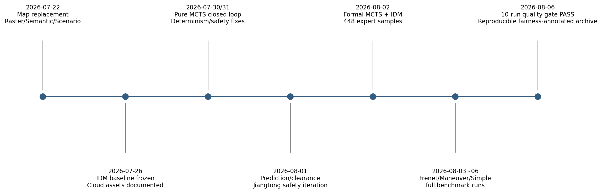
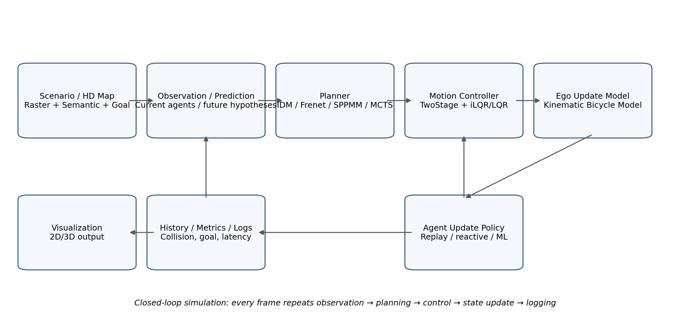
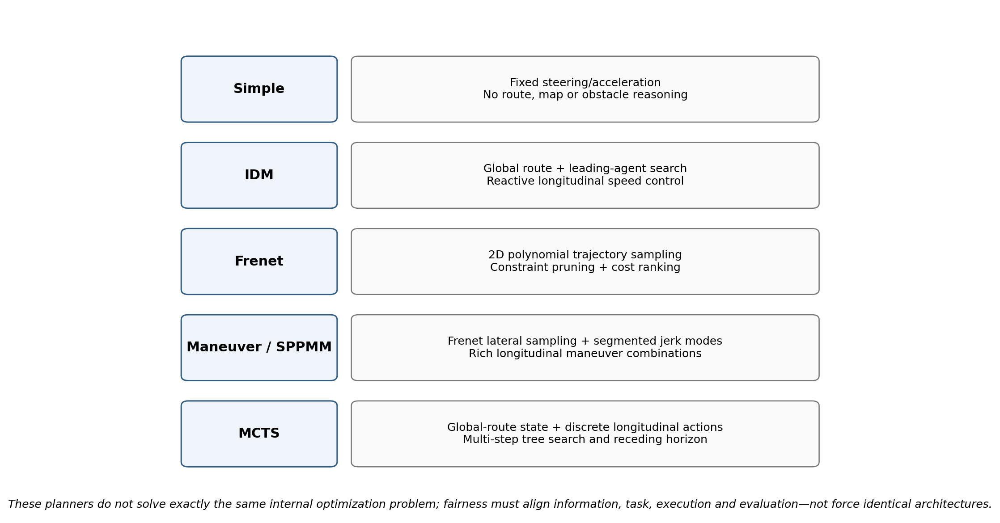

**MineSim-Dynamic**

**项目全景档案与 AI 长期接管超级手册**

原论文｜开源项目｜AutoDL 云端资产｜Pure MCTS 进展｜五规划器实验｜可复现归档｜公平实验路线

| **项目项**              | **当前事实**                                                                                |
|-------------------------|---------------------------------------------------------------------------------------------|
| 文档快照                | 2026-08-06（基于截至本轮对话的上传文件、终端输出与归档证据）                                |
| 正式仓库                | /root/MineSim-Dynamic                                                                       |
| 当前开发分支            | fix-ilqr-determinism-20260731                                                               |
| 当前正式结果 Commit     | 94693dc799fe5f325a75e8fc6d7d5e88764b4799                                                    |
| 基线分支 / Commit / Tag | autodl-idm-baseline / 2521aa41a69a6e734c04c15a715e9530c8095ac3 / idm-replay-autodl-baseline |
| 运行环境                | Conda: minesim；Python 3.9.25；当前实验为 CPU classical planners                            |
| 最终实验归档            | /root/autodl-tmp/five_planner_final_release_v2_fairness_annotated_20260806.tar.gz           |
| 归档 SHA256             | 719cbd5cd2ee3a7ce80eb722944580519ea291c812d93b2ae3ccdb3617e5e79b                            |

<table>
<colgroup>
<col style="width: 100%" />
</colgroup>
<thead>
<tr class="header">
<th>
<strong>本文件的唯一目的</strong>

即使原对话不可继续，只要把本 Word 发给新的 AI，并让它先按“AI 接管启动清单”核验云端现状，新 AI 就能够理解项目背景、源码链路、当前成果、实验事实、风险边界和下一步任务。旧文档中的“尚未开始 MCTS”属于 2026-07-26 的历史快照，不能覆盖本文件记录的 2026-08-06 当前状态。
</th>
</tr>
</thead>
<tbody>
</tbody>
</table>

**请勿把本文件当成云端实时状态的替代品：每次接管仍必须重新核验 Git、环境、路径、哈希和正在运行的进程。**

文档使用说明

本手册把用户最初上传的项目文件、后续形成的配套手册、原论文、代码逻辑解释、AutoDL 终端输出、正式实验结果和公平性讨论整合成一个长期事实源。文档内所有关键结论均被标记为“已核验事实、由数据推导、历史快照、计划但未执行、仍需源码审计”之一，避免未来 AI 将旧计划误当成当前事实。

| **标记**       | **含义**                                              | **使用规则**                                           |
|----------------|-------------------------------------------------------|--------------------------------------------------------|
| \[V\] 已核验   | 由终端输出、文件哈希、正式 CSV/日志或当前源码证据支持 | 可作为当前项目事实，但仍应在云端重连后复核是否发生变化 |
| \[D\] 数据推导 | 由已核验数据计算或逻辑推断                            | 可用于分析；论文中应说明计算定义                       |
| \[H\] 历史快照 | 旧文档在特定日期记录的状态                            | 用于理解演进；不得覆盖更新的当前事实                   |
| \[P\] 计划     | 已设计但尚未执行                                      | 不得写成“已经完成”                                     |
| \[U\] 未核验   | 材料不足或存在冲突                                    | 必须先审计源码/云端再决定                              |

## 建议阅读顺序

1.  新 AI 第一次接管：先读“第一篇：一页接管摘要”“第二篇：事实源与证据等级”“第十二篇：AI 接管与操作规范”。

2.  需要向导师汇报：读“第三篇：原论文”“第五篇：五个 Planner 逻辑”“第八篇：正式实验结果”和“第九篇：公平性判断”。

3.  准备继续做实验：读“第十篇：公正实验设计”“第十一篇：下一阶段路线图”和附录中的路径、哈希与审计模板。

4.  准备修改代码：先完成本手册要求的只读源码审计，再一次只做一个最小改动。

# 目录（使用 Word 导航窗格可直接按标题跳转）

| **部分** | **内容**                                                              |
|----------|-----------------------------------------------------------------------|
| 第一篇   | 一页接管摘要与当前状态仪表盘                                          |
| 第二篇   | 事实源、来源文件与可信度边界                                          |
| 第三篇   | 原论文 MineSim 的系统、场景库与 benchmark                             |
| 第四篇   | AutoDL 云端环境、Git、目录、地图与闭环链路                            |
| 第五篇   | Simple、IDM、Frenet、Maneuver、MCTS 五个 Planner 的真实逻辑           |
| 第六篇   | 项目发展历程：从 IDM baseline 到 Pure MCTS 与五算法比较               |
| 第七篇   | 工程修复、运行时补丁、内存策略与已知工作树风险                        |
| 第八篇   | 两场景十组正式实验、指标、文件选择、哈希与归档                        |
| 第九篇   | 现有比较的公平性、可用结论与不可用结论                                |
| 第十篇   | 下一轮公正实验的完整设计                                              |
| 第十一篇 | 后续研究路线：扩展场景、消融、Neural-MCTS 与论文证据                  |
| 第十二篇 | AI 长期接管、实验 SOP、故障处理与强制规则                             |
| 附录     | 绝对路径、正式文件树、哈希、配置、审计表与可直接复制的 AI 开场 Prompt |

# 第一篇　一页接管摘要与当前状态仪表盘

## 1.1 当前项目一句话定义

MineSim-Dynamic 是面向露天矿非结构化道路自动驾驶矿卡的场景化闭环规划仿真项目。用户当前研究主线是在已复现的 IDM + Replay 基线上实现 Pure MCTS，以多步纵向交互决策提升复杂冲突场景中的安全任务完成能力；Pure MCTS 已完成两场景闭环、正式比较和专家数据采集，尚未开始正式神经网络训练。

## 1.2 当前状态仪表盘

| **项目**            | **当前状态**                                                      | **等级** |
|---------------------|-------------------------------------------------------------------|----------|
| 正式仓库            | /root/MineSim-Dynamic                                             | \[V\]    |
| 当前开发分支        | fix-ilqr-determinism-20260731                                     | \[V\]    |
| 当前正式结果 Commit | 94693dc799fe5f325a75e8fc6d7d5e88764b4799                          | \[V\]    |
| 稳定 IDM baseline   | autodl-idm-baseline @ 2521aa41...；tag idm-replay-autodl-baseline | \[V/H\]  |
| Conda / Python      | minesim / Python 3.9.25                                           | \[V\]    |
| 关键场景            | dapai_intersection_1_3_4；jiangtong_intersection_9_3_2            | \[V\]    |
| Pure MCTS           | 已实现、已闭环、已形成两场景正式结果                              | \[V\]    |
| MCTS 专家数据       | 448 samples；两场景；tag mcts-expert-dataset-v1-20260802          | \[V\]    |
| 神经网络            | 尚未正式训练；不得写成已完成 Neural-MCTS                          | \[V\]    |
| 五算法旧比较        | 10 组正式 CSV，质量门禁 PASS，但信息条件异构                      | \[V\]    |
| 公平实验            | 概念设计已完成，源码审计尚未开始                                  | \[P\]    |
| 最终归档            | fairness-annotated v2 包，SHA256 719cbd...e79b                    | \[V\]    |
| 工作树              | 存在多个未跟踪文件；禁止未经审计删除                              | \[V\]    |

## 1.3 已完成的核心成果

- 完成 IDMPlanner + replay policy + TwoStageController/iLQR + Kinematic Bicycle Model 的 AutoDL 闭环复现与基线冻结。

- 完成 Pure MCTS 的状态、动作、树内转移、奖励、UCT 搜索、轨迹适配、诊断日志和闭环集成。

- 在 Dapai 与 Jiangtong 两个场景完成 MCTS 正式运行；MCTS 在两场景均实现零车辆碰撞、零道路越界并进入目标区域。

- 完成 MCTS 与 IDM 的正式对比，并采集 448 条 MCTS 专家样本；当前没有神经网络训练结果。

- 完成 Frenet 的数组越界根因定位和安全重采样补丁；两场景完整运行均结束且严格安全检查通过，但均未进入目标区域。

- 完成 Adapted Maneuver 的工程适配；Dapai 安全但未到达，Jiangtong 长期停车后与 object-2 连续碰撞 30 帧。

- 完成 Simple 下限基线及 Jiangtong 车型参数适配；Dapai 安全但未到达，Jiangtong 出现 90 帧道路边界事件且未到达。

- 统一生成十组结果的 comparison_summary.csv/json、selection_manifest.json、quality_gate.txt，最终 GATE_STATUS=PASS。

- 生成包含十组原始轨迹、证据日志、配置、补丁、环境与公平性说明的最终可复现归档。

## 1.4 当前最重要的研究判断

<table>
<colgroup>
<col style="width: 100%" />
</colgroup>
<thead>
<tr class="header">
<th>
<strong>结论 A：旧实验有价值，但不是完全公平的五算法主比较</strong>

MCTS 与 IDM 使用 CURRENT_OBSERVATION；Frenet 与 Maneuver 使用 REPLAY_FUTURE_TRUTH_ORACLE；Simple 只使用自车状态。旧实验应作为“统一场景与评价协议下的异构基线评估”，不能写成完全相同信息条件下的总排名。
</th>
</tr>
</thead>
<tbody>
</tbody>
</table>

<table>
<colgroup>
<col style="width: 100%" />
</colgroup>
<thead>
<tr class="header">
<th>
<strong>结论 B：最接近公平的是 MCTS vs IDM</strong>

两者均使用当前观测，且共享相近的目标速度、加减速度、输出轨迹点数与采样间隔。当前两场景证据支持“MCTS 在复杂 Dapai 场景的多步交互决策优于 IDM；Jiangtong 中二者均安全完成，IDM 更快、更平顺”。
</th>
</tr>
</thead>
<tbody>
</tbody>
</table>

<table>
<colgroup>
<col style="width: 100%" />
</colgroup>
<thead>
<tr class="header">
<th>
<strong>结论 C：下一步不是继续修旧结果</strong>

旧结果已经冻结。下一步应先做五 Planner 的只读源码审计，明确各自的真实信息流、预测源、碰撞检查、规划时域与补丁影响，再建立公平在线 benchmark。
</th>
</tr>
</thead>
<tbody>
</tbody>
</table>

图 1　项目关键时间线（按文件名、终端证据与归档日期整理）

# 第二篇　事实源、来源文件与可信度边界

## 2.1 本手册的来源层级

本手册不把任何单一 Word、聊天回复或旧截图当作唯一事实。来源优先级按“当前云端文件与哈希 \> 正式结果 CSV/日志 \> 终端输出 \> 当前源码审计 \> 历史说明文档 \> 研究计划”排列。旧文档中的状态只能说明当时发生了什么，不能覆盖之后的真实进展。

| **编号** | **来源**                                                                            | **主要支持内容**                                                       |
|----------|-------------------------------------------------------------------------------------|------------------------------------------------------------------------|
| S1       | 矿山项目原论文.pdf                                                                  | MineSim 论文原文；系统架构、动态/静态场景库、benchmark、指标与论文结论 |
| S2       | 项目地址.txt                                                                        | 官方 GitHub：https://github.com/BUAA-TRANS-Mine-Group/MineSim-Dynamic  |
| S3       | 矿山项目分析.docx                                                                   | 项目模块级通俗分析：Prediction、Planner、Controller、KBM、Agent Policy |
| S4       | MineSim-Dynamic_论文与项目相关函数详解.docx                                         | 函数级闭环链路与 IDM/FOP/SPPMM/Controller/KBM 源码说明                 |
| S5       | MineSim-Dynamic_AutoDL云端项目环境与文件资产说明书_2026-07-26.docx                  | 2026-07-26 云端、Git、环境、目录和 IDM baseline 快照                   |
| S6       | MineSim-Dynamic_纯MCTS与神经网络增强实施手册\_...\_2026-07-26.docx                  | Pure MCTS → Value → Policy-Value/PUCT 的施工路线与测试规范             |
| S7       | MineSim-Dynamic_普通AI与AutoDL云端交互及代码调试手册_2026-07-26.docx                | 人机协作、文件读取、Patch、测试与 Git 回滚规范                         |
| S8       | MineSim-Dynamic_项目必备配套资料_风险清单与AI长期交接手册_2026-07-26.docx           | 实验治理、风险矩阵、数据/模型/结果治理与 AI 交接规则                   |
| S9       | MineSim-Dynamic_明日用DeepSeek建立项目管理文件与数据目录_执行说明书_2026-07-26.docx | 早期项目管理基础设施计划与严格小步执行规则                             |
| S10      | MineSim-Dynamic地图更换方案.docx                                                    | Raster Map、Semantic Map、Scenario 三类数据与新矿区接入要求            |
| E1-E13   | 2026-08-06 多个“粘贴的文本”终端证据                                                 | Frenet、Maneuver、Simple 全运行、统一审计、质量门禁与归档输出          |

## 2.2 关键终端证据索引

| **证据时间标识** | **内容**                                                                    |
|------------------|-----------------------------------------------------------------------------|
| 20260806-023111  | Frenet Jiangtong 249 步完整运行；RUN_STATUS=0；0 碰撞；0 越界；严格安全通过 |
| 20260806-023317  | Maneuver v4 补丁编译与硬编码检查；补丁 SHA256 476b1ab...                    |
| 20260806-023600  | Maneuver Jiangtong 5 步冒烟；全部补丁激活；接口通过                         |
| 20260806-031104  | Maneuver Jiangtong 249 步；30 碰撞帧；长期停车；严格安全失败                |
| 20260806-031352  | Maneuver 归档；Simple 源码定位；两个场景 goal polygon 结构确认              |
| 20260806-031533  | Simple 工厂和源码审计；信息条件与硬编码 Dapai 车型确认                      |
| 20260806-031912  | Simple Dapai 5 步冒烟通过                                                   |
| 20260806-032243  | Simple Dapai 199 步完整运行；安全但未进入目标                               |
| 20260806-032520  | Simple Jiangtong 车型补丁；5 步冒烟通过；车型 NTE200                        |
| 20260806-032843  | Simple Jiangtong 249 步；90 道路边界帧；目标外 119.45 m                     |
| 20260806-033140  | Simple 全轨迹 goal 审计；10 组正式 CSV inventory                            |
| 20260806-033715  | 统一比较脚本修复后输出；仅 Dapai Maneuver 证据缺失                          |
| 20260806-033932  | 补齐 Maneuver 证据；GATE_STATUS=PASS；RESULT_COUNT=10；FAILURE_COUNT=0      |

## 2.3 本手册明确不做的事情

- 不把旧文档中“Pure MCTS 尚未开始”继续写成当前事实；那只是 2026-07-26 快照。

- 不把程序正常退出等同于任务成功；必须检查是否进入 goal polygon、是否碰撞、是否越界。

- 不把连续碰撞帧写成独立事故次数；例如 30 collision frames 可能属于一个持续碰撞事件。

- 不把 two-scenario 结果扩展为“普遍优于”或统计显著结论。

- 不把 Oracle-assisted Frenet/Maneuver 与 current-observation MCTS/IDM 混成完全公平的主排名。

- 不把运行时补丁隐藏为原始算法；必须标注 Adapted Frenet / Adapted Maneuver / Simple vehicle adaptation。

# 第三篇　原论文 MineSim 的系统、场景库与 benchmark

## 3.1 论文基本信息

| **项目**     | **信息**                                                                                               |
|--------------|--------------------------------------------------------------------------------------------------------|
| 题目         | MineSim: A scenario-based simulation test system and benchmark for autonomous trucks in open-pit mines |
| 期刊         | Accident Analysis & Prevention, Volume 213, 2025, Article 107938                                       |
| DOI          | 10.1016/j.aap.2025.107938                                                                              |
| 作者         | Zhifa Chen, Guizhen Yu, Peng Chen 等                                                                   |
| 开源定位     | 面向露天矿非结构化道路规划任务的开源、场景化、闭环仿真与 benchmark 系统                                |
| 当前项目地址 | https://github.com/BUAA-TRANS-Mine-Group/MineSim-Dynamic                                               |

## 3.2 论文要解决的问题

城市自动驾驶仿真器通常围绕清晰车道线、规则路口、轻型车辆和高保真传感器展开；露天矿道路具有无清晰车道线、边界不规则、坡度显著、路宽变化、大型矿卡惯性与响应滞后明显等特征。MineSim 的目标不是替代所有通用模拟器，而是提供能够复现真实矿区规划问题的场景数据、自动解析、闭环仿真、指标评价与可视化工具。 \[S1\]

## 3.3 MineSim 系统组件

图 2　MineSim 当前项目最关键的闭环链路

- 场景解析：读取 Scenario JSON、地图引用、自车初始状态、目标区域、其他参与者轨迹和测试参数。

- 地图管理：加载 Raster Map 与 Semantic Map，为全局路线、道路边界与局部碰撞查询提供基础。

- 自车状态更新：Motion Controller 将规划轨迹转为动态控制量，Ego Update Model 用车辆模型积分下一帧。

- 其他参与者更新：可使用 replay、reactive IDM 或预测/学习策略更新其他车辆。

- 评价与可视化：记录 simulation history，计算安全、效率、平顺性和任务完成指标，并生成 2D/3D 可视化。

## 3.4 论文动态障碍场景 benchmark

论文动态场景库名为 dataset-dynamicscenario-v1.0，包含来自真实矿区数据的 210 个场景。动态 benchmark 比较 IDM 与 SPPMM，采用 Replay Test Mode：自车闭环，其他车辆按照 replay policy 更新；论文实验将 prediction 设置为 perfect prediction，并使用 LQR-based motion controller 与带响应滞后的 KBM-wRL。 \[S1\]

论文对动态任务的评价覆盖四类：安全、效率、平顺性、任务完成。若未到达目标，任务完成度按沿 route 的进度计算；若发生碰撞，安全得分归零。论文总体发现 IDM 更偏向安全和任务完成，SPPMM 的多项式轨迹在效率和平顺性上有优势，但 SPPMM 的安全性较弱、碰撞更多。 \[S1\]

| **论文动态 benchmark 项**  | **设置 / 结论**                                  |
|----------------------------|--------------------------------------------------|
| 场景数量                   | 210 dynamic scenarios                            |
| Agent 模式                 | Replay policy；non-reactive agents               |
| Prediction                 | Perfect prediction                               |
| Controller / vehicle model | LQR + KBM-wRL                                    |
| Planner 1                  | IDM：沿参考路线纵向调速                          |
| Planner 2                  | SPPMM：Frenet 横向 + 预定义纵向机动模式采样      |
| 论文分数                   | IDM total 84.6；SPPMM total 81.1                 |
| 论文解释                   | IDM 安全/完成更好；SPPMM 效率/平顺更好但安全较弱 |

## 3.5 SPPMM 的论文逻辑

SPPMM 是对 Frenet Optimal Planner 的纵向采样改进。横向仍使用 Frenet 多项式候选；纵向不再只依赖单一“加速、减速或匀速”模式，而是假设有限规划时域内合理轨迹可由至多两个连续机动模式组合。典型组合包括加速→减速、加速→匀速、减速→加速、匀速→减速等。规划时域被划分为若干段，采样 jerk 后积分出加速度、速度和纵向位移，再按速度、加速度、jerk、碰撞与边界约束筛除不可行轨迹。 \[S1\]

## 3.6 论文静态障碍 benchmark

论文静态场景库包含 22 个场景。静态 benchmark 比较 SPPMM 与 HA\*-CiLQR：Hybrid A\* 先生成无碰撞粗路径，CiLQR 再在车辆动力学、控制成本、参考偏移和障碍/边界约束下优化连续轨迹。论文报告 HA\*-CiLQR 总体得分高于 SPPMM，但因保持更大安全距离，效率略低。 \[S1\]

## 3.7 原论文与当前用户项目必须区分的地方

| **维度**     | **原论文**                 | **当前用户项目**                                                                                |
|--------------|----------------------------|-------------------------------------------------------------------------------------------------|
| 场景规模     | 动态 210；静态 22          | 云端当前正式开发/比较只使用 Dapai、Jiangtong 两个 Scenario JSON                                 |
| 动态预测     | Perfect prediction         | MCTS/IDM 当前观测；Frenet/Maneuver 读取 replay future truth；信息不一致                         |
| 主 benchmark | IDM vs SPPMM               | 新增 Pure MCTS，并补充 Frenet、Maneuver、Simple                                                 |
| 车辆模型     | 论文实验标注 LQR + KBM-wRL | 当前复现主要描述为 TwoStageController/iLQR + 普通 Kinematic Bicycle Model；须以实时配置审计为准 |
| 论文结论范围 | 大规模场景平均指标         | 当前只有两场景，不支持广泛泛化                                                                  |

# 第四篇　AutoDL 云端环境、Git、目录、地图与闭环链路

## 4.1 云端环境与版本演进

2026-07-26 的资产说明书记录：正式项目位于 /root/MineSim-Dynamic，基线分支为 autodl-idm-baseline，基线 Commit 为 2521aa41a69a6e734c04c15a715e9530c8095ac3，Tag 为 idm-replay-autodl-baseline，Conda 环境为 minesim，Python 为 3.9.25。之后 MCTS 开发、确定性修复和正式实验推进到分支 fix-ilqr-determinism-20260731，当前正式结果 Commit 为 94693dc799fe5f325a75e8fc6d7d5e88764b4799。 \[S5\]\[E\]

<table>
<colgroup>
<col style="width: 100%" />
</colgroup>
<thead>
<tr class="header">
<th>
<strong>版本原则</strong>

Baseline branch/tag 是历史可复现锚点；当前正式结果必须以 94693dc 和最终 manifest 为准。新 AI 不能因为旧 Word 写着 autodl-idm-baseline 就切回去覆盖当前成果。
</th>
</tr>
</thead>
<tbody>
</tbody>
</table>

## 4.2 云端主要路径

| **路径**                                                                          | **用途**                                           |
|-----------------------------------------------------------------------------------|----------------------------------------------------|
| /root/MineSim-Dynamic                                                             | 正式 Git 仓库；源码、配置、inputs、outputs         |
| /root/miniconda3/envs/minesim                                                     | 正式 Conda 环境                                    |
| /root/datasets                                                                    | 数据根目录                                         |
| /root/datasets/maps                                                               | 地图根目录，包含 bitmap 与 semantic_map            |
| /root/datasets/scenario-library-all                                               | 场景库路径；当前已核验可用正式 JSON 主要为两个场景 |
| /root/autodl-tmp/minesim_idm_baseline_backup                                      | IDM baseline 外部备份                              |
| /root/autodl-tmp/mcts_data                                                        | MCTS/Neural-MCTS 数据资产规划目录                  |
| /root/autodl-tmp/mcts_results                                                     | 所有正式/调试实验结果总目录                        |
| /root/autodl-tmp/mcts_checkpoints                                                 | 未来网络 checkpoint 目录                           |
| /root/autodl-tmp/five_planner_final_release_v2_20260806                           | 完整五算法可复现结果目录                           |
| /root/autodl-tmp/five_planner_final_release_v2_fairness_annotated_20260806.tar.gz | 最终带公平性说明的正式归档包                       |

## 4.3 地图、Scenario 与加载逻辑

MineSim 新矿区接入必须同时形成三类数据：Raster Map 描述可行驶/不可行驶空间；Semantic Map 描述道路区域、边界、参考路径、connector 和拓扑；Scenario 引用地图并定义一次任务的自车起点、目标、多车轨迹、车辆参数和时间设置。三者必须使用一致的 location、坐标基准、版本和比例尺。 \[S10\]

| **层**       | **典型输出**                    | **主要信息**                                                              |
|--------------|---------------------------------|---------------------------------------------------------------------------|
| Raster Map   | \<location\>\_bitmap_mask.png   | 可行驶面、禁行区、坐标范围、PixelPerMeter                                 |
| Semantic Map | \<location\>\_semantic_map.json | road polygon、borderline、reference_path、connector_path、拓扑、高程/坡度 |
| Scenario     | Scenario-\*.json                | 地图引用、自车、目标 polygon、agent 轨迹、静态障碍物、dt、max_t           |

## 4.4 当前两张地图与场景

| **简称**  | **Scenario**                 | **location**      | **长度**                        | **dt** | **局部位图**                     | **目标 polygon**                                                                  |
|-----------|------------------------------|-------------------|---------------------------------|--------|----------------------------------|-----------------------------------------------------------------------------------|
| Dapai     | dapai_intersection_1_3_4     | guangdong_dapai   | 200 iterations；正式执行 199 步 | 0.1 s  | bitmap 1495×1495，PNG normal     | goal x=\[1688.06,1686.56,1697.06,1700.05\]；y=\[654.902,633.905,631.906,655.402\] |
| Jiangtong | jiangtong_intersection_9_3_2 | jiangxi_jiangtong | 250 iterations；正式执行 249 步 | 0.1 s  | bitmap 2186×2186，PNG transposed | goal x=\[1276.85,1294.35,1303.86,1288.35\]；y=\[2320.29,2346.79,2339.79,2314.29\] |

Jiangtong 正式 Scenario 文件 SHA256 为 6eec8167eb367225478b51e0ad4056e986a2eb0167c37f1d1aa5d617a24743cd；单场景输入副本位于 /root/autodl-tmp/jiangtong_frenet_single_input_20260806。Dapai 对照输入目录为 /root/autodl-tmp/dapai_three_planner_smoke_input。

## 4.5 当前闭环调用链

**当前项目闭环主线**

<table>
<colgroup>
<col style="width: 100%" />
</colgroup>
<thead>
<tr class="header">
<th>
run_simulation.py

→ SimulationsRunner._initialize()

→ EnvironmentSimulation.initialize()

→ Scenario / Map loader

→ Planner.initialize()

→ 每帧 Planner.compute_planner_trajectory()

→ TwoStageController.update_state()

→ LQR / iLQR trajectory tracking

→ KinematicBicycleModel.propagate_state()

→ Agent Update Policy 更新其他车辆

→ SimulationHistory / metrics / log

→ 下一帧
</th>
</tr>
</thead>
<tbody>
</tbody>
</table>

Planner 的输出是未来轨迹，不是下一帧位置。Controller 比较当前状态和目标轨迹，生成加速度、转向角速度等控制量；Ego Update Model 再把控制量积分成下一帧 EgoState。这个分层是理解所有 Planner 的前提。 \[S4\]

## 4.6 核心源码索引

| **模块**             | **主要路径**                                                                                                                                     |
|----------------------|--------------------------------------------------------------------------------------------------------------------------------------------------|
| Scenario/Environment | devkit/sim_engine/environment_manager/；scenario_manager/                                                                                        |
| Map                  | devkit/sim_engine/map_manager/；Minesim semantic/bitmap loaders                                                                                  |
| IDM                  | devkit/sim_engine/planning/planner/local_planner/idm_planner.py；abstract_idm_planner.py                                                         |
| Frenet               | devkit/sim_engine/planning/planner/local_planner/frenet_optimal_planner.py                                                                       |
| Maneuver             | devkit/sim_engine/planning/planner/local_planner/predefined_maneuver_mode_sampling_planner.py                                                    |
| Simple               | devkit/sim_engine/planning/planner/simple_planner.py                                                                                             |
| MCTS adapter         | devkit/sim_engine/planning/planner/local_planner/mcts_planner.py                                                                                 |
| MCTS core            | devkit/sim_engine/planning/planner/mcts/{state,action_space,state_builder,transition_model,reward,node,search,trajectory_adapter,diagnostics}.py |
| Global route         | devkit/sim_engine/planning/planner/route_planner/                                                                                                |
| Controller           | devkit/sim_engine/ego_simulation/two_stage_controller.py；ego_motion_controller/                                                                 |
| Vehicle model        | devkit/sim_engine/ego_simulation/ego_update_model/kinematic_bicycle_model.py                                                                     |
| Agent policy         | devkit/sim_engine/observation_manager/agent_update_policy/                                                                                       |

# 第五篇　五个 Planner 的真实逻辑与能力边界

图 3　五 Planner 的内部问题定义与能力层级

## 5.1 Simple Planner：固定运动学下限

SimplePlanner 不搜索 route，不使用目标、地图和障碍物做决策。它从当前 EgoState 构造一个固定转向角和固定加速度的状态，在 10 s horizon、0.25 s sampling_time 下反复用 KinematicBicycleModel 传播；当前 benchmark 参数是 acceleration=\[0,0\]、max_velocity=5.0、steering_angle=0。其本质是“按当前朝向直线保持速度”，不是能力对等的完整路径规划器。 \[S4\]\[E\]

原始源码还把车辆参数硬编码为 guangdong_dapai。为在 Jiangtong 使用正确车型，运行时补丁从 initialization.initial_ego_state.car_footprint.vehicle_parameters 读取 NTE200，并重建 KinematicBicycleModel；补丁没有增加路线、地图、避障或目标推理。

## 5.2 IDM Planner：固定 route 上的反应式纵向规划

IDM 先用 GlobalRoutePathPlanner 从起点搜索到目标的参考路线，然后把周围车辆 box 放入 occupancy map，将自车前方路径按矿卡宽度扩展成走廊，找到最近且挡路的 leading object。IDMPolicy 根据目标速度、安全间距、headway、前车距离和相对速度求纵向加速度，再在一维 route progress 上逐点推进，最后映射回二维 EgoState 轨迹。 \[S4\]

- 优势：计算快、逻辑明确、沿路线跟驰稳定；对无冲突和常规前车场景有效。

- 限制：主要是一维纵向反应，不能主动在横向采样绕行，也不显式搜索多步动作序列。

- 当前工厂公共参数：target_velocity=10.0、min_gap=1.0、headway=1.5、accel_max=1.0、decel_max=3.0、16 点、0.5 s 间隔。

## 5.3 Frenet Planner：二维多项式候选采样

Frenet 将自车状态转换到参考路线坐标系，把轨迹分解为纵向 s 与横向 d。它采样横向终点、规划时间和目标速度，用高阶多项式生成候选，映射到全局坐标后检查速度、加速度、曲率、道路边界和障碍碰撞，删除不可行轨迹，再按成本选择最优轨迹。 \[S1\]\[S4\]

当前 benchmark 设置 num_width=5、num_t=5、num_speed=5、lowest_speed=0、planning time=5–7 s、输出 16 点、0.5 s 间隔。旧正式运行采用 replay future truth oracle 来做未来碰撞检查，因此不属于和 MCTS 相同的信息条件。

## 5.4 Maneuver / SPPMM：预定义分段 jerk 机动采样

Maneuver 继承 Frenet 的横向采样框架，但纵向候选由多段 jerk 模式组合产生。规划时域内可组合加速、减速、匀速等连续机动，积分得到 a-v-s 曲线，并按速度、加速度、jerk、碰撞和道路约束筛选。它的纵向解空间比普通 Frenet 更丰富，但候选量和工程复杂度更高。 \[S1\]

当前设置 num_width=3、num_jerk=5、highest_jerk=9.0、lon_accel∈\[-8.2,8.2\]、输出 16 点、0.5 s 间隔。当前正式结果依赖 v4 运行时补丁，包含 SAT 碰撞、后轴参考点、候选历史释放、样条缓存、空队列紧急制动、逐步碰撞检查与稠密输出；必须写作 Adapted Maneuver。

## 5.5 Pure MCTS：沿 route 的多步纵向动作搜索

当前 MCTS 不是直接在二维平面随机生成曲线，而是一个高层纵向交互决策器。树内状态主要保留 route_s、speed、acceleration、lead distance、relative speed、target speed、collision 与 goal_reached；动作空间固定为 BRAKE、DECEL、KEEP、ACCEL，对应约 -3.0、-1.5、0、+1.0 m/s²。 \[S6\]

搜索每帧执行 Selection、Expansion、Rollout、Backup；终止条件包括碰撞、到达目标或达到最大深度。奖励综合 progress、speed、safety、comfort/jerk 与 terminal goal/collision。搜索结束后只执行根节点第一动作，下一仿真帧依据新观测重新构树，属于 receding-horizon planning。当前正式日志使用 300 次迭代、最大深度 8、tree dt 0.5 s、四动作，并记录 visits、Q、即时奖励分量与搜索耗时。

<table>
<colgroup>
<col style="width: 100%" />
</colgroup>
<thead>
<tr class="header">
<th>
<strong>必须审计的实现细节</strong>

历史项目记录指出 MCTS 含 CV/CTRV 几何预测与 0.5 m 碰撞缓冲，但在启动下一轮公平实验前，必须直接读取当前 commit 的 mcts_planner.py、state_builder.py、transition_model.py、reward.py 和碰撞/预测代码确认：哪些障碍进入树、何时切换 CV/CTRV、是否使用历史观测、是否存在场景专用逻辑。当前本手册将其标记为“已记录但待源码复核”。
</th>
</tr>
</thead>
<tbody>
</tbody>
</table>

## 5.6 能力边界对照

| **Planner** | **Route** | **纵向决策**   | **横向避让**             | **多步时序** | **障碍未来信息**      | **正确定位**                        |
|-------------|-----------|----------------|--------------------------|--------------|-----------------------|-------------------------------------|
| Simple      | 否        | 固定           | 否                       | 否           | 无                    | Naive lower bound                   |
| IDM         | 是        | 反应式跟驰     | 否                       | 弱           | 当前前车              | Reactive longitudinal baseline      |
| Frenet      | 是        | 候选采样       | 是                       | 整条候选时域 | 旧实验为未来真值      | Adapted sampling baseline           |
| Maneuver    | 是        | 多段 jerk 机动 | 是                       | 多机动候选   | 旧实验为未来真值      | Adapted SPPMM baseline              |
| MCTS        | 是        | 离散动作搜索   | 当前版基本无独立横向动作 | 是           | 内部近似预测/当前观测 | Proposed multi-step decision method |

# 第六篇　项目发展历程：从 IDM baseline 到 Pure MCTS 与五算法比较

## 6.1 2026-07-22：地图与场景资料体系

形成地图更换方案，将新矿区接入拆分为 Raster Map、Semantic Map、Scenario 三类成果，明确坐标、比例尺、道路面、边界、参考路径、connector、车辆任务、动态轨迹和验收流程。这一阶段解决的是“数据如何进入 MineSim”，不是 MCTS 算法。 \[S10\]

## 6.2 2026-07-26：IDM baseline 冻结与项目治理文档

AutoDL 上完成 IDM + replay baseline 复现、正式仓库确认、Git commit/tag 冻结、环境与路径盘点、外部备份和系统盘清理。随后形成云端资产说明书、Pure MCTS 实施手册、普通 AI 协作手册、风险与长期交接手册，以及建立 mcts_data/mcts_results/mcts_checkpoints、EXPERIMENT_LOG 和 AI_HANDOFF 的执行计划。 \[S5-S9\]

## 6.3 2026-07-30 至 07-31：Pure MCTS 闭环与确定性修复

项目从“仅有 IDM baseline”推进到 MCTSPlanner、树搜索模块和闭环仿真。根据后续路径命名与结果记录，这一阶段完成 MCTS 运行、Jiangtong 可复现性、iLQR/控制链稳定和多轮 safety/viability 修正；当前开发分支名 fix-ilqr-determinism-20260731 保留了该阶段痕迹。具体每个 commit 的详细差异仍应由 git log 和源码审计补全。

## 6.4 2026-08-01：Jiangtong 预测与安全迭代

历史结果目录出现 jiangtong_ctrv_lookup_safety、envelope_margin05、viability_filtered_tree、object2_motion_probe 等实验，说明项目针对 Jiangtong 的动态冲突、预测轨迹、几何净距和可行动作做过系统排查。这些是开发阶段实验，不应直接混入最终 benchmark。

## 6.5 2026-08-02：正式 MCTS/IDM 与专家数据

在 commit 94693dc 上完成 Dapai 与 Jiangtong 的正式 MCTS 运行、IDM 对比和专家数据采集。专家数据总计 448 samples，来自两个场景，记录 ego、MCTS root state、选中动作、动作访问次数、Q 值、奖励分量等；tag 为 mcts-expert-dataset-v1-20260802。当前没有训练 Value Network 或 Policy-Value Network。

<table>
<colgroup>
<col style="width: 100%" />
</colgroup>
<thead>
<tr class="header">
<th>
<strong>训练数据限制</strong>

448 条样本来自连续时间序列和仅两个场景，不能随机按行切分训练/验证，否则会产生严重时序泄漏。未来训练必须按 scenario / episode 分组，并扩充未见场景。
</th>
</tr>
</thead>
<tbody>
</tbody>
</table>

## 6.6 2026-08-03 至 08-06：三类额外基线与统一比较

- 建立 five_planner_benchmark.py 与 five_planner_factory.py，支持 MCTS、IDM、FRENET、MANEUVER、SIMPLE。

- Frenet 首次 Dapai 完整运行在 step 150 因硬编码索引 79 越界失败；定位根因并创建外部安全重采样补丁。

- Frenet 在 Dapai 199 步与 Jiangtong 249 步完整跑通，均无车辆碰撞、无道路边界事件，但未到达目标。

- Maneuver v4 在 Dapai 安全但进度不足；Jiangtong 早期减速到停，随后 object-2 进入其停车区域，形成连续碰撞帧。

- Simple 完成 Dapai 与 Jiangtong；Jiangtong 修正车辆参数为 NTE200 后仍因直线行驶越界。

- 建立 goal polygon 全轨迹审计、正式文件 inventory、统一 summary/manifest/quality gate。

- 补齐 Dapai Maneuver 证据后，10 组结果质量门禁最终 PASS。

# 第七篇　工程修复、运行时补丁、内存策略与已知工作树风险

## 7.1 Frenet 数组越界根因与修复

原始 \_get_planned_trajectory() 将输出时间索引生成为 \[0,5,...,75\]，随后无条件 append(79)。当 best_traj 数组长度恰好为 79 时，有效下标只有 0–78，因此访问 79 触发 IndexError。错误发生在“Frenet 最优轨迹 → MineSim InterpolatedTrajectory”的接口重采样阶段，不代表候选搜索本身没有找到轨迹。

| **项**   | **记录**                                                                                                |
|----------|---------------------------------------------------------------------------------------------------------|
| 原始失败 | Dapai full run，step 150，IndexError: index 79 is out of bounds for axis 0 with size 79                 |
| 补丁路径 | /root/autodl-tmp/frenet_safe_resample_patch_20260806/sitecustomize.py                                   |
| SHA256   | 4d243ce1e482abbb1f0f675d74d52f1a2e0075cb77a87069910169ebdd661e59                                        |
| 修复逻辑 | 以相关数组最小长度计算 available_points；索引 clamp；去重；最后追加实际 last valid index，不再硬编码 79 |
| 源码状态 | 正式 Git 源码未直接改写；通过外部 runtime patch 验证                                                    |

## 7.2 Maneuver v4 适配补丁

| **项**     | **记录**                                                                                                                                                                                                              |
|------------|-----------------------------------------------------------------------------------------------------------------------------------------------------------------------------------------------------------------------|
| 补丁路径   | /root/autodl-tmp/maneuver_sat_rear_axle_center_v4_20260805_223049/sitecustomize.py                                                                                                                                    |
| SHA256     | 476b1ab43ad3b36a810ea92c3fc50214af08d6473bc0ebd3ac4555c4223430e3                                                                                                                                                      |
| 主要标记   | dynamic polygon cache、vector boundary lookup、candidate history release、fast clone、direct polygon、SAT collision、rear axle center、dead width skip、spline cache、emergency brake、check every step、dense output |
| 方法学影响 | 部分是性能/接口修复，部分直接改变碰撞检查与 fallback 行为，因此结果必须标注 Adapted Maneuver                                                                                                                          |

## 7.3 Simple Jiangtong 车型适配

| **项**   | **记录**                                                                                         |
|----------|--------------------------------------------------------------------------------------------------|
| 原始问题 | SimplePlanner.\_\_init\_\_() 固定 get_mine_truck_parameters(mine_name="guangdong_dapai")         |
| 补丁路径 | /root/autodl-tmp/simple_scenario_vehicle_patch_20260806/sitecustomize.py                         |
| SHA256   | 52628f8cefce4b81cd61ac0663b35bb838c2700a4865fdae18bb5a4cb66c6d09                                 |
| 修复     | initialize 时读取当前 Scenario 初始 EgoState 的 vehicle_parameters，并重建 KinematicBicycleModel |
| 行为影响 | 只消除车型错配；不增加路线、地图、障碍物或目标逻辑                                               |

## 7.4 局部 bitmap 与内存

Dapai 与 Jiangtong 的安全检查均使用局部 bitmap，日志中 FULL_BITMAP_ARRAY 始终为 None，从而避免加载整幅地图数组。Dapai 局部 bitmap 约 1495×1495；Jiangtong 约 2186×2186。Frenet Jiangtong 完整运行最大 RSS 约 1.54 GiB，结束时 cgroup current 一度接近 1.96 GiB / 2 GiB 上限，因此大型 classical planner 任务必须串行运行，不能并发。

## 7.5 当前 Git 工作树风险

多次 git status 显示当前分支下有若干未跟踪文件，例如 0:、=、math.pi、self.jerk_max、self.v_max，以及多个 YAML/Python .bak 文件。现有证据没有显示 tracked source 修改，但这些未跟踪文件来源不明。未来 AI 不得用 rm -rf、git clean -fd 或批量删除；必须先逐个 ls/file/sed/sha256 审计归属，再决定保留、归档或删除。

# 第八篇　两场景十组正式实验、指标、文件选择、哈希与归档

## 8.1 正式成功定义

<table>
<colgroup>
<col style="width: 100%" />
</colgroup>
<thead>
<tr class="header">
<th>
<strong>Safe Goal Success</strong>

自车轨迹至少一次进入 Scenario goal polygon，同时车辆碰撞帧数为 0、道路边界事件帧数为 0。SIMULATION_RUNNING=False 只表示时间控制器或场景结束，不等于完成目标。
</th>
</tr>
</thead>
<tbody>
</tbody>
</table>

碰撞计数在旧 benchmark 中是 collision frames，不是独立事故次数。未来统一评价应同时报告 frame count 与合并后的 collision episodes。

## 8.2 正式十组 CSV 选择

| **场景**  | **Planner** | **正式目录（位于 /root/autodl-tmp/mcts_results）**     | **CSV SHA256**                                                   |
|-----------|-------------|--------------------------------------------------------|------------------------------------------------------------------|
| Dapai     | MCTS        | unified_dapai_mcts_idm_20260805_225044/mcts            | 5996b1c2e9200e039a8d24467f735d339a1b75c2905242701c749b6842cce209 |
| Dapai     | IDM         | unified_dapai_mcts_idm_20260805_225044/idm             | feffe31ca480bc6ffd8c0be90e64ba3458b8f15853b1265b9406a2c7d1b42a36 |
| Dapai     | Frenet      | frenet_safe_resample_dapai_full199_20260806_094110     | d310c80fd0895a45c8f8719661f0b2b5999ffbd16fa2823cac89ad388cf617bc |
| Dapai     | Maneuver    | maneuver_v4_dapai_full199_20260805_224115              | edfb161c9d55d759893350ac6b82d01987fc3d7abc39b359fe0155d9f27e798a |
| Dapai     | Simple      | simple_dapai_full199_20260806_112107                   | 87261a1ff1c72313158e710c8084fba8834f634e44b812b00500dd492020501e |
| Jiangtong | MCTS        | expert_collection_jiangtong_94693dc_20260802           | cc15bf2bd246bf2267023f6d3b17ce2fdc7af4633a76f2c82298a68dde5d914d |
| Jiangtong | IDM         | idm_comparison_jiangtong_94693dc_20260802              | 672f5d01155915ed0275e9c30090cb6e3cb2d135583996da456b25c9777bdbd8 |
| Jiangtong | Frenet      | frenet_safe_resample_jiangtong_full249_20260806_100618 | dbb56dbec038226833eb4a870590ec7b53adcbbeaeb517de74157f76d8a523c1 |
| Jiangtong | Maneuver    | maneuver_jiangtong_full249_20260806_103715             | c5d518cad8f87412e77d43a505d850d27c679960a2c4a0c4b77039115e19be13 |
| Jiangtong | Simple      | simple_jiangtong_full249_20260806_112642               | 3b60cc490ebe5947c85d439aac9310bfb24e53ae60c22371e1b553a24971ea31 |

## 8.3 统一最终结果表

| **场景**  | **Planner** | **碰撞帧** | **越界帧** | **曾进目标** | **安全完成** | **平均速度** | **距离** | **平均\|jerk\|代理** | **频率 Hz** |
|-----------|-------------|------------|------------|--------------|--------------|--------------|----------|----------------------|-------------|
| Dapai     | MCTS        | 0          | 0          | 是           | 是           | 6.416        | 126.09   | 2.930                | 1.343       |
| Dapai     | IDM         | 21         | 0          | 否           | 否           | 4.913        | 96.33    | 0.440                | 23.836      |
| Dapai     | Frenet      | 0          | 0          | 否           | 否           | 4.659        | 91.49    | 0.490                | 0.273       |
| Dapai     | Maneuver    | 0          | 0          | 否           | 否           | 2.868        | 55.80    | 6.314                | 0.556       |
| Dapai     | Simple      | 0          | 0          | 否           | 否           | 4.497        | 88.60    | 0.000                | 154.452     |
| Jiangtong | MCTS        | 0          | 0          | 是           | 是           | 9.008        | 224.20   | 0.825                | 3.178       |
| Jiangtong | IDM         | 0          | 0          | 是           | 是           | 8.546        | 212.20   | 0.197                | 15.223      |
| Jiangtong | Frenet      | 0          | 0          | 否           | 否           | 3.865        | 95.36    | 0.393                | 0.241       |
| Jiangtong | Maneuver    | 30         | 0          | 否           | 否           | 0.546        | 13.68    | 1.829                | 0.808       |
| Jiangtong | Simple      | 0          | 90         | 否           | 否           | 4.498        | 111.09   | 0.000                | 101.700     |

最终 summary 中 planning frequency 由每步 CSV compute_seconds 重新计算，可能与单次运行日志中基于其他统计窗口的频率略有差异。论文主表应统一采用 comparison_summary.csv 的定义，并在指标章节说明计算方式。

## 8.4 Dapai 场景解读

- MCTS：0 碰撞、0 越界、进入目标，是五种方法中唯一安全完成 Dapai 的方法；旧单独日志最小车辆净距约 0.522 m。

- IDM：21 个连续碰撞帧，未进入目标；平均速度低于 MCTS，计算显著更快、jerk 更低。

- Frenet：严格安全通过，最小净距约 2.636 m，但进度不足，最终未进入目标。

- Adapted Maneuver：0 碰撞、0 越界，最小净距约 0.939 m，但平均速度仅 2.868 m/s、行驶 55.80 m，未到目标；jerk 代理最高。

- Simple：直线保持速度，0 碰撞、0 越界，但最终位置 x≈1652，小于目标 polygon 最小 x≈1686.56，未完成任务。

## 8.5 Jiangtong 场景解读

- MCTS：0 碰撞、0 越界、进入目标；平均速度 9.008 m/s、行驶 224.20 m；旧日志最小净距约 2.260 m。

- IDM：同样安全进入目标；平均速度 8.546 m/s，计算约 15.223 Hz，jerk 代理 0.197，说明更快、更平顺。

- Frenet：0 碰撞、0 越界，最小净距约 0.871 m，但平均速度 3.865 m/s、未进入目标。

- Adapted Maneuver：约第 75 步接近静止，此后长期停在冲突区域；object-2 从第 140 步起产生连续碰撞帧；总 30 collision frames，未到目标。

- Simple：0 车辆碰撞，但从第 160 步开始道路边界事件，累计 90 帧；全轨迹从未进入目标，最终距目标约 119.448 m。

## 8.6 质量门禁与正式汇总哈希

| **文件**                        | **SHA256**                                                       |
|---------------------------------|------------------------------------------------------------------|
| comparison_summary.csv          | e4421939a9354a32fdc0f72f72f595df84dac8047a1328079b0b95375bb7495b |
| comparison_summary.json         | 90416fb15f0847d9687d3e56ac0e738d999d3bcfbd01f4083a1dbbfb17544a76 |
| selection_manifest.json         | ec83100d2bf141fb3842123b3a7559fa96a2acb098ca018cd85e32b1af0f6136 |
| quality_gate.txt                | 26068e29587a886c69bad9155a850ca3a64fce7d2f5331e30447c917179a60c1 |
| build_final_comparison.log      | 76a5abc2a6ad2de269cd69932e4d676fb6ee5b8b80a0d63b4c7ecdc745961d2b |
| Dapai Maneuver RUN_METADATA.txt | c6d2e08971fcce0164a98e1133f394edfcdd2eea67318c91ae88ea74f5863a01 |

**最终质量门禁**

<table>
<colgroup>
<col style="width: 100%" />
</colgroup>
<thead>
<tr class="header">
<th>
GATE_STATUS=PASS

RESULT_COUNT=10

FAILURE_COUNT=0
</th>
</tr>
</thead>
<tbody>
</tbody>
</table>

## 8.7 归档版本

| **类型**         | **文件**                                                         | **大小** | **SHA256**                                                       | **说明**                                               |
|------------------|------------------------------------------------------------------|----------|------------------------------------------------------------------|--------------------------------------------------------|
| 轻量汇总包       | five_planner_final_release_20260806.tar.gz                       | 73K      | 28afeb68667f17eba503b1007fe4b4392c60ddf704e88a877b0e0f1e05a53f40 | 仅 summary/config/patch，不含十组完整 raw results      |
| 完整 v2 包       | five_planner_final_release_v2_20260806.tar.gz                    | 446K     | 9da10f75f98976545657f72cf87d67592d1df1ec4ab721f256abc5156dc766a0 | 10 CSV + 10 evidence + env + repo state + patches      |
| 最终公平性标注包 | five_planner_final_release_v2_fairness_annotated_20260806.tar.gz | 448K     | 719cbd5cd2ee3a7ce80eb722944580519ea291c812d93b2ae3ccdb3617e5e79b | 在 v2 基础上加入 FAIRNESS_AND_LIMITATIONS.md；正式推荐 |

# 第九篇　现有比较的公平性、可用结论与不可用结论

## 9.1 相同的条件

- 同一 Scenario JSON、初始自车状态、回放交通参与者、地图与 goal polygon。

- 相同仿真步长 0.1 s；Dapai 199 步、Jiangtong 249 步。

- 相同外部车辆碰撞检查、道路边界检查和 goal polygon 审计。

- 统一从每步 CSV 计算平均速度、行驶距离、加速度/jerk 代理和规划耗时。

- 同一结果成功定义：曾进入目标 + 0 碰撞帧 + 0 越界帧。

## 9.2 不相同的核心条件：信息源

| **Planner** | **information_condition**   | **含义**                                          |
|-------------|-----------------------------|---------------------------------------------------|
| MCTS        | CURRENT_OBSERVATION         | 使用当前自车/障碍物观测，并由内部模型推演未来     |
| IDM         | CURRENT_OBSERVATION         | 使用当前前车与 occupancy 几何，不访问未来回放真值 |
| Frenet      | REPLAY_FUTURE_TRUTH_ORACLE  | 候选轨迹碰撞检查可访问回放参与者未来真实轨迹      |
| Maneuver    | REPLAY_FUTURE_TRUTH_ORACLE  | 同样使用 replay future truth；且依赖适配补丁      |
| Simple      | EGO_ONLY_NO_OBSTACLE_OR_MAP | 不使用 route、地图或障碍物，只生成固定轨迹        |

因此现有五算法表是“统一仿真与评价协议下的异构能力评估”，不是五种方法在完全相同信息下的苹果对苹果比较。原论文动态 benchmark 本身采用 perfect prediction，这解释了 FOP/SPPMM 的原始设计为何依赖未来轨迹；但不能据此把 Oracle 结果与当前观测方法混成公平主排名。

## 9.3 其他公平性限制

- 基线代码状态不同：Frenet、Maneuver、Simple 都经过运行时适配；Maneuver 补丁可能改变安全行为。

- 调参预算未统一：没有证据证明五种方法使用相同参数搜索次数或相同 CPU 小时。

- 计算预算未统一：Simple 约百 Hz，IDM 十余 Hz，MCTS 数 Hz，Frenet/Maneuver 低于 1 Hz。

- 只有两个场景，且均用于开发、排错和参数调整，不是独立未见测试集。

- MCTS 存在随机性，但当前正式结果没有形成多 seed 均值、标准差与置信区间。

- MCTS 当前主要搜索纵向动作，而 Frenet/Maneuver 具备横向采样；算法能力边界不同。

- Dapai Maneuver 的证据文件是根据精确 CSV 哈希、最终状态和已验证指标重建的 RUN_METADATA，不是原始 raw console log。

## 9.4 当前可以严谨宣称什么

<table>
<colgroup>
<col style="width: 100%" />
</colgroup>
<thead>
<tr class="header">
<th>
<strong>允许的核心表述</strong>

在两个已评估的 replay 场景中，MCTS 是唯一在两场景均实现进入目标、零车辆碰撞帧和零道路边界事件帧的方法；在相同 CURRENT_OBSERVATION 条件下，MCTS 在 Dapai 复杂冲突场景中比 IDM 表现出更强的多步交互决策能力，而 Jiangtong 中 MCTS 与 IDM 均安全完成，IDM 更快、更平顺。
</th>
</tr>
</thead>
<tbody>
</tbody>
</table>

## 9.5 当前不能宣称什么

- MCTS 在所有矿山场景中普遍优于所有基线。

- 五种算法在完全相同输入、预算、调参和实现条件下公平比较。

- MCTS 具有统计显著优势。

- 21 或 30 是独立事故次数。

- 当前已完成 Neural-MCTS 或神经网络增强。

- 当前结果能够代表原论文 210 个动态场景的总体分布。

# 第十篇　下一轮公正实验的完整设计

## 10.1 设计原则：公平不等于把算法改成一样

五个 Planner 解决的内部问题不同。真正要统一的是任务、可见信息、地图/路线、车辆、控制器、调用频率、外部评价、调参机会和计算约束；不应强迫 IDM 变成轨迹采样器，也不应强迫 Frenet/Maneuver 变成离散动作树，更不能为了统一预测器而删除 MCTS 自身预测能力的贡献。

## 10.2 建议保留的实验层次

| **实验**                    | **目的**                   | **参与方法**               | **关键条件**                                                 |
|-----------------------------|----------------------------|----------------------------|--------------------------------------------------------------|
| E0 历史异构实验             | 保留当前工程结果与诊断价值 | 五种方法                   | 已完成并归档，不覆盖                                         |
| E1 Equal Online Information | 比较完整在线规划系统       | MCTS/IDM/Frenet/Maneuver   | 只允许当前+历史观测；禁止未来真值；保留各自原生预测/规划结构 |
| E2 Shared Prediction        | 隔离规划核心差异           | MCTS/IDM/Frenet/Maneuver   | 四者接收同一 CV/CTRV 预测输出；作为控制变量实验              |
| E3 Real-time Deadline       | 比较部署可行性             | 四主方法                   | 统一 0.5 s 规划周期与 fallback；记录 deadline misses         |
| E4 Oracle Upper Bound       | 观察理想预测上限           | Frenet/Maneuver，可选 MCTS | 允许 future truth；单独附表，不进入公平主排名                |
| E5 Lower Bound              | 无规划参考                 | Simple                     | 仅参考行/附表                                                |
| E6 MCTS Ablation            | 证明创新来源               | MCTS variants              | 去预测、去安全项、不同 budget/depth、CV vs CTRV 等           |

## 10.3 E1：Equal Online Information 主实验

- 所有主 Planner 只能获得当前 EgoState、当前/历史 DetectionsTracks、相同 HD Map、相同 global route、相同 goal polygon、相同 vehicle parameters。

- 禁止读取 scenario.scenario_info.vehicle_traj 的未来区段、未来 replay frame、future truth cache 或任何由测试后续帧构造的信息。

- IDM 可继续只使用当前 leading object；Frenet/Maneuver 必须将未来碰撞检查改为基于在线预测；MCTS 保留自己的内部状态转移/预测。

- 外部执行栈完全相同：同一 controller、同一 Ego Update Model、同一 agent replay policy、同一 dt、同一 route 初始化、同一 evaluator。

- 此实验比较“完整在线规划系统”，因此预测模块本身可以是各方法架构的一部分。

## 10.4 E2：Shared Prediction 控制变量实验

建立一个只从当前与历史观测生成未来轨迹的公共 PredictionProvider，例如 CV/CTRV：horizon=8 s，sample interval=0.5 s，16 个未来点，并统一 actor footprint、时间戳、置信度和占用膨胀。MCTS、Frenet、Maneuver 都使用同一预测；IDM 可从预测中提取前车未来 s/v 或继续只使用当前状态，但不得获得额外信息。该实验用于回答“在预测一致时，树搜索与轨迹采样/反应式规划的差异”。

## 10.5 规划调用与实时性

| **模块**               | **建议频率/规则**                                  |
|------------------------|----------------------------------------------------|
| 仿真与控制器           | 10 Hz，dt=0.1 s                                    |
| Planner 重规划         | 2 Hz，每 0.5 s 调用一次；中间控制帧跟踪现有轨迹    |
| 输出轨迹               | 16 点，0.5 s 间隔，覆盖约 8 s                      |
| Track A native compute | 不强行截断，记录真实 mean/median/P95/max           |
| Track B deadline       | 每次最多 0.5 s；超时统一复用上一有效轨迹或安全减速 |
| Fallback               | 所有方法同一实现；记录触发次数、连续超时与停车     |

## 10.6 场景划分

Dapai 与 Jiangtong 已被反复用于开发、排错和参数选择，只能作为 development/interface validation，不得作为最终 unseen test。当前云端只核验两个正式 Scenario JSON，而原论文动态库包含 210 场景，因此下一阶段必须先获取/恢复更多场景。

| **集合**    | **建议数量**                   | **用途**                                                         |
|-------------|--------------------------------|------------------------------------------------------------------|
| Development | 当前 Dapai、Jiangtong          | 接口、回归、源码改动验证；不参与最终泛化统计                     |
| Validation  | 至少 12 个未见场景             | 调参数、选 prediction/fallback、确定安全膨胀；每方法相同调参预算 |
| Test        | 至少 30 个，优先扩展至完整 210 | 参数冻结后一次性运行；失败全部保留；不再回调参数                 |

测试集应覆盖常规跟驰、慢车、交叉横穿、合流让行、弯道动态障碍、静止阻塞、必须横向绕行、多车连续冲突。必须包含对当前纵向 MCTS 不利的“横向绕行必需”场景，真实暴露算法边界。

## 10.7 调参预算与冻结

- 每种方法最多相同数量配置（例如 20 组）或相同 CPU 小时，不允许只对 MCTS 或某个 baseline 反复专门调场景。

- 只允许在 validation 集调参；测试前保存配置快照和 SHA256。

- MCTS 固定 action order、reward version、budget/depth/c_uct/gamma；Frenet/Maneuver 固定采样数、cost 权重、安全距离；IDM 固定 target speed/headway/gap。

- 测试集结果出现失败后不得回调参数并重新选取“更好版本”。

## 10.8 重复、统计与主指标

| **对象**            | **重复建议**                                                             |
|---------------------|--------------------------------------------------------------------------|
| MCTS                | 每测试场景 10 个预注册 seed；报告成功率、均值/标准差或中位数/IQR、95% CI |
| IDM/Frenet/Maneuver | 若轨迹确定，1 次行为结果 + 3 次计算时间重复；如存在随机采样则同样多 seed |
| Simple              | 1 次即可，附表                                                           |

- 第一主指标：Safe Goal Success rate。

- 安全：collision episodes、collision frames、road-boundary episodes/frames、min clearance、min TTC、unsafe TTC ratio。

- 任务：first goal time、route completion、minimum/final distance to goal、timeout/off-route 分类。

- 效率和平顺：平均速度、路径长度、纵/横向加速度、centripetal acceleration、jerk。

- 计算：mean/median/P95/max、0.1/0.5/1.0 s deadline miss rate、fallback rate。

- 不要用主观加权综合分掩盖任务失败；排序顺序应先成功，再安全，再效率/平顺，最后计算成本。

## 10.9 公平实验开始前必须完成的源码审计

| **审计对象**      | **必须回答的问题**                                                                                         |
|-------------------|------------------------------------------------------------------------------------------------------------|
| MCTS              | 当前/历史观测读取；CV/CTRV；障碍筛选；树内碰撞；route/goal；是否有场景专用逻辑                             |
| IDM               | occupancy map 半径；leading object；是否只用 current observation；route 生成与目标判断                     |
| Frenet            | plan_trajectory、has_collision；未来 agent state 来自哪里；cost、horizon、fallback；补丁只影响接口还是行为 |
| Maneuver          | 与 Frenet 相同；外加 v4 patch 每一项对候选、碰撞和 fallback 的行为影响                                     |
| Simple            | 确认无 route/map/obstacle；vehicle patch 行为；只作为 lower bound                                          |
| Factory/Benchmark | planner 构造参数、information_condition、controller、agent policy、dt、输入场景与 evaluator 完全记录       |

<table>
<colgroup>
<col style="width: 100%" />
</colgroup>
<thead>
<tr class="header">
<th>
<strong>当前状态</strong>

上述公平实验尚未执行，源码审计也尚未开始。此前提出创建 fair_benchmark_v1_20260806 的命令只是计划，用户随后明确要求先制作本总文档。未来 AI 不得把该目录或协议写成已经完成，除非云端重新核验。
</th>
</tr>
</thead>
<tbody>
</tbody>
</table>

# 第十一篇　后续研究路线：扩展场景、消融、Neural-MCTS 与论文证据

## 11.1 近期单一步骤

<table>
<colgroup>
<col style="width: 100%" />
</colgroup>
<thead>
<tr class="header">
<th>
<strong>Next Single Step</strong>

只读审计当前 commit 的五个 Planner 与 factory/benchmark：输出“信息流、预测源、动作/候选、碰撞检查、规划时域、输出轨迹、补丁影响”的统一表；不修改代码、不运行新完整 benchmark。
</th>
</tr>
</thead>
<tbody>
</tbody>
</table>

## 11.2 Pure MCTS 需要补齐的算法证据

- 正式数学定义：State、Action、Transition、Reward、UCB/UCT、terminal、trajectory adapter。

- one-step model error：树内预测与真实闭环下一步 speed/progress/clearance 的误差。

- 参数研究：budget 100/300/1000；depth 6/8/12；c_uct；gamma；预测模型与安全 buffer。

- 消融：无多步搜索、无 safety reward、无 CTRV、无 action pruning、不同 rollout policy。

- 失败案例：横向绕行场景、遮挡、多车、预测失配、计算 deadline。

## 11.3 MCTS 专家数据与 Neural-MCTS

当前 448 条专家数据足够验证日志 schema 和训练管线，不足以支撑可靠网络结论。建议先做 Value Network，而不是直接 Policy-Value + PUCT：以 MCTS 搜索回报/episode outcome 为 value target，使用按 scenario/episode 的 train/val/test split，保存 feature schema、normalization、action mapping、git commit、dataset manifest 和 checkpoint metadata。

| **阶段**               | **目标**                          | **通过标准**                                          |
|------------------------|-----------------------------------|-------------------------------------------------------|
| N1 数据扩展            | 多场景、多 seed 采集 (s, π, z)    | 无时序泄漏；manifest、schema、hash 完整               |
| N2 Value Network       | 替代/辅助 rollout leaf value      | 离线优于 naive；相同/更低 budget 在线不劣于 Pure MCTS |
| N3 Policy-Value + PUCT | 用 policy prior 与 value 引导搜索 | 相同计算预算下提高成功率或显著降低搜索时延            |
| N4 迭代聚合            | 新策略产生新状态并再训练          | 独立测试集稳定提升；避免只学习两场景                  |

## 11.4 论文结构建议

5.  Introduction：露天矿复杂混合交通、传统反应式方法短视、轨迹采样对预测和计算的依赖。

6.  Related Work：MineSim、IDM、FOP/SPPMM、MCTS/decision planning、trajectory prediction。

7.  Method：系统架构、MCTS state/action/transition/reward/search、预测、trajectory adapter。

8.  Experimental Setup：场景 split、online information、controller/vehicle、调参预算、统计协议。

9.  Results：E1 公平主实验、E2 shared prediction、E3 deadline、E6 消融。

10. Analysis：安全-效率-平顺-计算 trade-off、失败案例、横向能力限制。

# 第十二篇　AI 长期接管、实验 SOP、故障处理与强制规则

## 12.1 AI 接管的事实优先级

11. 先读本 Word 的第一、二、八、九、十、十二篇。

12. 在 AutoDL 执行只读 preflight：pwd、conda、python、git branch/commit/status、磁盘、进程。

13. 核验最终 archive SHA256 与 quality_gate；确认结果包仍在。

14. 读取当前 AI_HANDOFF.md/PROJECT_STATUS.md（若存在）和最新 git log，不以旧 Word 猜当前状态。

15. 只读取本轮任务所需 3–6 个真实源码文件；缺少 API 定义时明确要求用户补文件。

16. 一次只推进一个可验证任务，修改后执行编译、单测、smoke、完整回归的分层验证。

## 12.2 强制规则

- 不得编造 MineSim API、类属性、配置字段或路径。

- 不得直接修改 baseline branch/tag；所有新工作在明确开发分支进行。

- 不得无证据删除未跟踪文件、backup、结果、datasets、Conda 环境、.ssh。

- 不得同时重构 Planner、Controller、KBM 和 evaluator；每次只改一层。

- 不得把 runtime patch 验证结果直接写回正式源码，除非已经有测试、diff、回归和 commit 计划。

- 不得只看最后一行 traceback；必须找第一根因。

- 不得以“程序跑完”判成功；必须检查 goal、collision、boundary、metrics。

- 不得在公平测试前根据 test 场景结果继续调参数。

- 不得宣称 Neural-MCTS，直到网络、checkpoint、数据 manifest、离线/在线验证全部存在。

## 12.3 每次会话的只读 preflight

**首次接管时优先执行（只读）**

<table>
<colgroup>
<col style="width: 100%" />
</colgroup>
<thead>
<tr class="header">
<th>
cd /root/MineSim-Dynamic

conda activate minesim

echo '===== ENV ====='

pwd

echo "$CONDA_DEFAULT_ENV"

python --version

echo '===== GIT ====='

git branch --show-current

git rev-parse HEAD

git status --short --branch

git log -5 --oneline --decorate

echo '===== PROCESS ====='

pgrep -af 'five_planner_benchmark.py|run_simulation.py' || true

echo '===== STORAGE ====='

df -h /

du -sh /root/autodl-tmp/mcts_results 2&gt;/dev/null || true

echo '===== FINAL ARCHIVE ====='

sha256sum /root/autodl-tmp/five_planner_final_release_v2_fairness_annotated_20260806.tar.gz

cat /root/autodl-tmp/five_planner_final_release_v2_20260806/summary/quality_gate.txt
</th>
</tr>
</thead>
<tbody>
</tbody>
</table>

## 12.4 标准实验 SOP

17. Preflight：确认 branch/commit、环境、场景 SHA、无其他 planner 进程、内存上限。

18. 冻结配置：保存配置副本与 SHA256，记录 method、scenario、seed、参数、information condition。

19. Smoke：1–5 步，只验证初始化、轨迹类型、地图、补丁激活与无 traceback。

20. Full run：后台串行运行；写 result_dir、run_log、status、PID、launcher log 指针文件。

21. 安全审计：collision frames/events、road boundary、min clearance、goal polygon 全轨迹。

22. 性能审计：CSV row count、distance、speed、accel、jerk、mean/P95/max latency。

23. 归档：RUN_METADATA、decision log、CSV、source/patch/config hash、README、manifest。

24. 质量门禁：结果数量、字段完整、证据路径、哈希一致；失败时不覆盖旧结果。

25. 结论：区分程序执行、任务完成、安全完成；记录失败原因。

## 12.5 故障分层

| **层**     | **典型问题**                            | **先查什么**                                                         |
|------------|-----------------------------------------|----------------------------------------------------------------------|
| 接口层     | import/Hydra/signature/trajectory type  | 真实 AbstractPlanner、constructor、YAML \_target\_、完整 traceback   |
| 地图层     | bitmap None、转置、越界、route 搜索失败 | location/version、local crop、scale/origin、semantic graph           |
| 算法层     | 无候选、动作异常、车不动、频繁抖动      | state、候选数量、reward/cost components、selected action、fallback   |
| 控制层     | 轨迹正确但实际偏离/停滞                 | Controller 输入、时间戳、iLQR/LQR、KBM vehicle parameters            |
| 安全评价层 | 内部说安全但外部碰撞                    | 坐标参考点、footprint、SAT/geometry、frame indexing、future source   |
| 性能层     | 内存接近 2 GiB、步耗时过大              | full bitmap、cache、history、candidate retention、并发进程           |
| 方法学层   | 结果看似领先但条件不同                  | information condition、tuning budget、scenario split、seed、deadline |

## 12.6 新 AI 开场 Prompt（可直接复制）

**给未来 AI 的固定开场消息**

<table>
<colgroup>
<col style="width: 100%" />
</colgroup>
<thead>
<tr class="header">
<th>
你正在接管 MineSim-Dynamic 露天矿无人矿卡规划项目。

先阅读本手册，但必须重新核验云端。

仓库：/root/MineSim-Dynamic

当前结果：fix-ilqr-determinism-20260731 @ 94693dc799fe5f325a75e8fc6d7d5e88764b4799

基线锚点：autodl-idm-baseline @ 2521aa4；tag idm-replay-autodl-baseline

环境：minesim / Python 3.9.25

正式旧实验包：/root/autodl-tmp/five_planner_final_release_v2_fairness_annotated_20260806.tar.gz

SHA256：719cbd5cd2ee3a7ce80eb722944580519ea291c812d93b2ae3ccdb3617e5e79b

下一任务：只读审计五个 Planner 与 factory/benchmark 的信息流，不修改代码。

规则：先 preflight；不编造 API；一次一个小步骤；不 rm -rf/git clean；不覆盖正式结果；区分事实/推断/计划；旧五算法表不是完全公平主比较；MCTS 是核心创新。

先输出：当前理解、必须复核的事实、审计计划和第一条只读命令。
</th>
</tr>
</thead>
<tbody>
</tbody>
</table>

# 附录 A　绝对路径快速索引

| **绝对路径**                                                                       | **说明**             |
|------------------------------------------------------------------------------------|----------------------|
| /root/MineSim-Dynamic                                                              | 正式仓库             |
| /root/MineSim-Dynamic/inputs                                                       | Scenario 输入        |
| /root/MineSim-Dynamic/outputs                                                      | 仿真输出             |
| /root/datasets/maps/bitmap                                                         | Raster Map           |
| /root/datasets/maps/semantic_map                                                   | Semantic Map         |
| /root/datasets/scenario-library-all                                                | 场景库               |
| /root/autodl-tmp/mcts_data                                                         | MCTS 数据            |
| /root/autodl-tmp/mcts_results                                                      | 实验结果             |
| /root/autodl-tmp/mcts_checkpoints                                                  | 未来网络权重         |
| /root/autodl-tmp/five_planner_factory.py                                           | 旧五 Planner 构造    |
| /root/autodl-tmp/five_planner_benchmark.py                                         | 旧统一 benchmark     |
| /root/autodl-tmp/frenet_safe_resample_patch_20260806/sitecustomize.py              | Frenet patch         |
| /root/autodl-tmp/maneuver_sat_rear_axle_center_v4_20260805_223049/sitecustomize.py | Maneuver patch       |
| /root/autodl-tmp/simple_scenario_vehicle_patch_20260806/sitecustomize.py           | Simple vehicle patch |
| /root/autodl-tmp/five_planner_final_audit_20260806                                 | 统一审计输出         |
| /root/autodl-tmp/five_planner_final_release_v2_20260806                            | 完整可复现结果目录   |
| /root/autodl-tmp/five_planner_final_release_v2_fairness_annotated_20260806.tar.gz  | 正式归档包           |

# 附录 B　最终 fairness-annotated v2 包内容树

<table>
<colgroup>
<col style="width: 100%" />
</colgroup>
<thead>
<tr class="header">
<th>
five_planner_final_release_v2_20260806/

├── README.txt

├── FAIRNESS_AND_LIMITATIONS.md

├── SHA256SUMS.txt

├── archive_manifest.json

├── configuration/

│ ├── Scenario-dapai_intersection_1_3_4.json

│ ├── Scenario-jiangtong_intersection_9_3_2.json

│ ├── five_planner_benchmark.py

│ └── five_planner_factory.py

├── environment/

│ ├── conda_environment_no_builds.yml

│ ├── pip_freeze.txt

│ └── runtime_environment.txt

├── repository_state/

│ ├── git_commit.txt

│ ├── git_status.txt

│ └── tracked_worktree_diff.patch

├── runtime_patches/

│ ├── frenet_safe_resample_sitecustomize.py

│ ├── maneuver_adaptation_sitecustomize.py

│ └── simple_vehicle_sitecustomize.py

├── summary/

│ ├── build_final_comparison.py

│ ├── build_final_comparison.log

│ ├── comparison_summary.csv

│ ├── comparison_summary.json

│ ├── five_planner_final_inventory_20260806.txt

│ ├── quality_gate.txt

│ └── selection_manifest.json

└── raw_results/

├── dapai_intersection_1_3_4/{mcts,idm,frenet,maneuver,simple}/

│ ├── *_steps.csv

│ ├── *_decisions.log

│ └── EVIDENCE_* / RUN_METADATA.txt（按方法可用）

└── jiangtong_intersection_9_3_2/{mcts,idm,frenet,maneuver,simple}/

├── *_steps.csv

├── *_decisions.log

└── EVIDENCE_* / RUN_METADATA.txt / FINAL_AUDIT.json（按方法可用）
</th>
</tr>
</thead>
<tbody>
</tbody>
</table>

包内正式轨迹 CSV 数量为 10，证据文件数量为 10，内部 SHA256 条目 59。完整目录解压后约 2.4 MB；tar.gz 为约 448 KB，文本压缩率高属正常。

# 附录 C　关键配置与哈希

| **对象**                  | **值**                                                           |
|---------------------------|------------------------------------------------------------------|
| 当前结果 commit           | 94693dc799fe5f325a75e8fc6d7d5e88764b4799                         |
| baseline commit           | 2521aa41a69a6e734c04c15a715e9530c8095ac3                         |
| Frenet patch              | 4d243ce1e482abbb1f0f675d74d52f1a2e0075cb77a87069910169ebdd661e59 |
| Maneuver patch            | 476b1ab43ad3b36a810ea92c3fc50214af08d6473bc0ebd3ac4555c4223430e3 |
| Simple vehicle patch      | 52628f8cefce4b81cd61ac0663b35bb838c2700a4865fdae18bb5a4cb66c6d09 |
| five_planner_factory.py   | 3db70769c9d8f7016e7d2de272608b7041d92334839b4ec21f4385ebebeebac1 |
| five_planner_benchmark.py | 014bdb5d4b74491f5f7c74ab848315fa55df70937e0ca63716bece5471bb944b |
| Simple source             | 14db9957cf42402a097ce90080093076f9ebff40009c280ab04404ee5bf0178b |
| Jiangtong Scenario        | 6eec8167eb367225478b51e0ad4056e986a2eb0167c37f1d1aa5d617a24743cd |
| 最终 fairness archive     | 719cbd5cd2ee3a7ce80eb722944580519ea291c812d93b2ae3ccdb3617e5e79b |

# 附录 D　当前 Planner 配置快照

| **Planner** | **主要参数**                                                                                                                          |
|-------------|---------------------------------------------------------------------------------------------------------------------------------------|
| MCTS        | target_velocity≈10；accel/decel 与 IDM 对齐；16×0.5 s output；search budget 300；depth 8；tree dt 0.5；actions BRAKE/DECEL/KEEP/ACCEL |
| IDM         | target_velocity=10.0；min_gap=1.0；headway=1.5；accel_max=1.0；decel_max=3.0；16×0.5 s                                                |
| Frenet      | num_width=5；num_t=5；num_speed=5；lowest_speed=0；planning time=5–7 s；16×0.5 s；truck expansion=1.3                                 |
| Maneuver    | num_width=3；num_jerk=5；highest_jerk=9；lon_accel=\[-8.2,8.2\]；16×0.5 s；truck expansion=1.3                                        |
| Simple      | horizon=10 s；sampling=0.25 s；acceleration=\[0,0\]；max_velocity=5；steering=0                                                       |

注意：以上参数来自旧 five_planner_factory 和终端审计，下一轮公平 benchmark 需要重新由源码和配置文件核验，并生成冻结配置 hash。

# 附录 E　下一轮源码审计记录模板

| **字段**                        | **记录内容** |
|---------------------------------|--------------|
| Planner / class                 |              |
| 源码路径 / commit               |              |
| initialize 输入                 |              |
| compute_planner_trajectory 输入 |              |
| 当前观测                        |              |
| 历史观测                        |              |
| 未来真值访问                    |              |
| 地图 / route / goal             |              |
| 预测源与 horizon                |              |
| 动作空间 / 候选空间             |              |
| 动力学 / 轨迹生成               |              |
| 碰撞检查                        |              |
| 道路边界检查                    |              |
| 成本 / reward                   |              |
| fallback                        |              |
| 输出轨迹格式                    |              |
| 规划频率 / deadline             |              |
| runtime patch                   |              |
| 场景专用逻辑                    |              |
| 审计结论                        |              |

# 附录 F　当前开放问题清单

- \[U\] 当前 commit 的 MCTS 具体障碍预测实现：CV/CTRV 切换条件、历史窗口、footprint expansion 和 0.5 m buffer 的真实代码位置。

- \[U\] Frenet/Maneuver 当前源码具体怎样从 scenario.vehicle_traj 读取未来；改成在线 prediction 需要什么最小接口。

- \[U\] Maneuver v4 patch 哪些项纯性能优化，哪些会改变 candidate feasibility、安全和 fallback。

- \[U\] 当前 controller 是否严格为普通 KBM，还是某些运行使用 response-lag variant；必须从配置审计。

- \[U\] 当前云端是否存在完整 210 动态场景库，只是 inputs 中未链接，还是尚未下载。

- \[U\] MCTS 横向能力的真实边界：当前是否完全无横向动作，还是 trajectory adapter 有有限横向修正。

- \[U\] 448 专家样本的完整 manifest、schema 和训练目标是否已正式冻结。

- \[P\] 公平 benchmark 的 validation/test 场景名单、参数调优预算、统一 planner frequency 和 fallback。

- \[P\] MCTS 多 seed、统计检验、置信区间和失败案例可视化。

# 附录 G　文档更新规则

26. 每次完成一个可解释里程碑后，复制本文件生成新日期版本，不覆盖旧版本。

27. 首页更新 branch、commit、environment、当前单一步骤和最终归档 hash。

28. 把已完成的 \[P\] 改为 \[V\]，必须附命令、路径、结果和 hash。

29. 新增实验时更新 scenario split、config hash、result manifest、quality gate 和公平性说明。

30. 任何与旧事实冲突的新证据，应保留冲突记录并注明最终采用哪个事实及原因。

31. 文档不能替代 AI_HANDOFF.md、Git、测试和 raw logs；实时 handoff 应保持短而最新，本文件保持全而可追溯。

# 最终接管结论

截至本快照，用户已经把 MineSim-Dynamic 从 IDM replay baseline 推进到可闭环运行的 Pure MCTS，并完成两场景 MCTS/IDM 正式比较、Frenet/Maneuver/Simple 工程基线、统一指标审计、十组结果质量门禁和可复现归档。当前最重要的不足不是“没有结果”，而是旧五算法比较的信息条件不一致、场景数量过少、没有独立测试集和多 seed 统计。下一步应保护现有成果，先只读审计五 Planner 的真实信息流，再建立 Equal Online Information 主实验、Shared Prediction 控制实验和 Real-time Deadline 实验。任何未来 AI 都应以云端现状、源码、配置、日志和哈希为事实，不应凭旧计划或算法常识替代证据。
