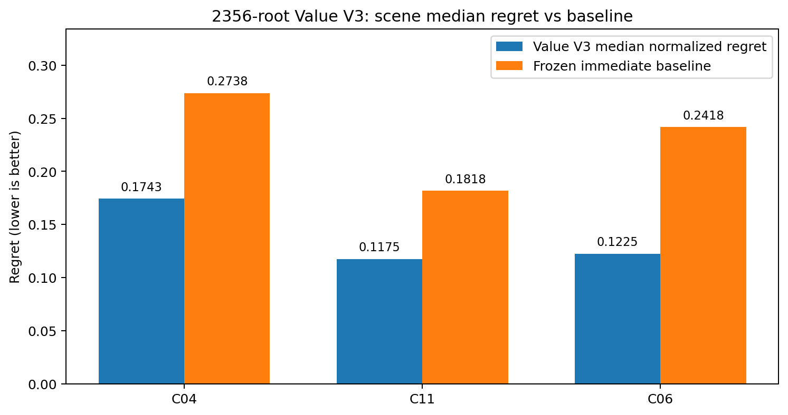

**MineSim-Dynamic**

**Value V3（2356-root episode-aware LOSO）**

**神经网络阶段性交接文档**

**训练技术与科学结果已确认；最终 postexec closure sidecar 状态待核验**

| 证据截点     | 2026-08-25                                              |
|--------------|---------------------------------------------------------|
| 当前真实状态 | 9-fold 训练 RC=0；3/3 scene win；DEVELOPMENT_READY=True |
| 不可越过边界 | 不得重跑训练；不得 best-seed/retune；不得接入 MCTS      |
| 唯一未确认项 | closure 脚本已执行但交接时未取得终端输出或 closure 日志 |

交接版本：V1 \| 适用对象：后续 ChatGPT / Codex / 项目执行人员

# 0. 一页接手摘要

当前神经网络线已经完成 2356-root episode-aware 数据扩展、固定 LOSO 协议、逐 fold normalization 冻结、一次性授权、9-fold 正式训练和技术/科学结果读取。最新训练是一次性正式执行，授权已经消费，绝对不得重跑。

| **对象**                | **状态**              | **当前含义**                                                                        |
|-------------------------|-----------------------|-------------------------------------------------------------------------------------|
| 2356-root 数据集        | **FROZEN PASS**       | 2356 roots、37696 action rows、6 episodes；旧 2052 前缀 bit-exact 保留。            |
| Value V3 模型与训练协议 | **FROZEN**            | 12→64→64→16；pairwise objective；3 seeds；600 epochs；LR=0.001。                    |
| LOSO normalization      | **FROZEN PASS**       | 每个 heldout scene 仅用 train roots 的 pooled mean/std；3 folds 数值及 SHA 已冻结。 |
| 一次性训练授权          | **CONSUMED**          | START 已创建，attempt 1 已消费；自动 retry 禁止。                                   |
| 训练技术结果            | **PASS**              | runner_rc=0；9 checkpoints + 9 predictions + 1 summary；stderr 为空。               |
| 训练科学结果            | **3/3 PASS**          | C04/C11/C06 的 3-seed median normalized regret 均优于 frozen immediate baseline。   |
| Value V3 readiness      | **DEVELOPMENT READY** | 可冻结为 development candidate；尚不是独立泛化或生产结论。                          |
| 最终 closure sidecar    | **待确认**            | 用户已执行 closure 脚本，但交接时没有终端 RC/LOG，不能擅自标记 FROZEN_PASS。        |
| MCTS Value integration  | **FALSE / FORBIDDEN** | 必须先完成全新独立场景预注册和盲评；当前不得接入。                                  |

## 当前真实停点

已确认到：postexec technical closure preflight 完成，训练技术 PASS、科学 3/3 PASS、summary SHA 已固定。

未确认到：\`expanded_2356_postexec_closure_v1\` 是否已经成功生成并原子发布。用户说明已执行 closure 脚本但没有输出；由于该脚本将详细输出重定向到日志，仅在结束后打印 RC/LOG，沉默本身不能证明成功或失败。

若 closure 最终 PASS，下一唯一 Gate 是：\`PREREGISTER_BRAND_NEW_INDEPENDENT_SCENE_FOR_VALUE_V3\`。资源应为 LOW。

## 最重要的接管纪律

- 绝对不要重新运行 \`run_2356_one_time_training_execution_start_and_run.sh\`；attempt 1 已消费。

- 不要从 9 个 checkpoint 中做 best-seed selection，不要根据当前结果重调 seed、epoch、LR、loss、scene weight 或 normalization。

- 不要把 DEVELOPMENT_READY 解释为独立泛化、生产可用或可接入 MCTS。

- 不要切换 torch/conda 环境；正式运行后端已冻结为 minesim Python 3.9.25 + torch 2.8.0+cpu + HIGH-CPU 80GB/15CPU。

- 不要破坏 episode identity=(scene, episode_uid, root_step)，尤其 C11 的两个 0..889 episode 不得 flatten。

# 1. 本阶段目标、研究边界与结论口径

## 1.1 本阶段目标

在不改变 Value V3 架构、pairwise objective、训练 seeds、epochs、学习率、scene-balanced weighting 和 LOSO split 的前提下，通过新增 C04 seed5 与 C06 seed1 两个独立 development episode，增加 heldout C11 时可进入训练的 C04/C06 coverage，并检验 C11 泛化是否改善。

## 1.2 当前可以说的结论

- 2356-root 训练链技术完整：9/9 folds 均产出 checkpoint 与 prediction，runner_rc=0。

- 在 frozen development protocol 下，C04、C11、C06 三个场景的 3-seed median normalized regret 均低于各自 immediate baseline，primary gate 与 secondary gate 均 PASS。

- 新增 C04/C06 coverage 对 heldout C11 的训练支持从 272 roots 增至 576 roots；本轮 C11 median regret 下降到 0.1174589567，并通过 baseline gate。

- Value V3 可被称为“development candidate ready”，但仍需全新的、未参与设计/训练的 independent scene 预注册与盲评。

## 1.3 当前不能说的结论

- 不能宣称独立场景泛化已经完成。

- 不能宣称生产可用、MCTS 可接入或安全性已证明。

- 不能从当前 9 个 LOSO checkpoint 中挑选“最好 seed”作为最终模型。

- 不能把 9 个 fold-specific checkpoint 当作一个已经训练完成的 all-scene deployment model；当前没有冻结的全 development scene 最终模型。

# 2. 2356-root episode-aware 数据集

数据集路径：

| /root/autodl-tmp/paper1_value_v3_development_only_v1/expanded_2356_development_input_v1/paper1_value_v3_expanded_2356_episode_aware_root_dataset_v1.npz |
|---------------------------------------------------------------------------------------------------------------------------------------------------------|

## 2.1 总体规模

| **指标**        | **数值**   | **冻结语义**         | **备注**                               |
|-----------------|------------|----------------------|----------------------------------------|
| Root count      | 2356       | ONE_MCTS_ROOT_SEARCH | 每 root 对应一个 MCTS root search      |
| Action rows     | 37696      | 2356 × 16            | 每 root 16 个 joint actions            |
| State shape     | (2356, 12) | float32              | 冻结 12-D root-state features          |
| Q shape         | (2356, 16) | float32              | joint_index=A\*4+B                     |
| Immediate shape | (2356, 16) | float32              | 与 Q 同动作列顺序                      |
| Episode count   | 6          | episode-aware        | identity=(scene,episode_uid,root_step) |

## 2.2 Episode 组成

| **Scene** | **Episode UID**    | **Roots** | **角色**                  |
|-----------|--------------------|-----------|---------------------------|
| C04       | C04_FROZEN_EP0     | 126       | 历史冻结 episode          |
| C04       | C04_SEED5_EP1      | 148       | 新增独立 coverage episode |
| C11       | C11_80M_SEED0_EP0  | 890       | 80 m 独立 episode         |
| C11       | C11_100M_SEED0_EP1 | 890       | 100 m 独立 episode        |
| C06       | C06_FROZEN_EP0     | 146       | 历史冻结 episode          |
| C06       | C06_SEED1_EP1      | 156       | 新增独立 coverage episode |

## 2.3 Scene 统计与 LOSO 支持

| **Heldout scene** | **Train roots** | **Validation roots** | **Train episodes** | **Validation episodes** |
|-------------------|-----------------|----------------------|--------------------|-------------------------|
| C04               | 2082            | 274                  | 4                  | 2                       |
| C11               | 576             | 1780                 | 4                  | 2                       |
| C06               | 2054            | 302                  | 4                  | 2                       |

关键说明：heldout C11 时，所有 C11 episode 都不进入训练；新增的 304 roots 全部来自 C04 seed5 与 C06 seed1，因此将 C11-fold 的训练支持从 272 提升到 576。

# 3. Value V3 模型与训练协议

## 3.1 网络结构

| **项目**              | **冻结值**                                               |
|-----------------------|----------------------------------------------------------|
| 模型类型              | ActionConditionedValueV3PairwiseRank                     |
| 输入维度              | 12                                                       |
| 网络结构              | 12 → 64 → 64 → 16                                        |
| 输出语义              | 16 个 joint-action scores                                |
| 动作索引              | joint_index = A\*4 + B                                   |
| 训练目标              | ROOT_NORMALIZED_WEIGHTED_PAIRWISE_LOGISTIC               |
| Scene weighting       | 各 train scene 内 root mean，再对 train scenes 等权 mean |
| Split                 | LEAVE_ONE_SCENE_OUT                                      |
| Seeds                 | 20260824 / 20260825 / 20260826                           |
| Epochs                | 600                                                      |
| Learning rate         | 0.001                                                    |
| Best-seed selection   | False                                                    |
| Hyperparameter search | False                                                    |

## 3.2 12 个冻结特征

| **Index** | **Feature name**          | **语义位置**                                          |
|-----------|---------------------------|-------------------------------------------------------|
| 0         | A_speed_mps               | root_state.vehicles.A.speed_mps                       |
| 1         | B_speed_mps               | root_state.vehicles.B.speed_mps                       |
| 2         | A_accel_mps2              | root_state.vehicles.A.accel_mps2                      |
| 3         | B_accel_mps2              | root_state.vehicles.B.accel_mps2                      |
| 4         | A_remaining_to_conflict_m | root_state.vehicles.A.remaining_to_conflict_m         |
| 5         | B_remaining_to_conflict_m | root_state.vehicles.B.remaining_to_conflict_m         |
| 6         | delta_v_abs_mps           | root_state.pair_features.delta_v_abs_mps              |
| 7         | delta_heading_abs_rad     | root_state.pair_features.delta_heading_abs_rad        |
| 8         | delta_heading_over_pi     | root_state.pair_features.delta_heading_over_pi        |
| 9         | I_Omega_app_AND           | root_state.pair_features.pair_indicator_AND.Omega_app |
| 10        | I_Omega_int_AND           | root_state.pair_features.pair_indicator_AND.Omega_int |
| 11        | alpha3                    | root_state.pair_features.alpha3                       |

# 4. LOSO normalization 冻结

真实训练代码中的公式已经通过 AST 提取并冻结：

<table>
<colgroup>
<col style="width: 100%" />
</colgroup>
<thead>
<tr class="header">
<th>mean = Xtr.mean(axis=0) 
std = Xtr.std(axis=0) 
std[std &lt;= 1e-12] = 1.0</th>
</tr>
</thead>
<tbody>
</tbody>
</table>

三个 fold 中索引 \[2,3\]（A/B acceleration）在 train roots 中标准差为 0，因此按冻结 guard 被置为 1.0。Normalization 仅使用 train roots，且对三个 seed 完全相同。

| **Heldout** | **Train** | **Val** | **Mean SHA**                                                     | **Std SHA**                                                      | **Adjusted** |
|-------------|-----------|---------|------------------------------------------------------------------|------------------------------------------------------------------|--------------|
| C04         | 2082      | 274     | a3756dc9a3c48fbf917ff7580b83c4e7c7b07f2bae6f8e9c925ee4a75205d9d3 | 3f106e59f81d09258df7216a68bcff654f6d7ac7529b7e97c7cd3da168979ee0 | \[2,3\]      |
| C11         | 576       | 1780    | d3997c2e69f729065f9832d3b2e7f77e38d8b9d5a0c4ca5a32c9ece2ca169bb2 | b37d206eae2c8dc8e58208329b8e6c5a8adbdc67f7568dfdfeb570375d3f38fd | \[2,3\]      |
| C06         | 2054      | 302     | 61128e9eecb44d0404772ac0f48160b3a3cb5b6a05e83fcd7d12b10014de321f | b0769ea38ea2b81074e2ce775336faef1b616ba689ae9edd7b7d64749264f606 | \[2,3\]      |

# 5. 一次性授权、资源策略与执行链

## 5.1 资源策略修正

最初 authorization 资源标签写为 HIGH_GPU；runtime preflight 发现 minesim 环境为 torch 2.8.0+cpu。为避免在科学协议冻结后引入新的 CUDA 数值后端，已通过 clarification sidecar 将实际执行资源改为 HIGH_CPU：使用高资源实例的 80GB RAM 与 15 CPU，但保持 CUDA_VISIBLE_DEVICES=""、torch 2.8.0+cpu，不安装/切换 torch。

## 5.2 一次性授权状态

| **字段**                  | **最终状态** |
|---------------------------|--------------|
| Attempt number            | 1            |
| Authorization created     | True         |
| Authorization consumed    | True         |
| START created             | True         |
| Process launched          | True         |
| Automatic retry forbidden | True         |
| Retry authorized          | False        |
| MCTS Value integration    | False        |

固定执行命令：

<table>
<colgroup>
<col style="width: 100%" />
</colgroup>
<thead>
<tr class="header">
<th>/root/miniconda3/envs/minesim/bin/python -u \ 
/root/autodl-tmp/paper1_value_v3_development_only_v1/expanded_2356_harness_static_v1/paper1_value_v3_pairwise_rank_training_pipeline_expanded_2356_v1.py \ 
--execute-development \ 
--authorization-lock /root/autodl-tmp/paper1_value_v3_development_only_v1/expanded_2356_execution_preflight_v1/PAPER1_VALUE_V3_EXPANDED_2356_DEVELOPMENT_TRAINING_COMPAT_AUTHORIZATION_LOCK_V1.json</th>
</tr>
</thead>
<tbody>
</tbody>
</table>

# 6. 正式训练技术结果

| **项目**                  | **结果** | **说明**                                         |
|---------------------------|----------|--------------------------------------------------|
| Runner RC                 | 0        | 技术执行完成                                     |
| Result files              | 19       | 9 checkpoint + 9 prediction + 1 summary          |
| Checkpoint count          | 9        | 3 scenes × 3 seeds                               |
| Prediction NPZ count      | 9        | 每个 fold 1 个                                   |
| Summary count             | 1        | PAPER1_VALUE_V3_DEVELOPMENT_LOSO_SUMMARY_V1.json |
| Runner stderr             | 0 bytes  | SHA=e3b0c442...（空文件）                        |
| Derived process after run | ABSENT   | 无残留训练进程                                   |

## 6.1 结果目录结构

<table>
<colgroup>
<col style="width: 100%" />
</colgroup>
<thead>
<tr class="header">
<th>expanded_2356_development_execution_v1/ 
├─ PAPER1_VALUE_V3_DEVELOPMENT_LOSO_SUMMARY_V1.json 
├─ seed_20260824_heldout_C04/{checkpoint.pt,predictions.npz} 
├─ seed_20260824_heldout_C11/{checkpoint.pt,predictions.npz} 
├─ seed_20260824_heldout_C06/{checkpoint.pt,predictions.npz} 
├─ seed_20260825_heldout_C04/{checkpoint.pt,predictions.npz} 
├─ seed_20260825_heldout_C11/{checkpoint.pt,predictions.npz} 
├─ seed_20260825_heldout_C06/{checkpoint.pt,predictions.npz} 
├─ seed_20260826_heldout_C04/{checkpoint.pt,predictions.npz} 
├─ seed_20260826_heldout_C11/{checkpoint.pt,predictions.npz} 
└─ seed_20260826_heldout_C06/{checkpoint.pt,predictions.npz}</th>
</tr>
</thead>
<tbody>
</tbody>
</table>

# 7. 科学结果：3/3 scene win

评价口径：每个 heldout scene 取 3 个固定 seed 的 normalized regret 中位数，并与训练前冻结的 immediate baseline 比较；regret 越低越好。

| **Scene** | **Seed 20260824** | **Seed 20260825** | **Seed 20260826** | **Median**  | **Frozen baseline** | **Win** | **相对改善** | **结论**           |
|-----------|-------------------|-------------------|-------------------|-------------|---------------------|---------|--------------|--------------------|
| C04       | 0.181987592       | 0.155618844       | 0.174277542       | 0.174277542 | 0.273804418         | PASS    | 36.35%       | median \< baseline |
| C11       | 0.116699341       | 0.120093067       | 0.117458957       | 0.117458957 | 0.181778548         | PASS    | 35.38%       | median \< baseline |
| C06       | 0.088145494       | 0.128795213       | 0.122468490       | 0.122468490 | 0.241806713         | PASS    | 49.35%       | median \< baseline |

图1 2356-root Value V3 各场景 median normalized regret 与 frozen immediate baseline

## 7.1 Gate 结果

- VALUE_V3_SCENE_WIN_COUNT = 3

- VALUE_V3_PRIMARY_GATE_PASS = True

- VALUE_V3_SECONDARY_GATE_PASS = True

- VALUE_V3_DEVELOPMENT_READY = True

- DECISION = FREEZE_VALUE_V3_DEVELOPMENT_CANDIDATE_AND_PREREGISTER_BRAND_NEW_INDEPENDENT_SCENE

## 7.2 结果解释

最关键变化发生在 C11：此前 development chain 的主要失败点是 heldout C11；补充 C04/C06 coverage 后，C11 三个固定 seed 均明显优于 baseline，median=0.1174589567。C04 与 C06 也继续通过。

平均 scene median regret = 0.1380683293；平均 frozen baseline = 0.2324632267。该结果支持将本轮协议冻结为 development candidate，但不能替代全新独立场景验证。

数值细节：训练前 baseline freeze 与 runner stdout 中的 immediate 值存在约 10^-10 量级差异，这是 float/序列化路径差异，不应被解释为 protocol drift。交接时应同时保留 baseline freeze SHA 与 runner summary SHA。

# 8. 当前唯一未确认项：最终 postexec closure sidecar

用户已执行：

| /root/autodl-tmp/run_2356_postexec_technical_and_scientific_closure.sh |
|------------------------------------------------------------------------|

但交接时反馈“没有输出”。该 closure 脚本将所有详细输出重定向到 \`/root/autodl-tmp/2356_POSTEXEC_TECHNICAL_AND_SCIENTIFIC_CLOSURE\_\<timestamp\>.txt\`，只在脚本结束后向终端打印 RC 和 LOG，因此无输出可能表示：仍在运行、已结束但终端未刷新、或在最终 echo 前异常退出。

## 8.1 接手后先做的只读检查

<table>
<colgroup>
<col style="width: 100%" />
</colgroup>
<thead>
<tr class="header">
<th>ps -eo pid,etime,%cpu,%mem,cmd \ 
| grep -F 'run_2356_postexec_technical_and_scientific_closure.sh' \ 
| grep -v grep || true 
 
echo '--- closure logs ---' 
find /root/autodl-tmp -maxdepth 1 \ 
-name '2356_POSTEXEC_TECHNICAL_AND_SCIENTIFIC_CLOSURE_*.txt' \ 
-printf '%TY-%Tm-%Td %TH:%TM:%TS %p 
' | sort 
 
echo '--- closure root ---' 
ls -la /root/autodl-tmp/paper1_value_v3_development_only_v1/expanded_2356_postexec_closure_v1 2&gt;/dev/null || true</th>
</tr>
</thead>
<tbody>
</tbody>
</table>

## 8.2 分支处理

| **观测**                  | **判定**           | **动作**                                                             |
|---------------------------|--------------------|----------------------------------------------------------------------|
| 有 closure 进程           | 脚本仍在执行       | 等待；不要再次启动。                                                 |
| 无进程；closure root 存在 | 可能已发布         | 运行 sha256sum -c，读取 closure JSON status/next_gate；不要重建。    |
| 无进程；有日志、无 root   | 脚本可能失败       | 上传日志，按 sidecar technical failure 处理；训练结果本身不失效。    |
| 无进程；无日志、无 root   | 脚本可能未真正启动 | 确认 namespace 后，可重新执行 closure sidecar 一次；这不是训练重跑。 |

重要边界：即使 closure sidecar 未生成，已经存在的 START、CAPTURE、19 个结果文件和 summary 仍是有效 evidence。不得因为 sidecar 问题重跑训练。

# 9. closure PASS 后的下一阶段

## 9.1 下一 Gate

| PREREGISTER_BRAND_NEW_INDEPENDENT_SCENE_FOR_VALUE_V3 |
|------------------------------------------------------|

推荐资源：LOW。先做场景候选、盲选规则、数据采集协议、模型使用方式、评价指标和 one-time 边界的预注册，不应直接开始仿真或训练。

## 9.2 仍需在预注册中明确的事项

- 全新 independent scene 的身份与选择规则；不得从已看过结果的场景中按表现挑选。

- 独立场景的数据采集 unit、root/action schema、episode 数量、seed、budget/depth/dt 和 one-time retry 边界。

- 如何将当前 9 个 fold-specific checkpoints 映射到独立场景评价；当前没有冻结的 all-scene final model，不能临时挑最好 seed。

- 是否需要在全部 development scenes 上按固定协议训练 final candidate；如需要，必须先预注册，不能根据独立场景结果反向设计。

- 独立评价仍应使用 frozen exact metric closure；baseline、seed aggregation 和 PASS/FAIL gate 必须在执行前冻结。

- 独立验证完成前，MCTS_VALUE_INTEGRATION 必须保持 False。

# 10. 关键路径速查

| **对象**               | **路径**                                                                                                                                                 |
|------------------------|----------------------------------------------------------------------------------------------------------------------------------------------------------|
| 正式 repo              | /root/MineSim-Dynamic                                                                                                                                    |
| Value V3 evidence root | /root/autodl-tmp/paper1_value_v3_development_only_v1                                                                                                     |
| 2356 dataset           | /root/autodl-tmp/paper1_value_v3_development_only_v1/expanded_2356_development_input_v1/paper1_value_v3_expanded_2356_episode_aware_root_dataset_v1.npz  |
| derived harness        | /root/autodl-tmp/paper1_value_v3_development_only_v1/expanded_2356_harness_static_v1/paper1_value_v3_pairwise_rank_training_pipeline_expanded_2356_v1.py |
| 训练结果 root          | /root/autodl-tmp/paper1_value_v3_development_only_v1/expanded_2356_development_execution_v1                                                              |
| START/CAPTURE evidence | /root/autodl-tmp/paper1_value_v3_development_only_v1/expanded_2356_training_execution_evidence_v1                                                        |
| 目标 closure root      | /root/autodl-tmp/paper1_value_v3_development_only_v1/expanded_2356_postexec_closure_v1                                                                   |
| closure 脚本           | /root/autodl-tmp/run_2356_postexec_technical_and_scientific_closure.sh                                                                                   |

# 11. 永久禁忌与不可回退项

- 禁止重跑 2356 one-time 训练。

- 禁止删除或覆盖 START.json、CAPTURE.json、runner stdout/stderr/rc、9 checkpoints、9 predictions、summary。

- 禁止 best-seed selection、retry for better science、超参搜索或 post-hoc threshold 调整。

- 禁止修改 2356 dataset、episode UID、root_step、feature order、joint-action order 或 normalization 数值。

- 禁止把 base prereg 与 expanded prereg 的 SHA 混为一个 auth binding。

- 禁止切换到 base/mappolce CUDA torch 环境来重跑当前训练。

- 禁止在 brand-new independent scene 预注册前查看/筛选候选场景表现。

- 禁止将 DEVELOPMENT_READY 直接转写为 MCTS integration authorized。

# 12. 关键 SHA 与冻结对象

| **对象**                    | **相对路径/位置**                                                                       | **SHA256**                                                       | **状态/意义**                                  |
|-----------------------------|-----------------------------------------------------------------------------------------|------------------------------------------------------------------|------------------------------------------------|
| Git HEAD                    | /root/MineSim-Dynamic                                                                   | 112d2bd0f3412fc83b13d5587d2b41402d2d0f5e                         | 当前正式 repo HEAD                             |
| 2356 dataset                | expanded_2356_development_input_v1/...root_dataset_v1.npz                               | 106936a30e4c55b10b7968de2534e822c262db50c21494cca354700d78a70a27 | 2356 roots / 37696 action rows                 |
| Dataset manifest            | expanded_2356_development_input_v1/...MANIFEST_V1.json                                  | 0828fe303cfef86bd35144a31bb4e62022a9f3ac5521abec71f46a14c401a1ea | 6 episodes                                     |
| Dataset freeze              | expanded_2356_development_input_v1/...FREEZE_V1.json                                    | fe6652e6057f95c0113d7594cce8bb1b6e5e3b457fbdee3ba7c4981c8662c12d | FROZEN_PASS                                    |
| Build contract              | expanded_2356_adapter_build_contract_v1/...CONTRACT_V1.json                             | 9c5ea534dd4388d6d6ea3274bfb23a67bcbd45887b99fa3602570088e2bbb3f3 | 旧 2052 前缀 bit-exact                         |
| Baseline freeze             | expanded_2356_baseline_harness_derivation_contract_v1/...BASELINE_FREEZE_V1.json        | 97194bcb671953cf44f4c8741712f840b75fde4d0a04077af6b6bf3d0da6abee | 训练前 immediate baseline                      |
| Harness derivation contract | expanded_2356_baseline_harness_derivation_contract_v1/...DERIVATION_CONTRACT_V1.json    | 1d2d816821e06a876ca436a51a0cf2be8ea6aa0e41686793618a5b5576b80d03 | 10 项授权变更                                  |
| 2356 preregistration        | expanded_2356_harness_static_v1/...PREREGISTRATION_V1.json                              | 3a34fbc2dc2769cb4eb82a3c78ca3d4ef96417ef98399262ef70798f4ec8866b | 固定 9 folds                                   |
| Derived harness             | expanded_2356_harness_static_v1/...expanded_2356_v1.py                                  | 753bcf28eb689a86291b55e8c6c9f8578e9333c978cbd3253743c747ebfd400c | 算法核心 byte-exact                            |
| Static lock                 | expanded_2356_harness_static_v1/...STATIC_DERIVATION_V1.json                            | 5c0f062004d75da65bca1a4bb7f658292cbe5875717e01ae9fc6e449d47af16c | STATIC_DERIVATION_PASS                         |
| Compat lock                 | expanded_2356_execution_preflight_v1/...COMPAT_AUTHORIZATION_LOCK_V1.json               | ce1cc8040444c16b7c3a64268d767bb15b1905a4b8a5ff2e10a65550dcaecc2c | legacy internal admission                      |
| Execution preauth           | expanded_2356_execution_preflight_v1/...EXECUTION_PREAUTH_V1.json                       | 6d83cf94c10e10068ec6f5ea4e08d8d1f86fa3bd02702e824832cdaddcdce3bf | 固定 exact command                             |
| Normalization freeze        | expanded_2356_loso_normalization_v1/...NORMALIZATION_FREEZE_V1.json                     | 07bae9789890c0dcc6e6e2c8899615d81778cc32fe6ffa600f4a0ea76ea0b2ee | 3 folds pooled train mean/std                  |
| Resource clarification      | expanded_2356_runtime_resource_clarification_v1/...CLARIFICATION_V1.json                | 511e95f92ee63ff6f8cd1a7d8fbb21d5dc3aa679195363641361f7f3e74b238b | HIGH_GPU -\> HIGH_CPU                          |
| One-time authorization      | expanded_2356_execution_authorization_v1/...AUTHORIZATION_V1.json                       | 8ba25e43866a87030c6e6b2328c3035e74802f5db5c98e6758fab112ecff3a78 | 已消费；禁止重跑                               |
| START                       | expanded_2356_training_execution_evidence_v1/START.json                                 | d9d08b25621c9a00f9d9a2892a49e8a9b3aeed297326aac9d2f2573a21dede95 | attempt 1 已开始                               |
| CAPTURE                     | expanded_2356_training_execution_evidence_v1/CAPTURE.json                               | ce5b6e4c873388d97e1e7d9c2c7e63eac0d27dd2ae227f3052a4b2311b4847f8 | runner_rc=0                                    |
| Runner stdout               | expanded_2356_training_execution_evidence_v1/runner_stdout.txt                          | c533811495147512990fbfa765294f5c3a59be51951b1c48f166d2fd816641ec | 9 folds + science gate                         |
| Runner stderr               | expanded_2356_training_execution_evidence_v1/runner_stderr.txt                          | e3b0c44298fc1c149afbf4c8996fb92427ae41e4649b934ca495991b7852b855 | 空文件                                         |
| Runner RC                   | expanded_2356_training_execution_evidence_v1/runner_rc.txt                              | 9a271f2a916b0b6ee6cecb2426f0b3206ef074578be55d9bc94f6f3fe3ab86aa | 内容 0                                         |
| LOSO summary                | expanded_2356_development_execution_v1/PAPER1_VALUE_V3_DEVELOPMENT_LOSO_SUMMARY_V1.json | 87302b40142043bcce413d268543c21b51be0a5b8052b921c6260294e63dfccc | 3/3 PASS                                       |
| Final postexec closure      | expanded_2356_postexec_closure_v1/...CLOSURE_V1.json                                    | 未确认                                                           | 用户已执行 closure 脚本但交接时未取得输出/日志 |

# 附录 A. 三个 LOSO fold 的完整 normalization 数值

以下数组顺序与 12 个 feature_names 完全一致。精确审计以 content SHA 为准。

## A.C04 heldout

Train roots=2082；Validation roots=274；Adjusted std indices=\[2,3\]。

<table>
<colgroup>
<col style="width: 100%" />
</colgroup>
<thead>
<tr class="header">
<th>feature_mean = [2.081315279006958, 1.9971650838851929, 0.0, 0.0, 14.017745018005371, 22.708309173583984, 0.416186660528183, 2.68290638923645, 0.8540025949478149, 0.9755043387413025, 0.8045148849487305, 2.7800192832946777] 
 
feature_std = [3.581676483154297, 3.5724732875823975, 1.0, 1.0, 25.72699737548828, 22.633094787597656, 1.0665963888168335, 0.16170112788677216, 0.05147096514701843, 0.15458011627197266, 0.39657139778137207, 0.4696648120880127] 
 
mean_sha = a3756dc9a3c48fbf917ff7580b83c4e7c7b07f2bae6f8e9c925ee4a75205d9d3 
std_sha = 3f106e59f81d09258df7216a68bcff654f6d7ac7529b7e97c7cd3da168979ee0</th>
</tr>
</thead>
<tbody>
</tbody>
</table>

## A.C11 heldout

Train roots=576；Validation roots=1780；Adjusted std indices=\[2,3\]。

<table>
<colgroup>
<col style="width: 100%" />
</colgroup>
<thead>
<tr class="header">
<th>feature_mean = [8.010936737060547, 8.315973281860352, 0.0, 0.0, 34.27864074707031, 33.218360900878906, 2.4321212768554688, 2.393312931060791, 0.7618144750595093, 0.9114583134651184, 0.375, 2.2864582538604736] 
 
feature_std = [2.6370410919189453, 2.3611624240875244, 1.0, 1.0, 35.789710998535156, 38.066280364990234, 2.2182161808013916, 0.6072746515274048, 0.19330143928527832, 0.2840806245803833, 0.4841229319572449, 0.6176433563232422] 
 
mean_sha = d3997c2e69f729065f9832d3b2e7f77e38d8b9d5a0c4ca5a32c9ece2ca169bb2 
std_sha = b37d206eae2c8dc8e58208329b8e6c5a8adbdc67f7568dfdfeb570375d3f38fd</th>
</tr>
</thead>
<tbody>
</tbody>
</table>

## A.C06 heldout

Train roots=2054；Validation roots=302；Adjusted std indices=\[2,3\]。

<table>
<colgroup>
<col style="width: 100%" />
</colgroup>
<thead>
<tr class="header">
<th>feature_mean = [1.8459126949310303, 1.7938182353973389, 0.0, 0.0, 11.025136947631836, 19.589134216308594, 0.5169893503189087, 2.655712127685547, 0.8453451991081238, 0.9639727473258972, 0.8261927962303162, 2.790165424346924] 
 
feature_std = [3.2754883766174316, 3.2595417499542236, 1.0, 1.0, 21.242685317993164, 19.228151321411133, 1.3380337953567505, 0.35013478994369507, 0.11145123839378357, 0.1863568127155304, 0.3789476156234741, 0.4877120554447174] 
 
mean_sha = 61128e9eecb44d0404772ac0f48160b3a3cb5b6a05e83fcd7d12b10014de321f 
std_sha = b0769ea38ea2b81074e2ce775336faef1b616ba689ae9edd7b7d64749264f606</th>
</tr>
</thead>
<tbody>
</tbody>
</table>

# 附录 B. 新 AI 接管时的 10 项快速检查

**1.** 确认 HEAD=112d2bd0f3412fc83b13d5587d2b41402d2d0f5e 且 tracked git clean。

**2.** 确认 START_SHA=d9d08b... 与 CAPTURE_SHA=ce5b6e...。

**3.** 确认 runner_rc=0、stderr=0 bytes。

**4.** 确认 result root 中 19 个文件完整。

**5.** 确认 summary SHA=87302b...。

**6.** 确认 C04/C11/C06 scene win count=3。

**7.** 确认 authorization consumed=True、retry_authorized=False。

**8.** 确认 closure sidecar 是否已发布；未确认前不要声明 closure gate PASS。

**9.** 确认 MCTS_VALUE_INTEGRATION=False。

**10.** closure PASS 后只进入全新 independent scene 的预注册，不直接开始新训练。
