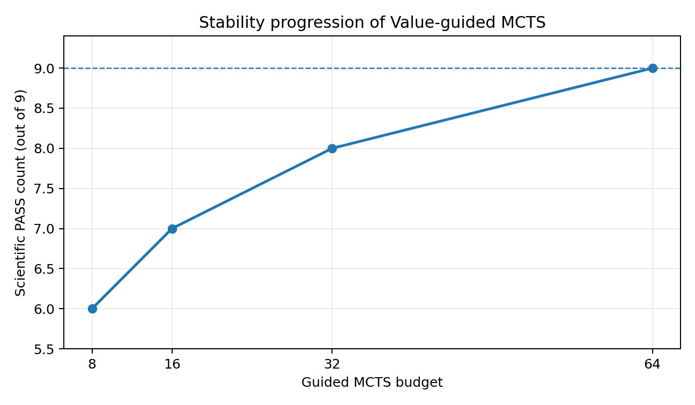
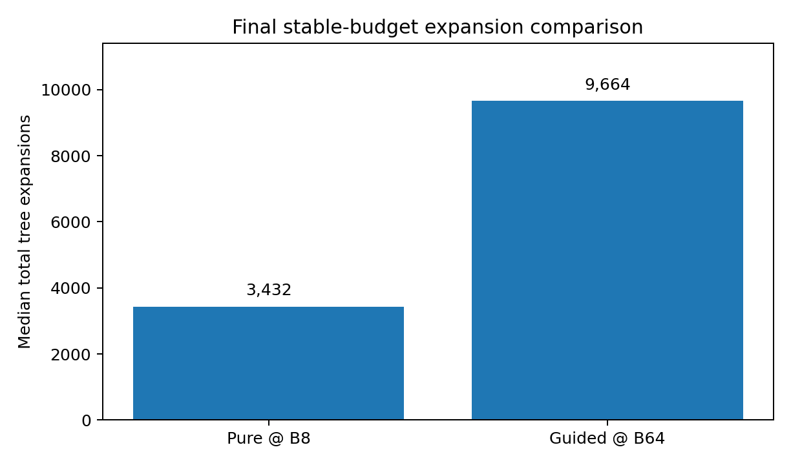

**MineSim-Dynamic**

**全项目最终交接与 AI 无缝接管手册**

Value-guided MCTS 闭环完成、问题复盘、经验教训与数据盘文件整理终版

**最终停止点：Guided B64 9/9 PASS；稳定预算与系统效率结论均已冻结**

| **项目**          | **当前状态**                                                            |
|-------------------|-------------------------------------------------------------------------|
| **文档版本**      | V1.0 · 终版交接                                                         |
| **完成日期**      | 2026-08-30（服务器/会话日期）                                           |
| **当前 Git HEAD** | 112d2bd0f3412fc83b13d5587d2b41402d2d0f5e                                |
| **主环境**        | conda: minesim · Python 3.9.25 · CPU-only · OMP_NUM_THREADS=1           |
| **当前结论**      | Value V3 独立排序有效；root-order-only 接入在系统层面为负收益           |
| **数据盘整理**    | 顶层项目由 746 项压缩到 23 项；仅删除 \_\_pycache\_\_，其余均为可逆移动 |

用途：交接给下一位研究者、工程师或 AI；避免重复实验、误删证据、错误重跑与口径漂移。

# 文档控制与使用说明

<table>
<colgroup>
<col style="width: 100%" />
</colgroup>
<thead>
<tr class="header">
<th>
<strong>权威停止点</strong>

本次 Value-guided MCTS 的预注册预算阶梯 [8, 16, 32, 64] 已全部完成。Pure MCTS 在 B8 稳定；Guided MCTS 在 B64 才达到 9/9 稳定。最终扩展量和 outer-search wall-clock 均劣于 Pure B8。本实验分支已经 COMPLETE / FROZEN，不再继续 B128，也不允许回头挑 seed 重跑。
</th>
</tr>
</thead>
<tbody>
</tbody>
</table>

| **控制项**       | **说明**                                                                                                          |
|------------------|-------------------------------------------------------------------------------------------------------------------|
| **适用范围**     | MineSim-Dynamic 主线、Value V3、Value-guided MCTS B8/B16/B32/B64、最终效率判定、数据盘整理                        |
| **不覆盖内容**   | 不替代源代码注释；不把 FullMine 描述为官方生产级 HD Map；不把历史 Scientific FAIL 改写为技术故障                  |
| **优先证据**     | 最终 decision JSON \> 9-cell regression \> per-cell freeze \> START/CAPTURE/evidence/output manifests \> 便捷脚本 |
| **禁止事项**     | 禁止同条件重跑；禁止修改 frozen result；禁止选最好 model seed；禁止把 B8 的描述性收益包装为最终收益               |
| **后续新增工作** | 任何 confidence-gated / PUCT / selective expansion 等改进必须建立新 prereg、新 namespace、新实验分支              |

# 目录

- 1\. 一页式执行摘要

- 2\. 状态术语与证据优先级

- 3\. 项目长期主线与当前停止点

- 4\. 运行环境、权威路径与关键 SHA

- 5\. Value V3 模型、数据与独立验证

- 6\. 神经网络接入 MCTS 的真实机制与边界

- 7\. 预注册实验设计、治理流程与成熟运行模式

- 8\. B8/B16/B32/B64 完整进程与最终结果

- 9\. 最终科学结论与论文表述边界

- 10\. 关键问题、根因、解决办法与恢复策略

- 11\. 经验教训与成熟运行规范

- 12\. 当前交接状态、只读核验与可选下一研究分支

- 13\. 数据盘文件整理全过程、去向与影响（文档最后）

- 附录 A. 关键 SHA 与权威对象

- 附录 B. 9-cell 矩阵总表

- 附录 C. 接手者“绝对不要做”的事项

# 1. 一页式执行摘要

| **项目**            | **最终结论**                                                                   |
|---------------------|--------------------------------------------------------------------------------|
| **项目总体阶段**    | 当前 Value-guided MCTS 实验分支已 COMPLETE / FROZEN                            |
| **神经网络本身**    | Value V3 独立动作排序有效，C01 independent generalization PASS                 |
| **接入方式**        | 每个 root 一次 forward；只改变 depth=0 的 16 个 joint actions 展开顺序         |
| **稳定性**          | Guided B8=6/9，B16=7/9，B32=8/9，B64=9/9                                       |
| **最小稳定预算**    | Pure=8；Guided=64                                                              |
| **最终 expansions** | Pure B8 median=3432；Guided B64 median=9664（Guided 为 2.82 倍）               |
| **最终 wall-clock** | Pure B8 median=6763.01 ms；Guided B64 median=20098.90 ms（Guided 为 2.97 倍）  |
| **Primary claim**   | “Guided 以更低预算稳定” = Scientific FAIL                                      |
| **Secondary claim** | “Guided 在最终稳定预算上更省 expansions 和 wall-clock” = Scientific FAIL       |
| **通俗结论**        | 神经网络学到了东西，但当前 root-order-only 接法没有带来系统收益，反而干扰 MCTS |

<table>
<colgroup>
<col style="width: 100%" />
</colgroup>
<thead>
<tr class="header">
<th>
<strong>最重要的口径</strong>

不能说“神经网络完全没学到”；也不能说“神经网络提升了系统效率”。准确说法是：Value V3 的独立 ranking 信号成立，但 naive root-order-only integration 没有把该信号转化为闭环稳定性与效率优势。
</th>
</tr>
</thead>
<tbody>
</tbody>
</table>

最终判断不是由单格好坏决定，而是由完整预注册矩阵和稳定预算比较决定。B8 曾出现较低的描述性 expansions / wall-clock，但 B8 只有 6/9 PASS，因此不能用于最终效率 claim。只有 Guided 首次达到 9/9 的 B64 才能与 Pure 首次稳定的 B8 进行正式比较。

# 2. 状态术语与证据优先级

| **术语**                     | **交接定义**                                                                     |
|------------------------------|----------------------------------------------------------------------------------|
| **Technical PASS**           | 参数、身份、文件名、计数、manifest、环境与 budget closure 均正确；可以计入矩阵。 |
| **Scientific PASS**          | Technical PASS 且预注册质量谓词全部通过。                                        |
| **Scientific FAIL**          | Technical PASS，但任务质量谓词未全部通过；是真实科研负结果，必须计入矩阵并冻结。 |
| **Technical HOLD / FAILURE** | schema、路径、验证器、runner、环境或 evidence 链有问题；不得形成新科学结论。     |
| **AUTHORIZED_NOT_STARTED**   | one-time authorization 已发布，但 START 未写入；仍可安全 prestart。              |
| **START consumed**           | START_WRITTEN=True 后授权被消费；无论 SSH 是否中断，都不允许同条件再次执行。     |
| **FROZEN**                   | 结果已建立不可变 freeze、SHA 与 manifest；后续只能读取、聚合、引用，不得覆盖。   |
| **SUPERSEDED**               | 历史方案被后续证据覆盖，但仍保留 provenance，不等于可以删除。                    |

证据优先级必须固定。最终 decision JSON 是当前 scientific claim 的最上层来源；它下面是 frozen 9-cell regression，再下面是各 cell 的 freeze、START/CAPTURE、evidence/output manifests。顶层 shell/txt controller 只是生成与核验工具，不是最终结果本身。

# 3. 项目长期主线与当前停止点

| **阶段**                              | **状态**          | **当前真实结论**                                                          |
|---------------------------------------|-------------------|---------------------------------------------------------------------------|
| **MineSim 原项目复现**                | PASS / FROZEN     | IDM、replay、闭环基础与原始工程理解已完成，不需重做。                     |
| **Pure MCTS 接入**                    | PASS / FROZEN     | 真实 online closed-loop 的 search/reward/trajectory/controller 链已跑通。 |
| **单车与 FullMine**                   | PASS / FROZEN     | 代表性路线与地图链完成；FullMine 仍按 Research/DEV 口径。                 |
| **Fleet-MCTS / 双车冲突**             | PASS + 负结果并存 | 成功场景和 C11 安全死锁类负结果均保留。                                   |
| **多场景数据与神经数据链**            | PASS / FROZEN     | C04/C11/C06 development collection、2356-root 数据集与独立 C01。          |
| **Value V2**                          | CLOSED            | 独立验证失败，DO_NOT_INTEGRATE；不得回头重调以覆盖负结果。                |
| **Value V3**                          | INDEPENDENT PASS  | 模型级 ranking 能力成立。                                                 |
| **Value-guided MCTS root-order-only** | COMPLETE / FROZEN | B8/B16/B32/B64 全部完成；最终系统收益为负。                               |

长期主线可以用一句话串起来：MineSim 复现 → Pure MCTS → 单车闭环 → Fleet-MCTS → FullMine / 冲突 benchmark → 多场景数据 → Value V3 → Value-guided MCTS。当前停止点不是“模型还没接上”，而是“模型已经接上并完整跑完，但该接法在系统层面失败”。

# 4. 运行环境、权威路径与关键 SHA

| **对象**               | **当前值 / 路径**                                                             |
|------------------------|-------------------------------------------------------------------------------|
| **执行仓库**           | /root/MineSim-Dynamic                                                         |
| **数据盘项目目录**     | /root/autodl-tmp/MineSim-Dynamic（接手时先用 readlink -f 核验与执行仓库关系） |
| **Git HEAD**           | 112d2bd0f3412fc83b13d5587d2b41402d2d0f5e                                      |
| **Conda 环境**         | minesim                                                                       |
| **Python**             | 3.9.25                                                                        |
| **GPU**                | 当前流程按 CPU-only；CUDA_VISIBLE_DEVICES=""                                  |
| **OMP**                | OMP_NUM_THREADS=1，必须显式绑定                                               |
| **当前研究根目录**     | /root/autodl-tmp/paper1_value_v3_development_only_v1                          |
| **B64 最终结果根目录** | .../value_guided_mcts_c01_guided_b64_final9_stability_efficiency_v2           |

<table>
<colgroup>
<col style="width: 100%" />
</colgroup>
<thead>
<tr class="header">
<th>
<strong>仓库路径注意</strong>

执行日志使用 /root/MineSim-Dynamic；数据盘清单中还存在 /root/autodl-tmp/MineSim-Dynamic。交接后首次操作必须用 readlink -f、ls -ld 与 git rev-parse 核验两者是否为同一目录、链接或两份副本，避免在错误副本修改代码。
</th>
</tr>
</thead>
<tbody>
</tbody>
</table>

# 5. Value V3 模型、数据与独立验证

| **项目**              | **冻结值**                                              |
|-----------------------|---------------------------------------------------------|
| **Dataset**           | 2356 roots；37696 action rows；6 episodes               |
| **Identity**          | (scene, episode_uid, root_step)                         |
| **Input / Output**    | 12 维 root features → 16 个 joint-action scores         |
| **Architecture**      | 12 → 64 → 64 → 16；ActionConditionedValueV3PairwiseRank |
| **Objective**         | ROOT_NORMALIZED_WEIGHTED_PAIRWISE_LOGISTIC              |
| **Split**             | LEAVE_ONE_SCENE_OUT                                     |
| **Final model seeds** | 20260824 / 20260825 / 20260826                          |
| **Epochs / LR**       | 600 / 0.001                                             |
| **Best-seed / HPO**   | False / False（禁止事后挑最好模型）                     |

| **C01 独立评价对象**           | **结果**                                  |
|--------------------------------|-------------------------------------------|
| **Immediate baseline**         | 0.2951958615926099                        |
| **Model seed 20260824 regret** | 0.09947470394112914                       |
| **Model seed 20260825 regret** | 0.15596316637663826                       |
| **Model seed 20260826 regret** | 0.10583949665541333                       |
| **3-seed median regret**       | 0.10583949665541333 \< 0.2951958615926099 |
| **Classification**             | INDEPENDENT_GENERALIZATION_PASS           |

这部分证据说明 Value V3 不是随机噪声：它在独立 C01 上确实能比 immediate baseline 更好地排序动作价值。但该结论只支持“模型级 ranking 有效”，并不自动支持“接入 MCTS 后更稳定、更快或 production-ready”。

# 6. 神经网络接入 MCTS 的真实机制与边界

<table>
<colgroup>
<col style="width: 100%" />
</colgroup>
<thead>
<tr class="header">
<th>当前根状态 
-&gt; 提取冻结的 12D root features 
-&gt; Value V3 前向一次 
-&gt; 输出 16 个 joint-action scores 
-&gt; 只重排 depth=0 / root 的动作展开顺序 
-&gt; 后续 UCT / rollout / backup / reward / transition 全部保持原 MCTS</th>
</tr>
</thead>
<tbody>
</tbody>
</table>

| **机制边界**                                  | **冻结口径**                         |
|-----------------------------------------------|--------------------------------------|
| **每个 root forward 次数**                    | 1                                    |
| **改变内容**                                  | ROOT_DEPTH_ZERO_EXPANSION_ORDER_ONLY |
| **不做剪枝**                                  | 是                                   |
| **不替换 UCT**                                | 是                                   |
| **不使用 PUCT**                               | 是                                   |
| **不替换 rollout / backup**                   | 是                                   |
| **不修改 reward / transition / action space** | 是                                   |
| **不直接决定最终动作**                        | 是                                   |

<table>
<colgroup>
<col style="width: 100%" />
</colgroup>
<thead>
<tr class="header">
<th>
<strong>通俗类比</strong>

神经网络像“领航员”，只告诉 MCTS 先试哪几条路；MCTS 仍然自己搜索和决策。问题在于领航员有时会把错误路线排前，低预算下 MCTS 来不及纠正，高预算才逐步恢复稳定。
</th>
</tr>
</thead>
<tbody>
</tbody>
</table>

# 7. 预注册实验设计、治理流程与成熟运行模式

| **设计项**        | **冻结值**                                                             |
|-------------------|------------------------------------------------------------------------|
| **预算阶梯**      | \[8, 16, 32, 64\]                                                      |
| **Runtime seeds** | \[0, 1, 2\]                                                            |
| **Model seeds**   | \[20260824, 20260825, 20260826\]                                       |
| **每档矩阵**      | 3 × 3 = 9 cells                                                        |
| **稳定判据**      | 9/9 Scientific PASS；少一格也不能称 stable                             |
| **计入矩阵**      | Technical PASS 即计入；Scientific FAIL 也必须计入并冻结                |
| **禁止**          | 自动重试、同条件重跑、最好 seed 选择、post-hoc tuning、非预注册 budget |

成熟运行模式最终固定为两段式：

<table>
<colgroup>
<col style="width: 100%" />
</colgroup>
<thead>
<tr class="header">
<th>LOW controller: 
verify previous evidence/manifests 
-&gt; freeze current cell 
-&gt; publish state_v(N+1) 
-&gt; prepare next auth/preexec/wrapper 
-&gt; static checks + semantic AST 
-&gt; one final PRESTART_ONLY replay 
-&gt; STOP before START 
 
HIGH wrapper: 
exact SHA gate 
-&gt; START_WRITTEN=True / authorization consumed 
-&gt; launch exactly one runner process 
-&gt; capture technical/scientific result 
-&gt; publish evidence/output manifests 
-&gt; no automatic retry</th>
</tr>
</thead>
<tbody>
</tbody>
</table>

状态机只允许单向推进：UNPREPARED → AUTHORIZED_NOT_STARTED → STARTED → TECHNICAL_VALID_PASS / TECHNICAL_VALID_SCI_FAIL / TECHNICAL_FAILURE → FROZEN。任何 STARTED 条件都不得返回 AUTHORIZED_NOT_STARTED；任何 FROZEN 条件都不得重跑。

# 8. B8 / B16 / B32 / B64 完整进程与最终结果

四档预算保持神经网络、checkpoint、runner、features、root-order hook、runtime/model seeds 与质量谓词不变，唯一系统性变量是每个 root 的 MCTS budget。

表 8-1 Guided B8 9-cell 结果（6 PASS / 3 FAIL）

|               | **M20260824** | **M20260825** | **M20260826** |
|---------------|---------------|---------------|---------------|
| **Runtime 0** | **PASS**      | **FAIL**      | **PASS**      |
| **Runtime 1** | **PASS**      | **FAIL**      | **PASS**      |
| **Runtime 2** | **PASS**      | **FAIL**      | **PASS**      |

B8 的 3 个 FAIL 全部集中在 model seed 20260825。B8 的描述性中位 expansions 约 2640、outer-search wall-clock 约 6358 ms，表面优于 Pure B8，但因为只有 6/9 PASS，不能成为最终 efficiency claim。

表 8-2 Guided B16 9-cell 结果（7 PASS / 2 FAIL）

|               | **M20260824** | **M20260825** | **M20260826** |
|---------------|---------------|---------------|---------------|
| **Runtime 0** | **FAIL**      | **PASS**      | **PASS**      |
| **Runtime 1** | **FAIL**      | **PASS**      | **PASS**      |
| **Runtime 2** | **PASS**      | **PASS**      | **PASS**      |

B16 比 B8 多 1 个 PASS，但仍未达到 9/9；最终稳定性判定为 FAIL。B16 结果说明失败不再固定在单一 model seed，问题更像 learned ordering × runtime trajectory × finite budget 的耦合。

表 8-3 Guided B32 9-cell 结果（8 PASS / 1 FAIL）

|               | **M20260824** | **M20260825** | **M20260826** |
|---------------|---------------|---------------|---------------|
| **Runtime 0** | **PASS**      | **PASS**      | **PASS**      |
| **Runtime 1** | **PASS**      | **PASS**      | **PASS**      |
| **Runtime 2** | **PASS**      | **PASS**      | **FAIL**      |

B32 前 8 格均 PASS，最后 R2/M20260826 是技术有效的 Scientific FAIL：890 roots、28480 expansions，严格满足 890×32，必须作为真实负结果保留。B32 描述性 median expansions=5088；但 B32 不稳定，仍不能做最终 secondary claim。

表 8-4 Guided B64 9-cell 结果（9 PASS / 0 FAIL）

|               | **M20260824** | **M20260825** | **M20260826** |
|---------------|---------------|---------------|---------------|
| **Runtime 0** | **PASS**      | **PASS**      | **PASS**      |
| **Runtime 1** | **PASS**      | **PASS**      | **PASS**      |
| **Runtime 2** | **PASS**      | **PASS**      | **PASS**      |

B64 是 Guided 首个 9/9 stable budget，因此 Guided minimum stable budget=64。

**图 8-1 Guided 稳定性随预算增加的进展**

| **Budget** | **PASS / 9** | **Stable?** | **结论**                           |
|------------|--------------|-------------|------------------------------------|
| **B8**     | 6/9          | No          | 有局部效率迹象，但不稳定           |
| **B16**    | 7/9          | No          | 稳定性改善，仍不合格               |
| **B32**    | 8/9          | No          | 只差 1 格，但仍必须判 unstable     |
| **B64**    | 9/9          | Yes         | 首次稳定；minimum stable budget=64 |

## 8.5 最终稳定预算效率比较

| **指标**                                 | **Pure @ B8** | **Guided @ B64** | **Guided / Pure** | **结论**    |
|------------------------------------------|---------------|------------------|-------------------|-------------|
| **Median total_tree_expansions**         | 3432          | 9664             | 2.82×             | Guided 更差 |
| **Median outer_search_wallclock_ms_sum** | 6763.01 ms    | 20098.90 ms      | 2.97×             | Guided 更差 |
| **稳定预算**                             | 8             | 64               | 8× nominal budget | Guided 更差 |

**图 8-2 最终稳定预算 expansions 比较**

**图 8-3 最终稳定预算 outer-search wall-clock 比较**

<table>
<colgroup>
<col style="width: 100%" />
</colgroup>
<thead>
<tr class="header">
<th>
<strong>最终量化结果</strong>

Guided B64 的 median expansions 比 Pure B8 高约 181.6%，outer-search wall-clock 高约 197.2%。因此 secondary efficiency status = SCIENTIFIC_FAIL。
</th>
</tr>
</thead>
<tbody>
</tbody>
</table>

# 9. 最终科学结论与论文表述边界

| **可写 claim**                               | **状态**                 | **证据边界**                                                                       |
|----------------------------------------------|--------------------------|------------------------------------------------------------------------------------|
| **Value V3 学到了动作排序信号**              | SUPPORTED                | C01 independent median regret 严格优于 frozen immediate baseline。                 |
| **神经网络已真实接入 MCTS**                  | SUPPORTED                | 每 root 一次 forward，root depth-zero ordering 生效，36 个 Guided cells 完整执行。 |
| **Guided 以更低预算达到稳定**                | REJECTED                 | Pure B8 stable；Guided 首次 stable 在 B64。                                        |
| **Guided 在最终稳定预算上减少 expansions**   | REJECTED                 | 9664 \> 3432。                                                                     |
| **Guided 在最终稳定预算上减少 wall-clock**   | REJECTED                 | 20098.90 ms \> 6763.01 ms。                                                        |
| **当前 root-order-only 已 production-ready** | NOT SUPPORTED            | 系统级稳定性和效率均无优势。                                                       |
| **naive root ordering 可能干扰 MCTS**        | SUPPORTED AS OBSERVATION | 预算越大 PASS 数从 6→7→8→9，符合“更多预算用于纠错”的现象。                         |

推荐论文表述：Value V3 exhibits independent action-ranking generalization, but a naive root-order-only integration does not translate this signal into lower stable search budgets or lower realized search cost. Robustness improves monotonically with larger MCTS budgets, suggesting that additional search is needed to correct occasional ranking errors.

禁止表述：不能写“神经网络加速了 MCTS”“Guided 更省搜索”“B8 已经证明效率提升”或“模型 seed 20260825/20260826 更优因此应选择它”。这些说法都与完整矩阵和预注册口径冲突。

# 10. 关键问题、根因、解决办法与恢复策略

| **问题**                            | **根因**                                                                 | **解决办法**                                                                                                |
|-------------------------------------|--------------------------------------------------------------------------|-------------------------------------------------------------------------------------------------------------|
| **Exact metric 参数签名误判**       | 脚本假定 2 参数，真实接口为 (q, pred, immediate)                         | 先审计 frozen function body 与历史 call site，再按真实 3 参数语义恢复；不凭参数名猜。                       |
| **Runner / search 局部变量未绑定**  | 控制流中 search 在某些分支未构造或被 finalize 逻辑提前引用               | 做 dataflow / control-flow audit，恢复 constructor 与 zero-search guard；技术故障与科学结果分离。           |
| **stale schema / meta key**         | 从旧 wrapper 复制时遗留旧字段、旧 status 或旧路径                        | 建立 CellSpec 单一事实源；wrapper 由 spec 生成，不做全局字符串替换。                                        |
| **artifact filename / seed 不一致** | 不同 runtime seed 的 result/root/shadow 文件名未同步                     | 所有 artifact 名称从 CellSpec 派生；capture validator 禁止 literal seed。                                   |
| **OMP 环境告警**                    | OMP_NUM_THREADS 空或格式异常触发 libgomp warning                         | LOW 和 HIGH 均显式 export OMP_NUM_THREADS=1；warnings 非空即技术失败。                                      |
| **AST 按变量名识别 START/CAPTURE**  | 合法 wrapper 使用 d/payload 等变量名导致误判                             | 按 schema_version 的语义角色识别，不依赖变量名。                                                            |
| **dynamic f-string AST 误判**       | 模板里 schema_version 是 JoinedStr，直接 count 展开后的字符串为 0        | 解析 ast.JoinedStr，把 FormattedValue 归一为 {}，再匹配动态角色。                                           |
| **Bash 数组无法 export**            | V8_STAGE 是 mapfile 数组，Python os.environ 读不到                       | 数组统一命名 \*\_MATCHES；唯一标量路径统一 \*\_PATH 后再 export。                                           |
| **prepublish stage 失败**           | 静态断言失败前 stage 已生成但未 publish                                  | 先 HOLD；只读 inventory 核验 stage 唯一性和 SHA；复用 staged artifacts 做 targeted recovery，不删、不重建。 |
| **Scientific FAIL 与 runner RC**    | Scientific FAIL 可能 runner RC=1，但技术链正确                           | capture 按技术有效性分类；Scientific FAIL 计入矩阵并禁止重跑；最终 wrapper 以 technical pass 为成功闭环。   |
| **wall-clock 字段名误判**           | 假设 outer_search_wallclock_ms，真实字段是 outer_search_wallclock_ms_sum | 先做只读 schema diagnostic，再用相同 result-level sum 字段比较 Pure 与 Guided。                             |
| **SSH / screen 与重复执行风险**     | 连接中断可能让操作者误以为任务没跑                                       | START 写入即消费授权；先查 screen/ps/evidence，绝不直接再执行同一 wrapper。                                 |

## 10.1 恢复流程的统一原则

- 失败发生在 publish 前：优先只读 inventory，确认 final namespace 不存在、stage 唯一、SHA 与 manifest 完整。

- stage 已正确：定向修复 validator / controller，复用 stage 原子发布，不重新生成科研内容。

- START 已写：不论后续命令、SSH 或 post-check 是否失败，都禁止同条件重跑。

- 技术有效的 Scientific FAIL：立即 freeze，不做“补跑到 PASS”。

- 任何字段、路径、schema、计数都必须从真实 artifact 读取，禁止凭记忆或名字推断。

# 11. 经验教训与成熟运行规范

| **经验**                       | **交接含义**                                                                          |
|--------------------------------|---------------------------------------------------------------------------------------|
| **模型级有效 ≠ 系统级有效**    | 独立 regret PASS 只能说明模型有 signal；必须用完整闭环稳定性与真实成本验证系统价值。  |
| **负结果也是结果**             | Scientific FAIL 必须保留；不能挑 seed、改阈值、加特殊规则把矩阵“修成全 PASS”。        |
| **9/9 才是 stable**            | 8/9 不能称“基本稳定”；B32 的最后一格说明提前下结论风险极高。                          |
| **单一事实源**                 | CellSpec / prereg / state_vN 应驱动 wrapper、文件名、matrix accounting 与 validator。 |
| **先 schema 后统计**           | 读取真实 JSON key、shape、dtype 和语义；字段名不可猜。                                |
| **技术与科学分层**             | Technical failure 不形成科研结论；Scientific FAIL 是科研结论。                        |
| **不可变与 provenance**        | START、CAPTURE、freeze、manifest、decision 形成完整证据链；结果不能覆盖。             |
| **恢复优于重做**               | prepublish stage 出错时，精确恢复比删除重跑更安全，也更快。                           |
| **reusable controller 能提效** | B32/B64 最终实现 HIGH 一格 → 同一 controller → HIGH 下一格，大幅减少搬运。            |
| **控制器也必须被审计**         | 通用化代码最容易出现变量名、f-string、数组、placeholder 等静态误判。                  |
| **绝对路径会成为债务**         | 文件整理或环境移动后，旧脚本和 PATH 可能失效；核心 evidence 应尽量放稳定 root。       |

<table>
<colgroup>
<col style="width: 100%" />
</colgroup>
<thead>
<tr class="header">
<th>
<strong>成熟运行的最低标准</strong>

每格只允许一次 HIGH；LOW controller 必须做 exact SHA、namespace absence、manifest replay、semantic AST、final PRESTART_ONLY；HIGH 后立即 freeze；所有 Scientific FAIL 原样保留；任何恢复先 inventory 后动作。
</th>
</tr>
</thead>
<tbody>
</tbody>
</table>

# 12. 当前交接状态、只读核验与可选下一研究分支

| **当前对象**                | **状态**                                                             |
|-----------------------------|----------------------------------------------------------------------|
| **Guided B8/B16/B32/B64**   | 全部完成并冻结                                                       |
| **B64 state_v9**            | 9/9 PASS；matrix_remaining=0                                         |
| **B64 final regression V2** | SHA 479ae676f12ba42fa295cf50396f9934e5fa756d983fc68150273f55445a5b9f |
| **B64 final decision V2**   | SHA 71eeda99345740bc06e58518620e15bc99f0f7eb87a6fb70ee7d52516bd89fca |
| **当前授权**                | 无 next cell；不应再执行 B8/B16/B32/B64                              |
| **文件整理**                | 完成；顶层 746 → 23                                                  |

接手者第一次登录建议只做以下只读核验：

<table>
<colgroup>
<col style="width: 100%" />
</colgroup>
<thead>
<tr class="header">
<th>cd /root/MineSim-Dynamic 
git rev-parse HEAD 
git status --short --untracked-files=no 
conda activate minesim 
python --version 
sha256sum /root/autodl-tmp/C01_GUIDED_B64_FINAL9_STABILITY_EFFICIENCY_DECISION_V2.txt 
find /root/autodl-tmp -mindepth 1 -maxdepth 1 | wc -l</th>
</tr>
</thead>
<tbody>
</tbody>
</table>

可选下一研究分支（不是当前实验续跑）：先对 36 个 Guided cells 做 LOW-only mechanism diagnosis，检查 Value score margin、top1-top2 gap、entropy、rank correlation 与 PASS/FAIL 的关系；若低置信度与失败相关，再新建 confidence-gated root ordering prereg。

- 不要做 B128：预注册 ladder 已到 B64，B128 会成为 post-hoc。

- 不要修改旧 root-order-only 结果：它应作为 negative baseline。

- 新机制必须使用新 namespace、新 controller、新 decision，不得覆盖当前 final V2。

# 13. 数据盘文件整理全过程、去向与影响

<table>
<colgroup>
<col style="width: 100%" />
</colgroup>
<thead>
<tr class="header">
<th>
<strong>整理目标</strong>

本次清理不是因为容量不足。数据盘约 50G、当时仅使用约 6G（12%）；真正问题是 /root/autodl-tmp 顶层有 746 项，文件列表严重拥挤。目标是降低顶层项目数量，同时保留证据、可逆归档、避免误删。
</th>
</tr>
</thead>
<tbody>
</tbody>
</table>

## 13.1 整理前状态

| **指标**            | **整理前**               |
|---------------------|--------------------------|
| **顶层项目总数**    | 746                      |
| **顶层 ZIP**        | 79                       |
| **顶层目录 / 文件** | 195 / 463                |
| **散落 .txt**       | 309                      |
| **散落 .sh**        | 81                       |
| **散落 .log**       | 37                       |
| **散落 .py**        | 22                       |
| **散落 .rc**        | 7                        |
| **数据盘使用率**    | 约 12%；空间不是主要矛盾 |

## 13.2 第一阶段：ZIP、smoke/preflight 与缓存

| **整理对象**                                                     | **去向 / 动作**                                    | **数量 / 影响**              |
|------------------------------------------------------------------|----------------------------------------------------|------------------------------|
| **历史 \*\_UPLOAD.zip / \*\_DELIVERY.zip / \*\_FREEZE\*.zip 等** | /root/autodl-tmp/99_OLD_TOPLEVEL_PACKAGES_20260830 | 78 个 ZIP；仅移动            |
| **明确旧 smoke / preflight 目录**                                | /root/autodl-tmp/99_OLD_SMOKE_PREFLIGHT_20260830   | 9 个目录；仅移动             |
| **/root/autodl-tmp/\_\_pycache\_\_**                             | 直接删除                                           | 唯一实际删除项；可自动重建   |
| **阶段结果**                                                     | 顶层 746 → 658；ZIP 79 → 1                         | 当前 Value V3 与 repo 均保留 |

## 13.3 第二阶段：C04/C06/C11、旧 paper1 与散落文件

| **归档目录**                          | **内容**                                                               | **数量**      |
|---------------------------------------|------------------------------------------------------------------------|---------------|
| **99_OLD_C04_C06_C11_20260830**       | C04/C06/C11 历史 runner、smoke、loader、log、rc、tar/zip               | 50 项         |
| **99_OLD_PAPER1_COMPONENTS_20260830** | 除当前 paper1_value_v3_development_only_v1 外的旧 paper1 / PAPER1 组件 | 69 项         |
| **99_OLD_LOOSE_FILES_20260830**       | 顶层散落 txt/sh/log/py/rc；保留当前 B64 controller 与 final V2 在顶层  | 431 个文件    |
| **阶段结果**                          | 顶层 661 → 111；顶层文件 463 → 4                                       | 无覆盖；mv -n |

说明：第二阶段的 “BEFORE=661” 比上一阶段 658 多 3，是因为命令先创建了 3 个新的归档目录，再统计顶层；不是文件反弹。

## 13.4 第三阶段：历史研究目录统一归档

| **整理对象**                                                                                          | **去向**                                          | **数量 / 结果**                                  |
|-------------------------------------------------------------------------------------------------------|---------------------------------------------------|--------------------------------------------------|
| **旧 fullmine showcase、旧 mcts 数据/分析/benchmark、旧 map phases、旧 audit、旧 baseline backup 等** | /root/autodl-tmp/99_OLD_RESEARCH_HISTORY_20260830 | 83 项                                            |
| **阶段结果**                                                                                          | 顶层 112 → 29                                     | 当前 Value V3、repo、主地图、dual candidate 保留 |

说明：第三阶段 “BEFORE=112” 包含刚创建的 99_OLD_RESEARCH_HISTORY_20260830，因此比上一阶段 111 多 1。

## 13.5 第四阶段：独立项目与环境集中

| **原顶层目录**                    | **新位置**                                                                |
|-----------------------------------|---------------------------------------------------------------------------|
| **SFD-modeling-of-mixed-traffic** | /root/autodl-tmp/80_OTHER_PROJECTS_AND_ENVS/SFD-modeling-of-mixed-traffic |
| **tsinghua**                      | /root/autodl-tmp/80_OTHER_PROJECTS_AND_ENVS/tsinghua                      |
| **c_eq_alinea**                   | /root/autodl-tmp/80_OTHER_PROJECTS_AND_ENVS/c_eq_alinea                   |
| **codex-home**                    | /root/autodl-tmp/80_OTHER_PROJECTS_AND_ENVS/codex-home                    |
| **nodejs**                        | /root/autodl-tmp/80_OTHER_PROJECTS_AND_ENVS/nodejs                        |
| **npm-global**                    | /root/autodl-tmp/80_OTHER_PROJECTS_AND_ENVS/npm-global                    |
| **conda_env_backups**             | /root/autodl-tmp/80_OTHER_PROJECTS_AND_ENVS/conda_env_backups             |

第四阶段结果：顶层 29 → 23；80_OTHER_PROJECTS_AND_ENVS 内含 7 项。当前 Value V3 与 MineSim repo 均确认存在。

## 13.6 整理后的主要顶层结构

<table>
<colgroup>
<col style="width: 100%" />
</colgroup>
<thead>
<tr class="header">
<th>/root/autodl-tmp/ 
00_MineSim_ACTIVE/ 
10_MineSim_REPORTS/ 
80_OTHER_PROJECTS_AND_ENVS/ 
90_MineSim_ARCHIVE/ 
98_MineSim_QUARANTINE/ 
99_MineSim_CLEANUP_MANIFEST/ 
99_OLD_TOPLEVEL_PACKAGES_20260830/ 
99_OLD_SMOKE_PREFLIGHT_20260830/ 
99_OLD_C04_C06_C11_20260830/ 
99_OLD_PAPER1_COMPONENTS_20260830/ 
99_OLD_LOOSE_FILES_20260830/ 
99_OLD_RESEARCH_HISTORY_20260830/ 
MineSim-Dynamic/ 
paper1_value_v3_development_only_v1/ 
new_map_fullmine_vector_v2_dev/ 
fullmine_v4_dual_candidate_v1/ 
fullmine_v4_fleet_cross_scene_v1/ 
fullmine_snapshot_middleware_v0/ 
C01_GUIDED_B64_REUSABLE_ADVANCE_CONTROLLER_V1.txt 
C01_GUIDED_B64_FINAL9_STABILITY_EFFICIENCY_DECISION_V2.txt 
...（总计 23 个顶层项目，含少量隐藏项）</th>
</tr>
</thead>
<tbody>
</tbody>
</table>

## 13.7 对项目的实际影响

| **对象**                 | **影响等级**       | **说明**                                                                                                                                        |
|--------------------------|--------------------|-------------------------------------------------------------------------------------------------------------------------------------------------|
| **科研结果**             | 无影响             | 当前 paper1_value_v3_development_only_v1 内的 result/freeze/decision 未移动、未修改。                                                           |
| **Git 仓库**             | 无影响             | MineSim-Dynamic 仍存在；后续先核验 /root 与 /root/autodl-tmp 两处关系。                                                                         |
| **历史脚本**             | 路径改变           | 大量旧 txt/sh/log/py/rc 已移到 99_OLD_LOOSE_FILES_20260830；旧命令中的顶层绝对路径可能失效。                                                    |
| **历史组件**             | 路径改变           | C04/C06/C11 与旧 paper1 组件分别进入对应 99_OLD 目录。                                                                                          |
| **独立 Node/Codex 环境** | 可能受影响         | nodejs、npm-global、codex-home 已移动；若 PATH 或 shell 配置引用旧绝对路径，需要更新或建立兼容链接。                                            |
| **登录告警**             | 仍需处理           | 长期出现 bash: /root/autodl-tmp/codex-env.sh: No such file or directory；与 MineSim 结果无关，但应清理 ~/.bashrc / ~/.profile 中的陈旧 source。 |
| **回滚能力**             | 大部分可逆         | 所有归档采用 mv -n，不覆盖同名；需要时可按文件名从对应归档目录移回。                                                                            |
| **实际删除**             | 仅 \_\_pycache\_\_ | Python 缓存可重新生成，无科研证据损失。                                                                                                         |

## 13.8 恢复历史文件的建议

不要整目录恢复到顶层。先使用 find 或 grep 精确定位所需文件，再单文件恢复。例如：

<table>
<colgroup>
<col style="width: 100%" />
</colgroup>
<thead>
<tr class="header">
<th>find /root/autodl-tmp/99_OLD_LOOSE_FILES_20260830 -maxdepth 1 -name '&lt;exact_name&gt;' -print 
mv -n /root/autodl-tmp/99_OLD_LOOSE_FILES_20260830/&lt;exact_name&gt; /root/autodl-tmp/</th>
</tr>
</thead>
<tbody>
</tbody>
</table>

对于 nodejs/npm-global/codex-home，如果仍需旧路径兼容，优先更新 PATH；只有确认无冲突时再建立 symlink。不要为了消除登录告警随意恢复未知 codex-env.sh。

<table>
<colgroup>
<col style="width: 100%" />
</colgroup>
<thead>
<tr class="header">
<th>
<strong>文件整理总结果</strong>

顶层项目数从 746 降到 23；78 个 ZIP、9 个 smoke/preflight、50 个 C04/C06/C11 项、69 个旧 paper1 项、431 个散落文件、83 个历史研究项、7 个独立项目/环境均已分类归档。当前核心研究目录、repo、主地图、关键 controller 与 final decision 均保留。
</th>
</tr>
</thead>
<tbody>
</tbody>
</table>

# 附录 A. 关键 SHA 与权威对象

| **对象**                       | **SHA256**                                                       |
|--------------------------------|------------------------------------------------------------------|
| **Git HEAD**                   | 112d2bd0f3412fc83b13d5587d2b41402d2d0f5e                         |
| **FIX6R3 runner**              | ea4d7f21265be0b2409cc2b25e6f1bd2c7ad49317d593929a34752d286d5eb79 |
| **FIX6R3 meta**                | c0e1520d81ddc1b36c1e56078e2dbf1ea50c1cd6a0f2e9ad59adef5ccd25464c |
| **Checkpoint 20260824**        | 496e4259eb9801f3ce70c1094be12fd0985cb03e97d606cade8dfbe9d5228633 |
| **Checkpoint 20260825**        | 5df90947a5fdd2bc6aa525ca5eba78b6379e127e5df6ca1d0362c992caab73b5 |
| **Checkpoint 20260826**        | 3881d39c09b02a513e44f0fe612aad42de9ff636fd07e314d327b4c6d5f132df |
| **Pure B8 stability decision** | 3e17ef39f066377be2f1344a94c7d3d6eea9f61712fc52f3682218088b25e582 |
| **B16 regression9**            | 4ee9afe74ec8175a33d99db654f6f5f29e5ff4fa29aa33f945fe6b889fbe6e54 |
| **B16 decision**               | 9a4c947fb351c74277b23f881302b33c829518381f5641c22a710ca035e18562 |
| **B32 regression9**            | e6f5bae4ed41bd3d97a71a396f8c91ab18e54bad82075d9daacd8275a1ac811a |
| **B32 decision**               | 2c3ed7928590c2c6760a5eab9cf69df9d2f168735e9421beae0fbcd824a2cbb9 |
| **B64 regression9 V2**         | 479ae676f12ba42fa295cf50396f9934e5fa756d983fc68150273f55445a5b9f |
| **B64 final decision V2**      | 71eeda99345740bc06e58518620e15bc99f0f7eb87a6fb70ee7d52516bd89fca |
| **B64 reusable controller V1** | fbf4e7369f15d75809a7a0f8458f0658bc8dd42cacb095f6af1b403d26e0453f |
| **B64 final V2 script**        | 2d48988d762cd63861e05b47890272eeb52966e1022dbe41fbd8ee23f15fc2f6 |

# 附录 B. 9-cell 矩阵总表

| **Budget** | **R0/M24** | **R0/M25** | **R0/M26** | **R1/M24** | **R1/M25** | **R1/M26** | **R2/M24** | **R2/M25** | **R2/M26** |
|------------|------------|------------|------------|------------|------------|------------|------------|------------|------------|
| **B8**     | P          | F          | P          | P          | F          | P          | P          | F          | P          |
| **B16**    | F          | P          | P          | F          | P          | P          | P          | P          | P          |
| **B32**    | P          | P          | P          | P          | P          | P          | P          | P          | F          |
| **B64**    | P          | P          | P          | P          | P          | P          | P          | P          | P          |

注：P=Scientific PASS，F=Technical PASS / Scientific FAIL。所有 F 都已计入矩阵并冻结，不允许重跑。

# 附录 C. 接手者“绝对不要做”的事项

- 不要重跑任何 B8、B16、B32、B64 已 START / FROZEN 条件。

- 不要把 Scientific FAIL 当作脚本失败删除或补跑。

- 不要选择“表现最好”的 model seed 重新计算最终结论。

- 不要把 B8 描述性 expansions/wall-clock 优势当成最终系统效率。

- 不要继续 B128 作为当前 prereg 分支的一部分。

- 不要覆盖 final decision V2 或修改 frozen JSON。

- 不要在不核验绝对路径的情况下执行旧归档脚本。

- 不要直接删除 99_OLD\_\*、90_MineSim_ARCHIVE、98_MineSim_QUARANTINE。

- 不要假设 JSON 字段名、schema 或 AST 变量名；必须读取真实 artifact。

- 不要因 SSH 断开而重复执行 wrapper；先查 screen、ps、START 与 evidence。

<table>
<colgroup>
<col style="width: 100%" />
</colgroup>
<thead>
<tr class="header">
<th>
<strong>最终交接一句话</strong>

当前 Value V3 模型级能力成立，但 root-order-only 系统接法失败；完整证据已冻结，文件盘已整理。下一步若继续研究，应建立全新的 confidence-gated 等机制分支，而不是修改或重跑当前结果。
</th>
</tr>
</thead>
<tbody>
</tbody>
</table>
