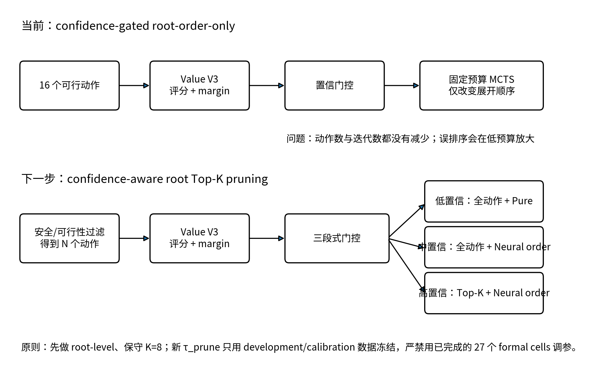
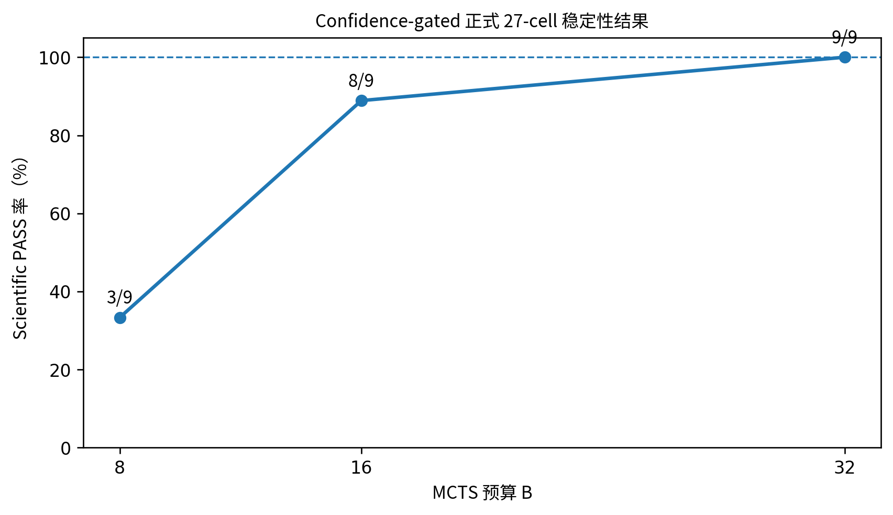

**MineSim-Dynamic / Value V3**

**Confidence-Gated MCTS 项目交接文档**

**当前结论、问题诊断与剪枝分支实施方案**

| **文档版本** | V1.0                                                       |
|--------------|------------------------------------------------------------|
| **交接日期** | 2026-08-30                                                 |
| **当前状态** | 27-cell confidence-gated formal matrix 已完成并冻结        |
| **正式结论** | B8 3/9；B16 8/9；B32 9/9；首次稳定预算 B32（Partial PASS） |
| **下一主线** | 在现有 confidence gate 基础上加入 root-level Top-K 剪枝    |

**交接原则：保留全部冻结证据，不重跑 formal cells，不用正式矩阵事后调参。**

# **执行摘要**

当前 Value V3 已完成从“无条件神经排序”到“置信门控排序”的完整验证。Confidence gating 将 naive unconditional root-order guidance 的首次 9/9 稳定预算从 B64 降到 B32，并将稳定预算下的中位树扩展数降低 32.45%、外层搜索 wall-clock 降低 29.66%。这证明 Value V3 的排序信号具有可利用价值，且置信门控确实缓解了错误神经排序带来的负面干预。

但该方案仍未超过 Pure MCTS：Pure 在 B8 即 9/9 稳定，而 confidence-gated 需要 B32；相对 Pure，稳定预算为 4 倍，中位扩展数增加 90.21%，wall-clock 增加 109.04%。核心原因不是“网络完全无效”，而是当前接入架构只改变 root action 的展开顺序，没有真正减少动作数、迭代数或 rollout/backup 工作量；少量关键 root 的误排序还会在低预算下造成正确动作未被搜索，随后通过闭环轨迹和分布漂移累积放大。

<table>
<colgroup>
<col style="width: 100%" />
</colgroup>
<thead>
<tr class="header">
<th>
<strong>交接结论</strong>

当前瓶颈应定位为 integration architecture，而不是继续单纯追求更高的离线预测精度。下一步建议保持现有 Value V3、特征、scorer 和 confidence-order gate 不变，在新分支中增加高置信 root-level Top-K pruning，让 learned signal 第一次真正减少候选动作集合，并通过低置信全量 fallback 保留 Pure MCTS 的鲁棒性。
</th>
</tr>
</thead>
<tbody>
</tbody>
</table>

## **文档结构**

- 1\. 交接范围、冻结边界与证据状态

- 2\. 当前方法、代码结构与正式实验协议

- 3\. 27-cell 正式结果及与 Pure/naive 的比较

- 4\. 为什么当前方案没有比 Pure 更高效

- 5\. 下一步 root-level Top-K 剪枝方案

- 6\. 实施步骤、日志字段、验证门槛与风险控制

- 7\. 文件与 SHA 交接清单

# **1. 交接范围、冻结边界与证据状态**

## **1.1 本次交接覆盖内容**

本交接文档覆盖 Value V3 confidence-gated root ordering 分支的模型接入方式、formal 27-cell 实验、legacy Pure/naive baseline 重绑定、最终效率结论、已知实现问题，以及下一阶段剪枝分支的推荐设计。本文不授权新增 formal 预算，不授权重跑已冻结 cell，也不授权使用当前正式结果重新选择 threshold、model seed 或 runtime seed。

## **1.2 不可变边界**

- Git HEAD 固定：112d2bd0f3412fc83b13d5587d2b41402d2d0f5e。

- 当前 ordering confidence threshold 固定：τ_order = 0.06767839193344116。

- B8/B16/B32 共 27 个 formal cells 全部完成；不得重跑、补跑或用其他 seed 替换。

- formal 结果不得用于选择新的 τ_prune 或 K；新剪枝参数只能在 development/calibration 数据上确定。

- 当前 confidence-gated prereg 分支不授权 B64/B128；后续剪枝必须作为新分支、新 CellSpec 和新命名空间。

- 旧 global postexec V1 的 legacy 绑定 HOLD 和后续 V2 PASS 均保留，不覆盖原文件。

## **1.3 当前冻结证据概览**

<table>
<colgroup>
<col style="width: 33%" />
<col style="width: 33%" />
<col style="width: 33%" />
</colgroup>
<thead>
<tr class="header">
<th><strong>证据</strong></th>
<th><strong>状态</strong></th>
<th><strong>关键 SHA / 值</strong></th>
</tr>
</thead>
<tbody>
<tr class="odd">
<td>27-cell final matrix</td>
<td>27/27 COMPLETE</td>
<td>c69180cd98c93edc04b08cb9cb762675 
f0fa7a1b710c744a30fec37d68cc2932</td>
</tr>
<tr class="even">
<td>Global analysis V2</td>
<td>PASS</td>
<td>60e991247a91479eb6f61925709c971d 
c29b93544ba3389b8fc86640fc0322a4</td>
</tr>
<tr class="odd">
<td>27-cell cell table V2</td>
<td>PASS</td>
<td>b4404923bc4f652482b1994ef18d4f73 
33f131d4e6e5dd023b95c616034ea02c</td>
</tr>
<tr class="even">
<td>Paper claim freeze V2</td>
<td>PASS</td>
<td>e48865f3a41a0a95240306fbc3b03593 
59ac43f2c68155fe364e824fc9172306</td>
</tr>
<tr class="odd">
<td>Postexec manifest V2</td>
<td>PASS</td>
<td>af1e46c093379550b731875cb4022f8c 
cc846849c1d638c8e5a53334fcfb1e48</td>
</tr>
<tr class="even">
<td>Legacy B64 final decision JSON</td>
<td>PASS</td>
<td>71eeda99345740bc06e58518620e15bc 
99f0f7eb87a6fb70ee7d52516bd89fca</td>
</tr>
</tbody>
</table>

# **2. 当前方法、代码结构与正式实验协议**

## **2.1 当前接入架构**

当前分支属于 root-order-only integration。每个决策 root 先构造 4×4=16 个 joint actions，Value V3 对动作评分并计算 confidence margin。若 margin 达到冻结阈值，则使用神经网络排序作为 root action expansion order；若 margin 低于阈值，则回退到原 Pure MCTS 的 root ordering。MCTS 的 UCT、rollout、backup、迭代预算和动作集合本身不变。

*图 1 当前 root-order-only 方法与建议的 root-level Top-K pruning 分支*

## **2.2 关键代码与资产**

| **对象**                    | **路径/文件**                                                                                              | **作用**                                              |
|-----------------------------|------------------------------------------------------------------------------------------------------------|-------------------------------------------------------|
| Confidence-gated controller | src/paper1_value_confidence_gated_root_order_search_v1.py                                                  | Value 排序、margin 门控与 root ordering               |
| Formal runner               | src/paper1_value_confidence_gated_runtime_recovery_presearch_probe_v1.py                                   | 统一 benchmark、formal 输出与退出码语义               |
| Value feature               | value_guided_mcts_c01_secondary_b8_guided_binding_fix6r3_v1/src/paper1_value_v3_online_root_features_v1.py | 在线 root 特征构造                                    |
| Value scorer                | value_guided_mcts_c01_secondary_b8_guided_binding_fix6r3_v1/src/paper1_value_v3_root_scorer_v1.py          | checkpoint 推理、动作得分与置信度                     |
| CellSpec                    | CONFIDENCE_GATED_CELLSPEC_V1.json                                                                          | 预算、runtime seed、model seed 的 27-cell formal 协议 |
| Threshold freeze            | CONFIDENCE_MARGIN_THRESHOLD_V1.json                                                                        | τ_order 的冻结证据                                    |

## **2.3 Formal 协议**

formal 矩阵使用 3 个预算 B8/B16/B32、3 个 runtime seeds（0/1/2）和 3 个 model seeds（20260824/20260825/20260826），共 27 个 cells。每个 root 只允许一次 Value forward；每个 cell 的 scientific status 由完整 5 项质量谓词决定。

| **质量谓词**                     | **含义**               |
|----------------------------------|------------------------|
| BENCHMARK_COMPLETION_SUCCESS     | benchmark 是否完整完成 |
| NO_COLLISION_OR_PHYSICAL_OVERLAP | 无碰撞或物理重叠       |
| NO_INVALID_OR_NAN_STATE          | 无非法状态或 NaN       |
| NO_RUNTIME_ERROR                 | 无运行时错误           |
| POST_CONFLICT_COMPLETION         | 冲突后阶段是否完成     |

Scientific PASS 要求五项全部为 True。Formal runner 的冻结退出码语义为：Scientific PASS→RC 0；完整 Scientific FAIL→RC 1；Technical FAIL 由 stderr、result.error、schema、mechanism contract 或 RC 语义不一致判定。

# **3. 正式结果与效果评价**

*图 2 Confidence-gated formal 27-cell 的预算—稳定性关系*

## **3.1 Confidence-gated 27-cell 结果**

| **预算** | **PASS** | **FAIL** | **PASS 率** | **9/9 stable** | **正式解释**                    |
|----------|----------|----------|-------------|----------------|---------------------------------|
| B8       | 3        | 6        | 33.33%      | 否             | 低预算下误排序风险明显          |
| B16      | 8        | 1        | 88.89%      | 否             | 接近稳定，但 primary ≤16 未满足 |
| B32      | 9        | 0        | 100%        | 是             | 首次稳定预算；Partial PASS      |

## **3.2 与 Pure 和 naive learned guidance 的比较**

| **方法**                       | **首次 9/9 稳定预算** | **中位 expansions** | **中位 outer wall-clock** |
|--------------------------------|-----------------------|---------------------|---------------------------|
| Pure MCTS                      | B8                    | 3432                | 6763.0108 ms              |
| Naive unconditional root-order | B64                   | 9664                | 20098.9015 ms             |
| Confidence-gated root-order    | B32                   | 6528                | 14137.5239 ms             |

<table>
<colgroup>
<col style="width: 100%" />
</colgroup>
<thead>
<tr class="header">
<th>
<strong>对 naive guidance 的正向效果</strong>

首次稳定预算从 B64 降到 B32（-50%）；稳定预算下中位 expansions 从 9664 降到 6528（-32.45%）；outer-search wall-clock 从 20098.90 ms 降到 14137.52 ms（-29.66%）。这说明 confidence gating 成功抑制了无条件神经排序的负面干预。
</th>
</tr>
</thead>
<tbody>
</tbody>
</table>

<table>
<colgroup>
<col style="width: 100%" />
</colgroup>
<thead>
<tr class="header">
<th>
<strong>相对 Pure 的限制</strong>

Pure 在 B8 即稳定，而 confidence-gated 要到 B32；稳定预算为 Pure 的 4 倍，expansions 增加 90.21%，wall-clock 增加 109.04%。因此当前方法不能表述为“整体效率优于 Pure MCTS”。
</th>
</tr>
</thead>
<tbody>
</tbody>
</table>

## **3.3 机制侧观察**

B16 唯一 Scientific FAIL cell 的 neural-order share 为 28.876%，而 B16 PASS cells 的 neural-order share 中位数为 97.107%。这说明失败轨迹异常 fallback-heavy，但只能视为描述性机制线索：低 confidence 很可能是困难状态或分布外状态的指示器，不应直接解释为“fallback 导致失败”，更不能据此回调 threshold。

# **4. 为什么按直觉应该更高效，实际却没有超过 Pure**

## **4.1 Root-order-only 没有减少真实搜索工作**

当前 Value V3 只改变“先搜索谁”，没有改变“要搜索多少”。固定预算 B 下，每个 root 仍执行约 B 次迭代/扩展；动作数仍为 16，UCT、rollout、backup 也不变，同时还增加了一次 Value forward。因此，如果 learned ordering 不能把稳定预算压到 Pure 以下，整体计算量就不会更低。

## **4.2 16 个 joint actions 使低预算对排序误差极其敏感**

joint action 空间为 4×4=16。B8 大致只能让一半动作获得早期搜索机会；一旦关键动作被误排到第 9～16 位，它可能完全不进入低预算搜索。B16 才接近“所有动作至少看一次”，B32 则允许第二轮纠错。这与 3/9→8/9→9/9 的正式趋势高度一致。

## **4.3 少量关键误排序会通过闭环轨迹累积放大**

离线平均 ranking 指标并不能保证每个 critical root 都正确。一个 episode 包含大量连续决策，只需少量关键 root 发生系统性误排序，就可能改变车辆轨迹，随后进入网络更不熟悉的状态分布，margin 下降、fallback 增加，最终形成 closed-loop error accumulation。

## **4.4 Pure 的无偏探索在当前 benchmark 上非常强**

Pure MCTS 在 B8 已经 9/9，说明当前 baseline 不是弱随机方法，而是鲁棒的搜索器。神经排序会把资源集中到网络认为好的方向；判断正确时有利，判断错误时则形成系统性 bias。Pure 的动作多样性反而能在低预算下保留纠错机会。

## **4.5 当前结论：模型有信号，但接入架构没有把信号转化为减算**

<table>
<colgroup>
<col style="width: 100%" />
</colgroup>
<thead>
<tr class="header">
<th>
<strong>问题定义</strong>

Value V3 的排序信号不是“无效”，因为 confidence gating 相比 naive 已显著改善；真正的问题是 root-order-only integration 仍让全部动作和固定迭代预算存在，因而收益主要体现为“减少错误干预”，而不是“减少计算”。下一步应优先改接入架构，而不是立即训练 Value V4。
</th>
</tr>
</thead>
<tbody>
</tbody>
</table>

# **5. 下一步：在现有基础上加入 root-level Top-K 剪枝**

## **5.1 设计目标**

- 保留现有 Value V3、feature、scorer、τ_order 和 Pure fallback，最大限度隔离“剪枝”本身的贡献。

- 仅在高置信 root 缩小候选动作集合，使 learned signal 第一次真实减少 branching workload。

- 低置信 root 不剪枝，避免把 critical action 永久删除。

- 先做 root-level pruning，不修改深层 UCT、rollout 和 backup；待 root-level 证据成立后再考虑 adaptive budget 或 leaf value。

## **5.2 推荐的三段式门控**

| **条件**                    | **候选动作集合** | **排序方式**    | **目的**                           |
|-----------------------------|------------------|-----------------|------------------------------------|
| margin \< τ_order           | 全部可行动作     | Pure 原始顺序   | 困难/OOD 状态保持最强鲁棒性        |
| τ_order ≤ margin \< τ_prune | 全部可行动作     | Neural ordering | 复用当前已验证机制，不剪枝         |
| margin ≥ τ_prune            | Neural Top-K     | Neural ordering | 真正减少候选动作并争取降低稳定预算 |

τ_order 保持当前冻结值以便横向比较；τ_prune 是新参数，必须在 development/calibration 数据上冻结，且应高于 τ_order。第一轮建议 K=8，作为保守 proof-of-concept；K=4 仅在 K=8 已证明 top-k retention 和 formal 稳定性后再启动。

## **5.3 推荐第一版算法**

<table>
<colgroup>
<col style="width: 100%" />
</colgroup>
<thead>
<tr class="header">
<th>feasible_actions = hard_safety_filter(all_16_joint_actions) 
scores, margin = value_v3_scorer(state, feasible_actions) 
neural_order = sort_descending(scores) 
 
if margin &lt; TAU_ORDER: 
candidate_actions = feasible_actions 
root_order = pure_order(feasible_actions) 
mode = "PURE_FULL" 
elif margin &lt; TAU_PRUNE: 
candidate_actions = feasible_actions 
root_order = neural_order 
mode = "NEURAL_ORDER_FULL" 
else: 
candidate_actions = neural_order[:K] 
root_order = candidate_actions 
mode = "NEURAL_TOPK_PRUNED" 
 
if len(candidate_actions) == 0 or pruning_recovery_condition: 
candidate_actions = feasible_actions 
root_order = pure_order(feasible_actions) 
mode = "PRUNE_RECOVERY_FULL" 
 
joint_action = mcts.search( 
..., allowed_root_actions=candidate_actions, 
ordered_root_actions=root_order, 
)</th>
</tr>
</thead>
<tbody>
</tbody>
</table>

## **5.4 为什么先做 K=8，再考虑 K=4**

| **配置**    | **直观含义**              | **推荐目标**                       | **主要风险**               |
|-------------|---------------------------|------------------------------------|----------------------------|
| K=8（保守） | 16→8，候选集减半          | 尝试把当前 B32 稳定性前移到 B16    | 仍可能剪掉少量关键动作     |
| K=4（激进） | 16→4，候选集缩至 1/4      | 争取在 B8 形成稳定并接近/超过 Pure | 动作覆盖风险显著提高       |
| 深层剪枝    | 不仅 root，树内节点也剪枝 | 后续独立分支                       | 机制耦合过强，不适合第一步 |

# **6. 实施步骤、日志字段与验证门槛**

## **6.1 新分支命名建议**

- controller：paper1_value_confidence_gated_topk_pruning_search_v1.py

- runner：paper1_value_confidence_gated_topk_pruning_runner_v1.py

- development root：paper1_value_v3_confidence_gated_topk_pruning_dev_v1/

- formal root：paper1_value_v3_confidence_gated_topk_pruning_matrix_v1/

- CellSpec：CONFIDENCE_GATED_TOPK_PRUNING_CELLSPEC_V1.json

不要直接修改已冻结的 root_order_search_v1.py 或原 formal runner；所有变更使用新文件和新命名空间，旧 SHA 继续作为 baseline binding。

## **6.2 必须新增的 root-level diagnostics**

| **字段**                          | **说明**                                                                 |
|-----------------------------------|--------------------------------------------------------------------------|
| pruning_mode                      | PURE_FULL / NEURAL_ORDER_FULL / NEURAL_TOPK_PRUNED / PRUNE_RECOVERY_FULL |
| tau_order / tau_prune / top_k     | 完整记录冻结参数                                                         |
| feasible_action_count_before      | 安全过滤后的原始候选数                                                   |
| candidate_action_count_after      | 剪枝后进入 MCTS 的候选数                                                 |
| pruned_action_count / prune_ratio | 真实剪枝量                                                               |
| pruning_recovery_triggered        | 是否因空集合/异常/保护条件恢复全量                                       |
| confidence_margin                 | 与门控决策一一对应                                                       |
| value_forward_count               | 保持每 root 一次 forward                                                 |
| chosen_action_rank_before_prune   | 最终动作在原 neural ranking 中的位置                                     |
| dev_target_retained（仅开发）     | Pure/teacher target 是否保留在 Top-K；formal 不使用 oracle               |

## **6.3 建议的开发—冻结—formal 流程**

1\. 只改代码和 diagnostics，不运行：完成 AST compile、静态未定义变量审计、旧 SHA/路径绑定。

2\. LOW prestart：验证新 controller 能在“剪枝关闭”时逐字段复现当前 confidence-gated 行为。

3\. HIGH-memory 单 cell technical smoke：先用 K=8，确认 allowed_root_actions 真正限制 root action set，且 Scientific PASS/FAIL 退出码语义不变。

4\. Development/calibration：使用非 formal 数据选择 τ_prune；建议以 top-k retention、critical-root retention、prune ratio 和安全谓词共同作为门槛。

5\. 冻结 K 与 τ_prune：发布 SHA、CellSpec、允许的预算梯度和停止规则，之后不再修改。

6\. Formal 3×3 matrix：建议先 B8；若未稳定再 B16；B32 仅作为上限。Scientific FAIL 正常冻结，Technical FAIL 才停。

## **6.4 推荐的开发门槛与 formal 成功标准**

| **类别**              | **建议门槛**                                                                                                                   |
|-----------------------|--------------------------------------------------------------------------------------------------------------------------------|
| Technical             | 无 stderr/result.error/NaN；candidate set 非空；chosen action 必在 candidate set；每 root 一次 forward；机制字段与实际行为一致 |
| Safety                | 五项质量谓词不因剪枝下降；硬安全过滤必须先于 Top-K                                                                             |
| Development retention | 总体 Top-K target retention 建议 ≥99%；critical roots 建议更严格；不满足则提高 K 或 τ_prune                                    |
| Primary formal        | B8 达到 9/9 stable，并在 expansions 或 wall-clock 至少一项优于 Pure B8，同时另一项不显著恶化                                   |
| Secondary formal      | 若 B8 未稳定，B16 9/9 且相对当前 confidence-gated B32 明显降低 expansions 与 wall-clock                                        |
| Claim boundary        | 只有同时满足稳定与成本指标，才允许表述为“效率提升”；仅降低预算但成本不降时需分开表述                                           |

## **6.5 风险与保护机制**

| **风险**                   | **表现**                        | **保护措施**                                                         |
|----------------------------|---------------------------------|----------------------------------------------------------------------|
| 关键动作被剪掉             | 低预算直接失败或轨迹快速偏离    | 高 τ_prune、先 K=8、低置信全量 fallback、空集合恢复                  |
| Top-K 动作过度同质化       | 动作多样性下降，系统性 bias     | 开发阶段统计动作覆盖；必要时增加 diversity reserve 作为独立 ablation |
| 用 formal 结果调参         | 破坏预注册可信度                | formal 27-cell 仅作冻结 baseline，不进入 τ_prune/K 选择              |
| 剪枝只减少候选数但不降迭代 | wall-clock 收益有限             | 先验证稳定预算是否前移；后续再叠加 adaptive budget/early stop        |
| 推理开销抵消收益           | expansions 降但 wall-clock 不降 | 同时报告 expansions、outer/core wall-clock、value inference time     |

# **7. 立即执行清单**

<table>
<colgroup>
<col style="width: 100%" />
</colgroup>
<thead>
<tr class="header">
<th>
<strong>推荐下一步（不要直接跑 formal）</strong>

先建立新 pruning controller/runner，只实现 root candidate masking + diagnostics；在“剪枝关闭”模式下复现现有结果路径，再进行 K=8 单 cell technical smoke。τ_prune 和正式预算梯度必须等 development/calibration 完成后再冻结。
</th>
</tr>
</thead>
<tbody>
</tbody>
</table>

1\. 复制当前 controller 到新文件，增加 allowed_root_actions/candidate mask 接口；旧文件保持只读。

2\. 增加四种 pruning_mode 和完整 root diagnostics。

3\. 编写 LOW prestart controller，验证 SHA、Git clean、旧 formal matrix 不被修改。

4\. 在高内存实例上做一次 K=8 technical smoke，确认剪枝真正生效。

5\. 用 development-only roots 计算 margin—Top-K retention 曲线，选择 τ_prune。

6\. 冻结 K、τ_prune、budget ladder、停止规则和 formal 9-cell matrix。

# **8. 核心文件与 SHA 交接清单**

## **8.1 Confidence-gated formal 与 global postexec**

<table>
<colgroup>
<col style="width: 50%" />
<col style="width: 50%" />
</colgroup>
<thead>
<tr class="header">
<th><strong>文件/对象</strong></th>
<th><strong>SHA256</strong></th>
</tr>
</thead>
<tbody>
<tr class="odd">
<td>CONFIDENCE_MARGIN_THRESHOLD_V1.json</td>
<td>7ec878383e3fb134c999f22e277fe91f 
01f8f9a6c1bce2ece79b13fbf78cbcec</td>
</tr>
<tr class="even">
<td>paper1_value_confidence_gated_root_order_search_v1.py</td>
<td>0ed2d1ff33a66198bf59b25e1117274d 
dc61440bf52dec1052d4aa553a52a2f9</td>
</tr>
<tr class="odd">
<td>CONFIDENCE_GATED_CELLSPEC_V1.json</td>
<td>b87d09bd3c63066f99414c405751c0d6 
bd59497f602983ee201340b6c97f68ae</td>
</tr>
<tr class="even">
<td>B8 final summary</td>
<td>b4048ae98dfea9ebd9f0e7fafa13aa07 
c1b7095dbb443ebfcf3c5d85f9323ac1</td>
</tr>
<tr class="odd">
<td>B16 final summary</td>
<td>51215e6a4257cf8126d4bdfa9c765542 
50a2dab775ddbbaa58ef1f5c05691a8c</td>
</tr>
<tr class="even">
<td>B32 final summary</td>
<td>fc26c73ee429a6f525a93a3309823c61 
262e6b18d4ea715cb4fe55e7374852f9</td>
</tr>
<tr class="odd">
<td>27-cell final matrix</td>
<td>c69180cd98c93edc04b08cb9cb762675 
f0fa7a1b710c744a30fec37d68cc2932</td>
</tr>
<tr class="even">
<td>Global analysis V2</td>
<td>60e991247a91479eb6f61925709c971d 
c29b93544ba3389b8fc86640fc0322a4</td>
</tr>
<tr class="odd">
<td>Cell table V2</td>
<td>b4404923bc4f652482b1994ef18d4f73 
33f131d4e6e5dd023b95c616034ea02c</td>
</tr>
<tr class="even">
<td>Paper claim freeze V2</td>
<td>e48865f3a41a0a95240306fbc3b03593 
59ac43f2c68155fe364e824fc9172306</td>
</tr>
<tr class="odd">
<td>Postexec manifest V2</td>
<td>af1e46c093379550b731875cb4022f8c 
cc846849c1d638c8e5a53334fcfb1e48</td>
</tr>
</tbody>
</table>

## **8.2 Legacy Pure / naive baseline**

<table>
<colgroup>
<col style="width: 50%" />
<col style="width: 50%" />
</colgroup>
<thead>
<tr class="header">
<th><strong>对象</strong></th>
<th><strong>SHA256 / 结果</strong></th>
</tr>
</thead>
<tbody>
<tr class="odd">
<td>B64 final manifest</td>
<td>f493e0899a3362e93c51703508ea474f 
755ee7c8a62f8be53ed18e36156a58db</td>
</tr>
<tr class="even">
<td>B64 frozen 9-cell regression V2</td>
<td>479ae676f12ba42fa295cf50396f9934 
e5fa756d983fc68150273f55445a5b9f</td>
</tr>
<tr class="odd">
<td>B64 stability &amp; efficiency decision V2</td>
<td>71eeda99345740bc06e58518620e15bc 
99f0f7eb87a6fb70ee7d52516bd89fca</td>
</tr>
<tr class="even">
<td>Pure B8 stability anchor</td>
<td>3e17ef39f066377be2f1344a94c7d3d6 
eea9f61712fc52f3682218088b25e582</td>
</tr>
<tr class="odd">
<td>Pure B8 median</td>
<td>3432 expansions；6763.010833 ms</td>
</tr>
<tr class="even">
<td>Naive Guided B64 median</td>
<td>9664 expansions；20098.901544 ms</td>
</tr>
</tbody>
</table>

## **8.3 交接后的禁止事项**

- 不重跑 B8/B16/B32 27 个 formal cells。

- 不使用当前 27-cell 结果调 τ_order、τ_prune 或 K。

- 不修改旧 controller、runner、summary、freeze 或 manifest。

- 不把 Partial PASS 改写为 Primary PASS。

- 不声称当前 confidence-gated 方法整体优于 Pure MCTS。

- 新剪枝分支必须使用新命名空间、新 CellSpec、新预注册边界。

# **9. 最终交接结论**

现有 confidence gating 已证明：Value V3 具备可利用的动作排序信号，且选择性注入能够显著改善 naive unconditional guidance；但 root-order-only 架构没有把该信号转化为真实减算，因此仍落后于 Pure MCTS。下一步最合理的技术路线是在现有三段式置信逻辑上增加保守的 root-level Top-K pruning，先用 K=8 验证“减少候选动作是否能把 B32 稳定性前移到 B16”，再决定是否以更严格的 τ_prune 和 K=4 冲击 B8。

交接完成后，首个工程任务应是“实现剪枝但不跑 formal”：新增 candidate mask 接口、diagnostics 和 LOW prestart；只有 development retention 与技术 smoke 全部通过后，才能冻结新参数并启动新 formal 分支。
