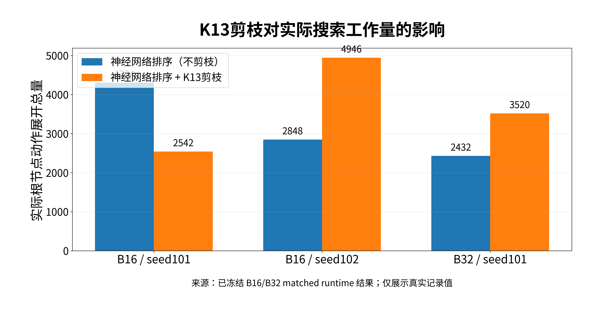
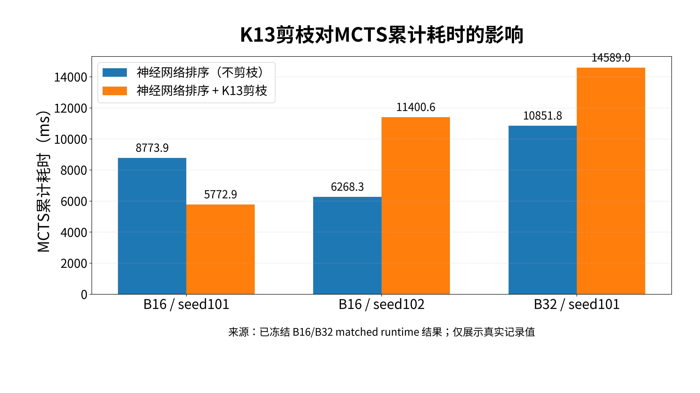
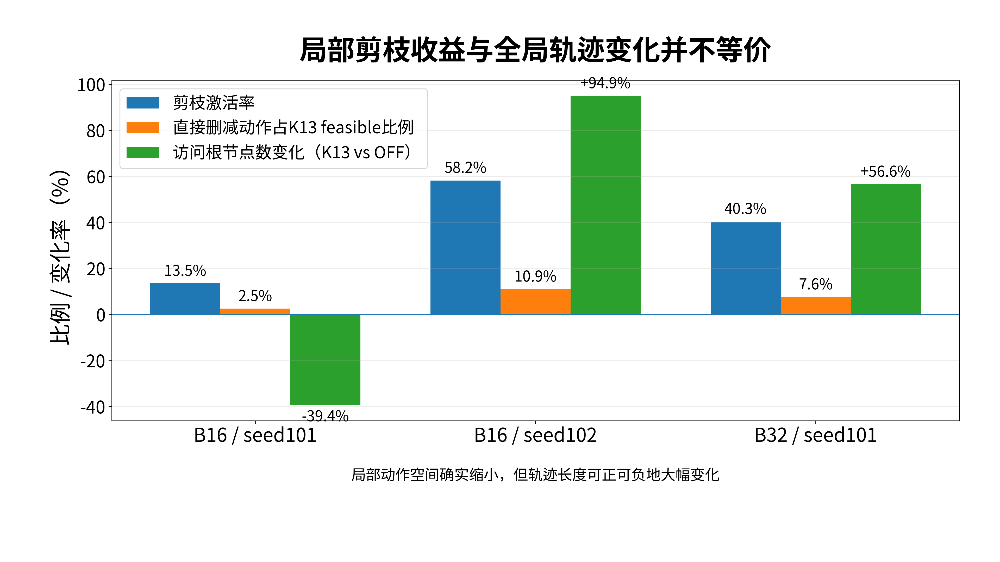

**MineSim-Dynamic 项目正式交接文档**

**FullMine / Fleet-MCTS / Value V3 / K13 工程价值终审后整合版 V1**

证据截止：2026-08-31

| **当前阶段**   | 神经网络已接入根节点评分与排序；K13剪枝工程价值评估已完成并冻结 |
|----------------|-----------------------------------------------------------------|
| **当前结论**   | 局部神经剪枝机制有效；可复现端到端加速不成立                    |
| **当前 Gate**  | HANDOFF_AND_REPORT_PACKAGE_FREEZE                               |
| **正式仓库**   | /root/MineSim-Dynamic                                           |
| **Git HEAD**   | 112d2bd0f3412fc83b13d5587d2b41402d2d0f5e                        |
| **证据根目录** | /root/autodl-tmp/.../matched_runtime_probe_k13_b16_b32_v2       |
| **下一资源**   | LOW；只读整理/真实视觉资产 inventory                            |

**内部研究资料 · 真实证据优先 · 不得用历史计划覆盖当前冻结结果**

# 0. 一页快速结论

<table>
<colgroup>
<col style="width: 100%" />
</colgroup>
<thead>
<tr class="header">
<th><strong>[FROZEN] K13最终工程结论 
</strong>神经网络置信度可真实触发root-only Top-K剪枝，局部候选动作确实减少；但B16出现跨runtime-seed方向反转，B32 seed101又使实际展开量、MCTS耗时和episode wall time全部上升。因此冻结结论为：不支持K13在当前冻结协议下具备可复现的端到端工程加速价值。</th>
</tr>
</thead>
<tbody>
</tbody>
</table>

<table>
<colgroup>
<col style="width: 100%" />
</colgroup>
<thead>
<tr class="header">
<th><strong>[HOLD] 当前视觉汇报资产 
</strong>交接文档和汇报Word可本地生成；FullMine、Polygon21、A/B冻结路径和冲突点的正式图像/视频必须回到AutoDL真实地图与冻结artifact生成。当前精确几何值和正式视觉文件均标记HOLD，严禁猜测或人工描线。</th>
</tr>
</thead>
<tbody>
</tbody>
</table>

| **字段**            | **当前值**                                                               |
|---------------------|--------------------------------------------------------------------------|
| EVIDENCE_CUTOFF     | 2026-08-31，FINAL_K13_ENGINEERING_DECISION_GATE=PASS_FROZEN之后          |
| CURRENT_STAGE       | Value V3/K13运行价值分支已完成并关闭                                     |
| CURRENT_GATE        | HANDOFF_AND_REPORT_PACKAGE_FREEZE                                        |
| CURRENT_STATUS      | 交接和汇报包生成；真实地图视觉资产待云端四级验收                         |
| NEXT_MINIMAL_ACTION | AutoDL只读 inventory，绑定真实FullMine/Polygon21/A/B路径/冲突点源文件    |
| RESOURCE_REQUIRED   | LOW                                                                      |
| DO_NOT_REPEAT       | 已消费B16/B32 one-shot；不得调K/tau救结果；不得跑B32 seed102改变成功判定 |

# 1. 权威性、状态标签与事实边界

- 事实优先级：当前AutoDL终端、Git、源码、实际runtime、SHA \> frozen result/manifest/START/CAPTURE \> 最新交接文档 \> 历史文档 \> 设计计划 \> AI记忆。

- FROZEN：有真实结果和SHA链，禁止覆盖和原namespace重跑。

- HISTORICAL：阶段性真实快照，但其“下一步/当前blocker”已被新证据取代。

- HOLD：当前材料不足；不得使用常识、坐标猜测或图像美化自动补齐。

- Scientific FAIL/negative是科研结果，不是必须调成PASS的Bug。Technical FAIL必须先定位故障域，且不能自动重跑。

<table>
<colgroup>
<col style="width: 100%" />
</colgroup>
<thead>
<tr class="header">
<th><strong>[HOLD] 地图表述边界 
</strong>Full-Mine Vector V2应称为DEV / Research Map。可以说源自真实GeoJSON、有明确provenance、Map API可加载；不能声称是官方production HD Map或production-authoritative可行驶真值。</th>
</tr>
</thead>
<tbody>
</tbody>
</table>

# 2. 项目主线总览

| **阶段**          | **状态**                     | **证据化结论**                                                               |
|-------------------|------------------------------|------------------------------------------------------------------------------|
| MineSim复现       | PASS / 历史冻结              | Dapai/Jiangtong IDM与Replay闭环已复现。                                      |
| Pure MCTS接入     | PASS / 历史冻结              | 真实MineSim online closed-loop；receding-horizon搜索。                       |
| 单车闭环          | PASS / 历史冻结              | Dapai/Jiangtong正式结果；多planner与budget实验已完成。                       |
| 双车冲突场景      | PASS/负筛选并存              | Dapai时序分离；Jiangtong Traj26为非近同时冲突负筛选；J117构造benchmark通过。 |
| FullMine新地图    | PASS到研究地图链             | 真实GeoJSON→Semantic/Map API；Vector V2=100 effective roads / 553 paths。    |
| Fleet-MCTS        | PASS / 历史冻结              | 16个联合动作；J117 5-seed冲突消解与swept safety通过。                        |
| 多种子/collection | PASS / 冻结                  | C03 full collection等数据链已冻结。                                          |
| 原生可视化        | 历史已有链，正式新汇报图HOLD | 必须重新绑定真实云端资产后生成。                                             |
| 神经网络接入      | PASS                         | Value V3完成评分、排序、置信度门控；每个root真实forward。                    |
| K13剪枝工程价值   | FROZEN NEGATIVE              | 局部剪枝有效；可复现端到端加速不成立。                                       |

# 3. MineSim复现与闭环架构

## 3.1 闭环执行栈

- Scenario / Map → Planner → Trajectory → Controller → Vehicle Model → Observation → Metrics / History → 下一帧。

- Planner输出未来轨迹，不是直接修改下一帧位置；Controller与Kinematic Bicycle Model必须独立诊断。

- 正式仓库为 /root/MineSim-Dynamic；大数据、实验结果、日志和临时runner放 /root/autodl-tmp。

## 3.2 IDM baseline与已冻结修复

| **对象**                     | **结论**        | **关键证据/边界**                                                                         |
|------------------------------|-----------------|-------------------------------------------------------------------------------------------|
| IDM baseline                 | PASS            | 历史commit 2521aa41...，tag idm-replay-autodl-baseline。                                  |
| CollisionLookup              | 已修复/历史冻结 | 标准XG90G footprint语义纠正，source SHA 10c1d133...；触及此模块需回归。                   |
| AbstractIDMPlanner route-end | 已修复/历史冻结 | 虚拟endpoint长度改为0，source SHA 0c64f7ae...。                                           |
| 历史A2 blocker               | SUPERSEDED      | 旧8月13日文档中的当前blocker已被后续FullMine/Fleet/Neural工作推进取代，不能再当当前Gate。 |

# 4. Pure MCTS与单车阶段

- 动作空间：BRAKE -3.0、DECEL -1.5、KEEP 0、ACCEL +1.0 m/s²。

- 历史核心参数：budget=300、max_depth=8、tree_dt=0.5 s、c_uct=1.4、gamma=0.99。

- 每帧执行Selection→Expansion→Rollout→Backup，执行根节点第一步动作，下一帧重新规划。

- 五planner旧表应称为“统一仿真和评价协议下的异构规划能力评估”，不能写成完全公平算法排名。

| **场景**  | **MCTS**  | **IDM**               | **严谨结论**                     |
|-----------|-----------|-----------------------|----------------------------------|
| Dapai     | Safe Goal | 发生冲突/未到goal     | MCTS展示多步冲突决策价值。       |
| Jiangtong | Safe Goal | Safe Goal且更快更平顺 | 不能推导MCTS在所有场景普遍最优。 |

# 5. 双车冲突、Fleet-MCTS与J117

## 5.1 Fleet状态与动作

- controlled A + controlled B + external actors → FleetState。

- 两车各4个纵向动作，联合动作空间为16。

- FleetTransitionModel与FleetRewardModel同时处理进度、效率、A-B真实几何、internal clearance、hard collision及外部actor预测。

## 5.2 场景筛选与J117

| **对象**              | **状态**     | **结果**                                                                       |
|-----------------------|--------------|--------------------------------------------------------------------------------|
| Dapai A-B-only        | PASS         | 形成B先通过、A后通过的联合时序证据；external object1被认定为confounder。       |
| Jiangtong Traj26      | FROZEN负筛选 | 空间交叉但ETA相差约9.496 s，不是天然近同时冲突，禁止人为改成冲突。             |
| J117 NO-MCTS baseline | FROZEN       | crossing gap约0.00070 s，minimum clearance=0，真实几何冲突。                   |
| J117 Pure MCTS        | FROZEN PASS  | seed0 crossing gap约1.561 s；swept minimum clearance约0.594 m；5/5 seeds通过。 |

# 6. FullMine真实地图与Polygon21

## 6.1 原始数据与坐标链

| **源文件**            | **数量/规格** | **用途**                 |
|-----------------------|---------------|--------------------------|
| road.geojson          | 94 features   | 道路polygon              |
| road_boundary.geojson | 100           | 道路边界                 |
| junction.geojson      | 35            | 路口polygon              |
| lane.geojson          | 553           | 参考路径/拓扑/raw Z      |
| rgn_boundary.geojson  | 84            | 区域/路口边界            |
| rng_load.geojson      | 36            | 装载区                   |
| rgn_unload.geojson    | 7             | 卸载区                   |
| rgn_auxiliary.geojson | 6             | 辅助区                   |
| 1.png                 | 1799×1050     | 普通视觉预览；无地理参考 |

- 历史坐标链：WGS84 → UTM Zone 46N / EPSG:32646 → MineSim local。

- 历史local origin：E0=409200.0，N0=4916800.0；正式汇报前仍须用当前云端源码/manifest重绑定。

- Topo ID是首要拓扑事实；距离接近不能代替topology identity。

## 6.2 Vector V2 Semantic

| **Layer**      | **数量** |
|----------------|----------|
| polygon        | 184      |
| road           | 100      |
| intersection   | 35       |
| loading_area   | 36       |
| unloading_area | 7        |
| auxiliary_area | 6        |
| reference_path | 553      |
| dubins_pose    | 565      |
| borderline     | 402      |
| waypoint       | 314692   |

<table>
<colgroup>
<col style="width: 100%" />
</colgroup>
<thead>
<tr class="header">
<th><strong>[HOLD] Polygon21当前可绑定provenance 
</strong>已知runner路径 /root/autodl-tmp/fullmine_v4_dual_candidate_v1/polygon21_rank1_fleet_mcts_transfer_v2.py，SHA 5a90a164...；B reference audit路径 .../polygon21_b_reference_chain_audit_v1.json，SHA 39f29de4...。但当前交接材料不包含可直接核验的Polygon21几何坐标、A/B冻结路径ID/坐标和冲突点几何，因此正式图像全部HOLD。</th>
</tr>
</thead>
<tbody>
</tbody>
</table>

# 7. Collection、Value V3与神经网络接入

## 7.1 数据与网络

- C03 Full Collection历史冻结：135 roots、2160 derived actions、8640 shadow expansions，benchmark_success=True，collision_or_overlap=False，freeze SHA 15c098f7...。

- Value V3使用ROOT_CENTERED_Q，12→64→64→16；16个输出分量与16个joint-action ID一一对应。

- 12D输入包含两车速度/加速度、距冲突点剩余距离、速度差、航向差及交互特征。

- 成熟development target collection：runtime seeds 101/102/103，每个151 roots；453 raw实际为151 unique roots×3完全重复，不能当453个独立样本。

- 三个frozen model seeds各对151 unique roots评分，共453 forwards。

## 7.2 K选择与置信度门控

| **参数/结论**                   | **冻结值**                 |
|---------------------------------|----------------------------|
| tau_order                       | 0.06767839193344116        |
| K                               | 13                         |
| tau_prune                       | 1.2940582036972046         |
| 高置信覆盖                      | 178 / 453 ≈ 39.29%         |
| Top-13 retention                | pooled及各model seed均100% |
| 触发时动作缩减                  | 16→13，条件剪枝18.75%      |
| 平均candidate reduction（静态） | 约7.37%                    |

- K=8扫描425个threshold-induced subsets，无合格阈值；K\<8按单调性排除。

- 预注册K-ladder 9→15中，K13为首个满足≥99% retention的非平凡K。

- scorer forward在prune threshold判断之前执行，因此每个root都支付一次神经网络forward。

# 8. K13 matched runtime结果与最终冻结结论

图 1 已冻结实验中的实际根节点动作展开总量。

图 2 已冻结实验中的MCTS累计耗时。

图 3 局部剪枝与全局轨迹变化的分离。

| **实验**    | **剪枝激活率** | **直接删动作** | **实际展开变化** | **MCTS耗时变化** | **episode wall变化** | **结论**                    |
|-------------|----------------|----------------|------------------|------------------|----------------------|-----------------------------|
| B16 seed101 | 13.50%         | 66             | -40.94%          | -34.20%          | 未直接记录           | 局部剪枝+轨迹变短，表面加速 |
| B16 seed102 | 58.21%         | 606            | +73.67%          | +81.88%          | +83.28%              | 轨迹显著变长，总体更慢      |
| B32 seed101 | 40.34%         | 288            | +44.74%          | +34.44%          | +35.26%              | 冻结B32成功判据失败         |

<table>
<colgroup>
<col style="width: 100%" />
</colgroup>
<thead>
<tr class="header">
<th><strong>[FROZEN] FINAL_K13_ENGINEERING_DECISION 
</strong>DIRECT_PRUNING_MECHANISM_VALID=True；NEURAL_GUIDED_LOCAL_ACTION_SPACE_REDUCTION_VALID=True；REPRODUCIBLE_END_TO_END_RUNTIME_ACCELERATION=False。最终决策：REJECT_REPRODUCIBLE_END_TO_END_ENGINEERING_RUNTIME_ADVANTAGE_FOR_K13_UNDER_FROZEN_B16_B32_PROTOCOL。</th>
</tr>
</thead>
<tbody>
</tbody>
</table>

# 9. 近期关键技术失败、定位和防护

| **现象**                     | **直接结果**                          | **原因**                                        | **处理**                                                                                | **以后禁止重复**                             |
|------------------------------|---------------------------------------|-------------------------------------------------|-----------------------------------------------------------------------------------------|----------------------------------------------|
| runtime seed 101 prereg拒绝  | 两个matched cell均在output root前失败 | runner只允许0/1/2                               | 只扩展development derived runner seed guard到101/102/103；normalized AST除该guard外一致 | 旧namespace已消费，禁止重跑                  |
| AST只扫描tree.body           | 找不到真实episode loop                | while嵌套在模块级try/if                         | 改为全AST唯一绑定                                                                       | 关键源码锚点不能假设顶层                     |
| result字典多行格式           | iterations key行不含steps             | key/value跨物理行                               | 使用AST value节点与end_lineno插入                                                       | 不按文本行猜语义                             |
| symbolic TAU_PRUNE审计假HOLD | PAIR literal_eval失败                 | PAIR含符号常量                                  | AST语义解析Name→冻结常量                                                                | 审计脚本也必须被测试                         |
| manifest .pyc假HOLD          | 顶层iterdir看不到\_\_pycache\_\_      | builder用递归rglob记录pyc                       | audit镜像builder discovery语义                                                          | manifest验证必须与生产者一致                 |
| expansion_count语义误读      | 看似剪枝减少39%                       | legacy expansion是feasible-before，不是实际展开 | 新增actual_root_expanded、visited roots、MCTS/wall指标                                  | 禁止再用legacy expansion代表实际剪枝后工作量 |

# 10. One-shot / 禁止重跑台账

| **namespace**                                         | **状态**                                          | **START SHA**                                                    | **重跑**                                           |
|-------------------------------------------------------|---------------------------------------------------|------------------------------------------------------------------|----------------------------------------------------|
| pilot_b16_seed101_model20260824_v1                    | Technical failure before runtime; START written   | 28d2180c57cc58f1931d8670660a87f7d8babb42ece8b2ebb7f5015824e4c997 | NO                                                 |
| pilot_b16_seed101_model20260824_seed_prereg_retry1_v1 | Technical PASS, scientific result preserved       | aeb0d6b7c0bdd3a64bf30dd327efd977be3ae2db3fb40798860c8d17f0d96921 | NO                                                 |
| b16_seed102_model20260824_pair_v1                     | Technical PASS; direction reversed vs seed101     | 080e7978029d7766ed3bfa2d57201eeda39afb523b218d56fa7e429c8421a97b | NO                                                 |
| b32_seed101_model20260824_pair_v1                     | Technical PASS; frozen success criterion failed   | 4b4956307ac633246edafd25a3271496f0c7703cff57b9012b15cc5a649897e5 | NO                                                 |
| B32 seed102                                           | Not required for success decision; not authorized | N/A                                                              | NO unless new preregistered characterization study |

- 只要START_WRITTEN=True，原namespace永久消费，不论PASS、technical FAIL或scientific negative。

- 不得因为结果不好重跑或调参数；如证据支持technical retry，必须新建独立authorization/namespace。

- B32 seed102未运行且对当前成功判定不再必要；若未来只为方差表征，必须另立新预注册研究问题。

# 11. 关键路径与SHA台账

| **对象**                         | **SHA256**                                                       | **状态**                      |
|----------------------------------|------------------------------------------------------------------|-------------------------------|
| Git HEAD                         | 112d2bd0f3412fc83b13d5587d2b41402d2d0f5e                         | CURRENT                       |
| Top-K controller                 | 5104d9c2c9363ec9acd51ea7849fe306d7632ab07577ceb2b2ccca74a4c93350 | FROZEN                        |
| Observability derived runner     | 5cd2a04a880e4ef83b3f9a6a4367ef406cf42ab71d9d54a8d9a7139385660986 | FROZEN                        |
| FleetMCTSSearch source           | e96c82d60b75c6d2b3311b9fd9d569cab1404c5c2ba4c729cb25c8e605d6ec94 | FROZEN BINDING                |
| Value V3 checkpoint seed20260824 | 496e4259eb9801f3ce70c1094be12fd0985cb03e97d606cade8dfbe9d5228633 | FROZEN                        |
| Final K13 decision JSON          | 5c1ec038a3a9593616dc93e3bd0cafc0d9bf2bb109dcc498aa7cf99c32eec58e | LATEST                        |
| Polygon21 transfer runner        | 5a90a164e2542c6bfdf310e13c5f516e798f3331cf2bcf9898eb890693b83552 | KNOWN PROVENANCE; LIVE REBIND |
| Polygon21 B reference audit      | 39f29de451ff64a418cdc78abdafedc568db7efffe7380064c95a8026612040e | KNOWN PROVENANCE; LIVE REBIND |
| Vector V2 candidate bitmap v2    | 57514c52203aeca5c970d5a30086a58ddda7c1e179166ee3a26ff0435ed9bbd5 | HISTORICAL IMMUTABLE          |
| CollisionLookup fixed source     | 10c1d1339e742ca893fedb4aa51402addfba82e16e08f68339ea35d35ba3043b | HISTORICAL FROZEN             |
| AbstractIDMPlanner fixed source  | 0c64f7aeae858d6e456aeeabb867d72640382913f8ed090461eb40f49ea0b3a1 | HISTORICAL FROZEN             |

- 正式repo：/root/MineSim-Dynamic。

- 当前K13证据root：/root/autodl-tmp/paper1_value_v3_confidence_gated_topk_pruning_dev_v1/matched_runtime_probe_k13_b16_b32_v2。

- FullMine历史关键资产root：/root/autodl-tmp/fullmine_vector_v2_targeted_runtime 与 /root/autodl-tmp/fullmine_v4_dual_candidate_v1；当前存在性需实时inventory。

# 12. 原生可视化与汇报资产状态

<table>
<colgroup>
<col style="width: 100%" />
</colgroup>
<thead>
<tr class="header">
<th><strong>[HOLD] 当前正式视觉资产状态 
</strong>本地可提供基于冻结数值的4K结果图；FullMine/Polygon21/A-B路径/冲突点/8秒视频尚未从当前云端真实资产重新绑定，因此均为HOLD。不得用AI图替代。</th>
</tr>
</thead>
<tbody>
</tbody>
</table>

| **产物**                                   | **要求**                                     | **状态** |
|--------------------------------------------|----------------------------------------------|----------|
| FIG01_fullmine_global_4k.png               | 3840x2160；FullMine全局结构                  | HOLD     |
| FIG02_fullmine_polygon21_location_4k.png   | 3840x2160；Polygon21在全矿中的真实位置       | HOLD     |
| FIG03_polygon21_local_intersection_4k.png  | 3840x2160；Polygon21局部路口                 | HOLD     |
| FIG04_polygon21_ab_paths_conflict_4k.png   | 3840x2160；A/B冻结路径与冲突点               | HOLD     |
| FIG05_fleet_mcts_scene_4k.png              | 3840x2160；双车真实场景与Fleet-MCTS对象      | HOLD     |
| VIDEO01_fullmine_to_polygon21_1080p_8s.mp4 | 1920x1080, 7.5-8.5s；全矿→Polygon21→局部路口 | HOLD     |

# 13. 云端资料、历史交接与删除状态

| **文档/资料**                                             | **当前分类**       | **说明**                                             |
|-----------------------------------------------------------|--------------------|------------------------------------------------------|
| MineSim_handoff_summary_V1.docx                           | HISTORICAL         | 截止C03/Value V2前，当前状态已被后续K13结果覆盖。    |
| MineSim_ValueV3\_...K13运行价值评审完成版_V1.docx         | HISTORICAL但高价值 | 截止K13静态评审，尚未包含matched runtime最终负结果。 |
| 本交接文档                                                | CURRENT            | 包含最终K13决策与汇报资产HOLD边界。                  |
| 原项目复现.zip / 蒙特卡洛实现.7z / 地图新建相关文件.zip等 | ARCHIVE/HISTORICAL | 用于provenance，不替代当前AutoDL live证据。          |

- ChatGPT/Library副本与AutoDL live文件必须区分。本交接能够确认Library中的历史文档副本；不能确认所有Word是否已经上传到AutoDL。

- 没有直接证据表明任何关键科研资产已被actual delete。路径missing、No such file、顶层未见均不能推断删除。删除状态统一HOLD。

- 移动、隔离、归档和删除必须分别记录；未经用户明确授权不得删除科研资产。

# 14. 固化协作与实验工作流

1.  一次只推进一个最小Gate：只读preflight → static/smoke → 短闭环 → 完整实验 → freeze。

2.  ChatGPT负责证据分析、决策、关键代码和交接；用户负责AutoDL真实执行；Codex只用于复杂算法/顽固bug。

3.  LOW优先完成Git/SHA/AST/schema/inventory；长MineSim使用HIGH-CPU；正式训练/大规模forward才用HIGH-GPU。

4.  长任务使用screen、独立log、START、CAPTURE和manifest；不让模型在线等待。

5.  核心源码最小patch；禁止git reset --hard、git clean -fd、git add .。

6.  所有可执行命令从正式repo和minesim环境开始；不得裸exit退出SSH。

7.  正式图像/视频采用文件优先，聊天只传关键字段和结论。

# 15. 当前HOLD与后续研究方向

| **对象**                                      | **状态**         | **下一步**                                                                    |
|-----------------------------------------------|------------------|-------------------------------------------------------------------------------|
| K13当前分支                                   | FROZEN CLOSED    | 不再调K/tau，不再跑成功判定runtime。                                          |
| trajectory-stable / policy-preserving pruning | 新方向，尚未启动 | 若用户重新授权，先做只读source/diagnostic availability review，再独立预注册。 |
| FullMine/Polygon21正式图像                    | HOLD             | AutoDL实时inventory→真实几何绑定→渲染→四级验收。                              |
| Polygon21精确坐标/A-B路径/冲突点              | HOLD             | 只能从冻结runner/scenario/audit提取，不得人工填写。                           |
| production drivability                        | BLOCKED/HOLD     | 缺官方production mask/terrain/exclusion/authoring rule。                      |

# 16. 快速接手区

| **问题**                    | **答案**                                                                                                            |
|-----------------------------|---------------------------------------------------------------------------------------------------------------------|
| 1\. 项目现在做到哪里？      | 神经网络根节点评分/排序接入完成；K13 root-only剪枝mechanism有效；B16/B32工程价值评估完成并冻结负结论。              |
| 2\. 哪些阶段无需重做？      | MineSim复现、Pure MCTS、单车、Fleet-MCTS/J117、FullMine Semantic基础链、Value V3 scoring/K选择、K13 runtime probe。 |
| 3\. 当前唯一Gate？          | HANDOFF_AND_REPORT_PACKAGE_FREEZE；地图视觉资产为HOLD。                                                             |
| 4\. 正式repo？              | /root/MineSim-Dynamic                                                                                               |
| 5\. 当前关键evidence root？ | /root/autodl-tmp/.../matched_runtime_probe_k13_b16_b32_v2                                                           |
| 6\. Git HEAD？              | 112d2bd0f3412fc83b13d5587d2b41402d2d0f5e                                                                            |
| 7\. 最关键SHA？             | Final K13 decision JSON 5c1ec038...；controller 5104d9c2...；runner 5cd2a04a...；checkpoint 496e4259...。           |
| 8\. 哪些路径不能动？        | 冻结result/START/CAPTURE/manifest；candidate bitmap旧版本；当前evidence root。                                      |
| 9\. 哪些实验禁止重跑？      | B16 seed101 retry1、B16 seed102、B32 seed101；初始技术失败namespace也禁止。                                         |
| 10\. 哪些对象HOLD？         | 真实FullMine/Polygon21正式视觉、精确A/B路径和冲突点、production map truth、删除情况。                               |
| 11\. 下一步最小行动？       | 运行AutoDL只读真实视觉资产inventory。                                                                               |
| 12\. PASS标准？             | 源文件和SHA绑定；无猜测；四级视觉验收全部PASS后才freeze。                                                           |
| 13\. 资源？                 | LOW。                                                                                                               |
| 14\. 新AI开工preflight？    | pwd/conda/Python/Git HEAD/status、关键SHA、输出namespace、残留进程、cgroup、authorization。                         |
| 15\. FAIL后停哪里？         | 停在当前视觉资产/来源故障域，不修改地图、不扩大到新算法。                                                           |
